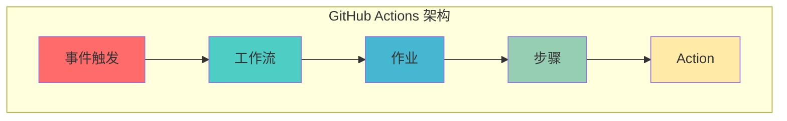

## 概述

GitHub Actions 是 GitHub 提供的 CI/CD 平台，让你能在代码仓库中直接自动化构建、测试和部署流程。通过编写 YAML 配置文件，你可以创建强大的工作流来响应各种 GitHub 事件。

## 为什么使用 GitHub Actions

- **无需额外配置** - 与 GitHub 仓库深度集成，无需注册第三方服务
- **免费额度充足** - 公开仓库无限使用，私有仓库每月 2000 分钟免费
- **丰富的生态** - GitHub Marketplace 提供数千个预构建的 Action
- **灵活的触发机制** - 支持 push、pull request、定时任务等多种触发条件
- **多环境支持** - 支持 Linux、macOS、Windows 三种运行环境

## 核心概念



| 概念                   | 说明                                     | 示例                         |
| ---------------------- | ---------------------------------------- | ---------------------------- |
| **Workflow（工作流）** | 可配置的自动化流程                       | `.github/workflows/ci.yml`   |
| **Job（作业）**        | 工作流中的执行单元，运行在指定 runner 上 | `build`、`test`、`deploy`    |
| **Step（步骤）**       | 作业中的执行命令或 Action                | `npm install`、`run tests`   |
| **Action（动作）**     | 可复用的代码单元                         | `actions/checkout@v4`        |
| **Runner（运行器）**   | 执行工作流的服务器                       | GitHub-hosted 或 Self-hosted |

## 常见应用场景

### 持续集成

当代码推送到仓库时自动运行测试和构建。

```yaml
name: CI

on:
  push:
    branches: [main]
  pull_request:
    branches: [main]

jobs:
  test:
    runs-on: ubuntu-latest
    steps:
      - uses: actions/checkout@v4
      - name: Setup Node.js
        uses: actions/setup-node@v4
        with:
          node-version: "20"
      - name: Install dependencies
        run: npm ci
      - name: Run tests
        run: npm test
```

### 持续部署

代码合并到主分支后自动部署到生产环境。

```yaml
name: Deploy to Production

on:
  push:
    branches: [main]

jobs:
  deploy:
    runs-on: ubuntu-latest
    steps:
      - uses: actions/checkout@v4
      - name: Deploy to server
        uses: appleboy/ssh-action@master
        with:
          host: ${{ secrets.HOST }}
          username: ${{ secrets.USERNAME }}
          key: ${{ secrets.SSH_KEY }}
          script: |
            cd /var/www/app
            git pull
            npm install --production
            pm2 restart all
```

### 代码质量检查

自动运行代码检查和格式化工具。

```yaml
name: Code Quality

on:
  push:
    branches: [main, develop]
  pull_request:

jobs:
  lint:
    runs-on: ubuntu-latest
    steps:
      - uses: actions/checkout@v4
      - name: Setup Node.js
        uses: actions/setup-node@v4
        with:
          node-version: "20"
      - name: Install dependencies
        run: npm ci
      - name: Run ESLint
        run: npm run lint
      - name: Run Prettier check
        run: npm run format:check
```

### Docker 镜像构建

自动构建并推送 Docker 镜像到容器仓库。

```yaml
name: Docker Build

on:
  push:
    branches: [main]
    tags: ["v*.*.*"]

jobs:
  build:
    runs-on: ubuntu-latest
    permissions:
      contents: read
      packages: write

    steps:
      - name: Checkout code
        uses: actions/checkout@v4

      - name: Set up Docker Buildx
        uses: docker/setup-buildx-action@v3

      - name: Login to GitHub Container Registry
        uses: docker/login-action@v3
        with:
          registry: ghcr.io
          username: ${{ github.actor }}
          password: ${{ secrets.GITHUB_TOKEN }}

      - name: Build and push
        uses: docker/build-push-action@v5
        with:
          context: .
          push: true
          tags: |
            ghcr.io/${{ github.repository }}:latest
            ghcr.io/${{ github.repository }}:${{ github.ref_name }}
```

### 定时任务

定期运行计划任务，如依赖更新检查。

```yaml
name: Dependency Check

on:
  schedule:
    # 每周一上午 9 点运行（UTC 时间）
    - cron: "0 9 * * 1"
  workflow_dispatch: # 允许手动触发

jobs:
  check:
    runs-on: ubuntu-latest
    steps:
      - uses: actions/checkout@v4
      - name: Run security audit
        run: npm audit
      - name: Check for outdated packages
        run: npm outdated || true
```

## 完整示例：前端项目 CI/CD

这是一个完整的前端项目工作流，包含测试、构建和部署。

```yaml
name: Frontend CI/CD

on:
  push:
    branches: [main, develop]
  pull_request:
    branches: [main]

env:
  NODE_VERSION: "20"
  REGISTRY: ghcr.io
  IMAGE_NAME: ${{ github.repository }}

jobs:
  # 代码质量检查
  quality:
    name: Code Quality
    runs-on: ubuntu-latest
    steps:
      - name: Checkout code
        uses: actions/checkout@v4

      - name: Setup Node.js
        uses: actions/setup-node@v4
        with:
          node-version: ${{ env.NODE_VERSION }}
          cache: "npm"

      - name: Install dependencies
        run: npm ci

      - name: Run ESLint
        run: npm run lint

      - name: Run type check
        run: npm run type-check

  # 运行测试
  test:
    name: Tests
    runs-on: ubuntu-latest
    needs: quality
    steps:
      - name: Checkout code
        uses: actions/checkout@v4

      - name: Setup Node.js
        uses: actions/setup-node@v4
        with:
          node-version: ${{ env.NODE_VERSION }}
          cache: "npm"

      - name: Install dependencies
        run: npm ci

      - name: Run tests
        run: npm test -- --coverage

      - name: Upload coverage reports
        uses: codecov/codecov-action@v4
        with:
          token: ${{ secrets.CODECOV_TOKEN }}

  # 构建生产版本
  build:
    name: Build
    runs-on: ubuntu-latest
    needs: [quality, test]
    steps:
      - name: Checkout code
        uses: actions/checkout@v4

      - name: Setup Node.js
        uses: actions/setup-node@v4
        with:
          node-version: ${{ env.NODE_VERSION }}
          cache: "npm"

      - name: Install dependencies
        run: npm ci

      - name: Build production bundle
        run: npm run build
        env:
          CI: true

      - name: Upload build artifacts
        uses: actions/upload-artifact@v4
        with:
          name: dist
          path: dist/
          retention-days: 7

  # 部署到生产环境（仅 main 分支）
  deploy:
    name: Deploy
    runs-on: ubuntu-latest
    needs: build
    if: github.ref == 'refs/heads/main'
    environment:
      name: production
      url: https://example.com
    permissions:
      contents: read
      deployments: write

    steps:
      - name: Download build artifacts
        uses: actions/download-artifact@v4
        with:
          name: dist
          path: dist/

      - name: Deploy to Vercel
        uses: amondnet/vercel-action@v25
        with:
          vercel-token: ${{ secrets.VERCEL_TOKEN }}
          vercel-org-id: ${{ secrets.VERCEL_ORG_ID }}
          vercel-project-id: ${{ secrets.VERCEL_PROJECT_ID }}
          vercel-args: "--prod"
          working-directory: ./
```

## Java Spring Boot 项目示例

```yaml
name: Spring Boot CI/CD

on:
  push:
    branches: [main, develop]
  pull_request:
    branches: [main]

jobs:
  build:
    runs-on: ubuntu-latest

    steps:
      - name: Checkout code
        uses: actions/checkout@v4

      - name: Set up JDK 17
        uses: actions/setup-java@v4
        with:
          java-version: "17"
          distribution: "temurin"
          cache: "maven"

      - name: Run tests
        run: mvn clean test

      - name: Build package
        run: mvn clean package -DskipTests

      - name: Build Docker image
        run: |
          echo "${{ secrets.GITHUB_TOKEN }}" | docker login ghcr.io -u ${{ github.actor }} --password-stdin
          docker build -t ghcr.io/${{ github.repository }}:${{ github.sha }} .
          docker push ghcr.io/${{ github.repository }}:${{ github.sha }}

      - name: Deploy to Kubernetes
        uses: steebchen/kubectl@v2.0.0
        with:
          config: ${{ secrets.KUBE_CONFIG }}
          command: set image deployment/myapp myapp=ghcr.io/${{ github.repository }}:${{ github.sha }}
```

## 高级功能

### 条件执行

使用 `if` 条件控制步骤执行。

```yaml
steps:
  - name: Run on specific branch
    if: github.ref == 'refs/heads/main'
    run: echo "Running on main branch"

  - name: Run only on changes
    if: contains(github.event.head_commit.modified, 'src/')
    run: echo "Source code was modified"

  - name: Skip on draft PR
    if: github.event.pull_request.draft == false
    run: echo "Not a draft PR"
```

### 矩阵构建

同时测试多个版本或环境。

```yaml
jobs:
  test:
    runs-on: ${{ matrix.os }}
    strategy:
      matrix:
        os: [ubuntu-latest, windows-latest, macos-latest]
        node: [16, 18, 20]
      fail-fast: false # 一个失败不影响其他组合

    steps:
      - uses: actions/checkout@v4
      - name: Setup Node.js ${{ matrix.node }}
        uses: actions/setup-node@v4
        with:
          node-version: ${{ matrix.node }}
      - run: npm test
```

### 缓存依赖

加速工作流执行。

```yaml
steps:
  - name: Cache node modules
    uses: actions/cache@v4
    with:
      path: ~/.npm
      key: ${{ runner.os }}-node-${{ hashFiles('**/package-lock.json') }}
      restore-keys: |
        ${{ runner.os }}-node-

  - name: Cache Maven packages
    uses: actions/cache@v4
    with:
      path: ~/.m2
      key: ${{ runner.os }}-maven-${{ hashFiles('**/pom.xml') }}
```

### 使用 Secrets

安全地存储敏感信息。

```yaml
# 在仓库设置中添加 Secrets: Settings > Secrets and variables > Actions

steps:
  - name: Deploy with secret
    run: |
      curl -X POST \
        -H "Authorization: Bearer ${{ secrets.API_TOKEN }}" \
        https://api.example.com/deploy
```

### 复用工作流

在多个仓库间共享工作流。

```yaml
# .github/workflows/call-shared-workflow.yml
jobs:
  call-workflow:
    uses: octo-org/shared-repo/.github/workflows/shared.yml@main
    with:
      config-path: ".github/workflows/shared.yml"
    secrets: inherit
```

## 最佳实践

### 使用最新版本的 Action

```yaml
# 推荐
- uses: actions/checkout@v4

# 不推荐（可能存在安全问题）
- uses: actions/checkout@master
```

### 精简运行时间

```yaml
# 使用 fail-fast 快速失败
strategy:
  fail-fast: true
  matrix:
    version: [1, 2, 3]

# 使用缓存加速
- uses: actions/cache@v4
```

### 使用环境变量

```yaml
env:
  NODE_ENV: production
  API_URL: ${{ secrets.API_URL }}

jobs:
  build:
    runs-on: ubuntu-latest
    steps:
      - run: echo $NODE_ENV
```

### 安全性

```yaml
permissions:
  contents: read      # 只读权限
  pull-requests: write

# 使用 pinned commit 而非标签
- uses: actions/checkout@b4ffde6584633679121fa33874bf8852fe29a8a4
```

### 版本控制

```yaml
# 在文件名中包含版本号
.github/workflows/ci-v1.yml
.github/workflows/ci-v2.yml
```

## 调试技巧

### 启用调试日志

在仓库 Secrets 中添加 `ACTIONS_STEP_DEBUG` 和 `ACTIONS_RUNNER_DEBUG`，设置为 `true`。

### 使用 tmate 进行交互式调试

```yaml
steps:
  - name: Setup tmate session
    uses: mxschmitt/action-tmate@v3
    if: failure()
```

### 查看工作流运行日志

在 **Actions** 标签页点击具体的工作流运行，可以查看详细日志。

## 总结

GitHub Actions 是一个强大而灵活的 CI/CD 平台，能够帮助你：

- **自动化重复任务** - 测试、构建、部署
- **提高代码质量** - 自动检查、格式化
- **加速开发流程** - 即时反馈、快速迭代
- **降低人为错误** - 标准化流程、减少手动操作

通过合理配置工作流，你可以建立高效的开发流程，让团队专注于编写代码而非处理部署琐事。

## 参考资源

- [GitHub Actions 官方文档](https://docs.github.com/en/actions)
- [GitHub Marketplace](https://github.com/marketplace?type=actions)
- [工作流语法](https://docs.github.com/en/actions/using-workflows/workflow-syntax-for-github-actions)
