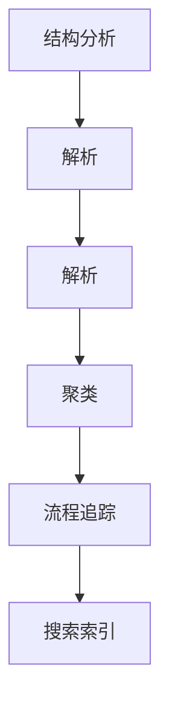
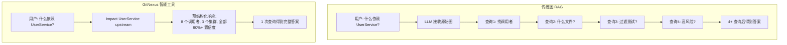

## 什么是 GitNexus？

GitNexus 是一个**零服务器代码智能引擎**，它能够将任何代码库索引为知识图谱 —— 包含每个依赖关系、调用链、集群和执行流程，然后通过智能工具暴露这些信息，让 AI 代理永远不会错过关键代码。

简单来说：它像给 AI 装了一个"神经系统"，让 AI 能够真正"理解"你的代码库结构。


## 核心特性

### 🎯 像 DeepWiki，但更深入

- **DeepWiki**：帮助你理解代码
- **GitNexus**：让你分析代码 —— 因为知识图谱追踪的是每个关系，而不仅仅是描述

### 🔧 CLI + MCP 深度集成

| 特性 | Claude Code | Cursor | Windsurf | OpenCode |
|------|-------------|--------|----------|----------|
| MCP 支持 | ✅ | ✅ | ✅ | ✅ |
| Agent Skills | ✅ | - | - | ✅ |
| Hooks | ✅ (PreToolUse + PostToolUse) | - | - | - |

### 🌐 Web UI

无需安装，直接访问 [gitnexus.vercel.app](https://gitnexus.vercel.app)，拖放 ZIP 文件即可开始探索代码。支持本地后端模式，连接 CLI 索引的仓库。

## 工作原理

### 知识图谱构建

GitNexus 通过多阶段索引管道构建完整的代码库知识图谱：



1. **结构分析**：遍历文件树，映射文件夹/文件关系
2. **解析**：使用 Tree-sitter AST 提取函数、类、方法、接口
3. **解析**：跨文件解析导入和函数调用
4. **聚类**：将相关符号分组为功能社区
5. **流程追踪**：从入口点追踪执行流
6. **搜索索引**：构建混合搜索索引

### 智能工具

GitNexus 通过 MCP 暴露 7 个智能工具：

| 工具 | 功能 |
|------|------|
| `list_repos` | 发现所有已索引的仓库 |
| `query` | 混合搜索 (BM25 + 语义 + RRF) |
| `context` | 360度符号视图 |
| `impact` | 爆炸半径分析 |
| `detect_changes` | Git diff 影响分析 |
| `rename` | 多文件协调重命名 |
| `cypher` | 原始 Cypher 图查询 |

### 核心创新：预计算关系智能



**优势**：
- **可靠性** —— LLM 不会错过上下文，工具响应中已包含
- **Token 效率** —— 无需 4 次查询链来理解一个函数
- **模型民主化** —— 更小的模型也能工作，因为工具做了重活

## 快速开始

### 安装

```bash
npm install -g gitnexus
```

### 索引仓库

```bash
# 在仓库根目录运行
npx gitnexus analyze
```

这将：
1. 索引代码库
2. 安装 agent skills
3. 注册 Claude Code hooks
4. 创建 AGENTS.md / CLAUDE.md 上下文文件

### 配置编辑器

```bash
gitnexus setup
```

自动检测编辑器并写入正确的全局 MCP 配置。

### 手动配置

**Claude Code:**
```bash
claude mcp add gitnexus -- npx -y gitnexus@latest mcp
```

**Cursor** (~/.cursor/mcp.json):
```json
{
  "mcpServers": {
    "gitnexus": {
      "command": "npx",
      "args": ["-y", "gitnexus@latest", "mcp"]
    }
  }
}
```

### 使用 Web UI

```bash
# 启动本地服务器
gitnexus serve
```

然后访问 [gitnexus.vercel.app](https://gitnexus.vercel.app)，它会自动检测本地服务器。

## 支持的语言

- TypeScript / JavaScript
- Python
- Java / Kotlin
- C / C++ / C#
- Go
- Rust
- PHP
- Swift

## 为什么需要 GitNexus？

现在的 AI 编程工具（Cursor、Claude Code、Cline 等）很强大 —— 但它们并不真正了解你的代码库结构。

**常见问题**：
- AI 修改了 `UserService.validate()`
- 不知道有 47 个函数依赖它的返回类型
- 破坏性更改被提交

GitNexus 解决了这个问题，让 AI 能够：
- 准确知道一个函数被谁调用
- 了解代码的集群和模块结构
- 在修改前评估影响范围
- 进行安全的多文件重命名

## 相关资源

- [GitHub 仓库](https://github.com/abhigyanpatwari/GitNexus)
- [Web UI](https://gitnexus.vercel.app)
- [NPM 包](https://www.npmjs.com/package/gitnexus)
- [Discord 社区](https://discord.gg/AAsRVT6fGb)
