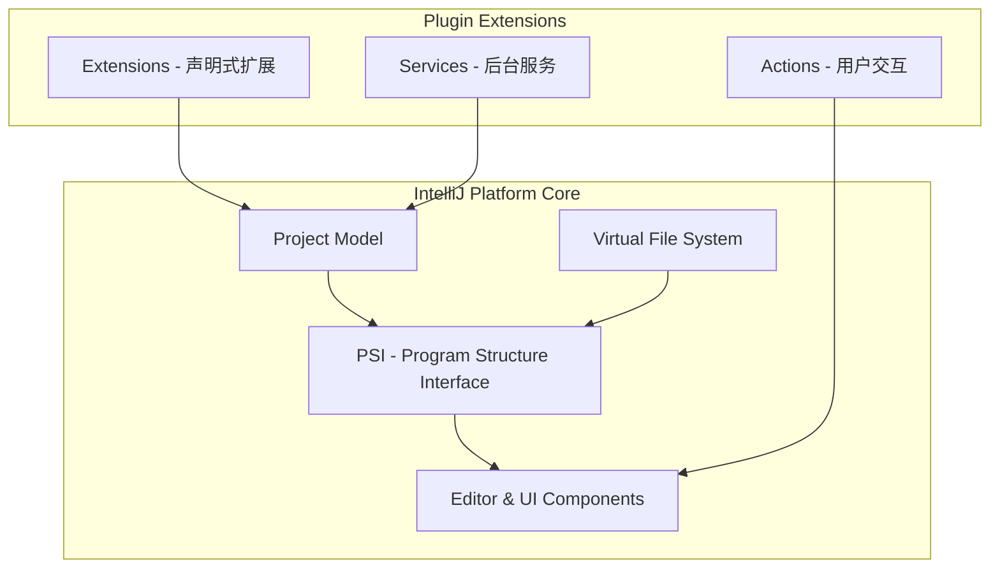

## 概述

IntelliJ IDEA 插件开发是基于 IntelliJ Platform SDK 进行的扩展开发。通过插件，可以扩展 IDE 的功能，实现代码生成、语法高亮、快捷操作、集成外部工具等丰富的自定义功能。

> **本指南适用范围**：适用于 IntelliJ IDEA、PyCharm、WebStorm、Android Studio 等所有基于 IntelliJ Platform 的 JetBrains IDE

### 核心技术栈

| 技术 | 版本要求 | 用途 |
|:---|:---:|:---|
| IntelliJ Platform | 2023.2+ | 插件运行平台 |
| JDK | 17+ | Java运行环境 |
| Gradle | 8.0+ | 构建工具 |
| Kotlin | 1.9+ | 推荐开发语言（也可用Java） |

---

## 目录

1. [开发环境搭建](#1-开发环境搭建)
2. [创建插件项目](#2-创建插件项目)
3. [核心概念解析](#3-核心概念解析)
4. [扩展点详解](#4-扩展点详解)
5. [UI开发](#5-ui开发)
6. [调试与测试](#6-调试与测试)
7. [打包发布](#7-打包发布)
8. [最佳实践](#8-最佳实践)
9. [实战示例：完整项目](#9-实战示例完整项目)
10. [高级主题](#10-高级主题)
11. [常见问题](#11-常见问题)
12. [学习资源](#12-学习资源)
13. [版本历史](#13-版本历史)

---

## 1. 开发环境搭建

### 1.1 安装必要工具

#### 下载 IntelliJ IDEA

插件开发推荐使用 **IntelliJ IDEA Ultimate**（旗舰版），因为旗舰版内置了完整的 IntelliJ Platform 插件开发支持。

```bash
# macOS (使用 Homebrew Cask)
brew install --cask intellij-idea

# 或下载安装包
# https://www.jetbrains.com/idea/download/
```

#### 配置 JDK

插件开发需要 JDK 17 或更高版本：

```bash
# macOS (使用 Homebrew)
brew install openjdk@17

# 验证安装
java -version
# 输出: openjdk version "17.0.x"
```

在 IntelliJ IDEA 中配置 JDK：
1. `File → Project Structure → SDKs`
2. 添加 JDK 17 路径

### 1.2 安装 Plugin DevKit

Plugin DevKit 是 IntelliJ IDEA 内置的插件开发工具包，包含：

- 项目模板和向导
- plugin.xml 编辑器
- 调试运行配置
- 构建工具集成

**检查是否已启用**：
1. `File → Settings → Plugins`
2. 搜索 "Plugin DevKit"
3. 确保已启用（默认内置并启用）

---

## 2. 创建插件项目

### 2.1 使用项目向导创建

1. **新建项目**：`File → New → Project`

2. **选择模板**：选择 **IntelliJ Platform Plugin**

   ```mermaid
   graph TD
       A[New Project] --> B[选择 IntelliJ Platform Plugin]
       B --> C[配置项目信息]
       C --> D[配置插件基础信息]
       D --> E[选择运行平台]
       E --> F[完成创建]
   ```

3. **配置项目信息**：

   | 配置项 | 说明 | 示例 |
   |:---|:---|:---|
   | Name | 项目名称 | `MyFirstPlugin` |
   | Location | 项目路径 | `~/dev/MyFirstPlugin` |
   | Language | 开发语言 | Kotlin / Java |
   | Build System | 构建系统 | Gradle (Kotlin DSL) |
   | JDK | Java版本 | JDK 17 |

4. **配置插件基础信息**：

   | 配置项 | 说明 | 示例 |
   |:---|:---|:---|
   | Plugin Name | 插件名称 | `My First Plugin` |
   | Plugin ID | 插件唯一ID | `com.example.my-first-plugin` |
   | Group ID | Maven GroupId | `com.example` |
   | Artifact ID | Maven ArtifactId | `my-first-plugin` |

5. **选择运行平台**：选择目标 IDE（如 IntelliJ IDEA Community）

### 2.2 项目结构说明

创建完成后，项目结构如下：

```
MyFirstPlugin/
├── build.gradle.kts           # Gradle 构建配置
├── gradle.properties          # Gradle 属性配置
├── settings.gradle.kts        # Gradle 设置
├── src/
│   └── main/
│       ├── resources/
│       │   └── META-INF/
│       │       └── plugin.xml      # 插件描述文件
│       └── kotlin/
│           └── com.example.myplugin/
│               └── MyPluginClass.kt  # 插件代码
├── build/
│   └── kotlin-compile/        # 编译缓存
└── CHANGELOG.md              # 更新日志
```

### 2.3 plugin.xml 详解

`plugin.xml` 是插件的核心配置文件：

```xml
<idea-plugin>
    <!-- 插件唯一标识 -->
    <id>com.example.my-first-plugin</id>

    <!-- 插件名称 -->
    <name>My First Plugin</name>

    <!-- 插件版本 -->
    <version>1.0.0</version>

    <!-- 供应商信息 -->
    <vendor email="support@example.com" url="https://example.com">
        Example Company
    </vendor>

    <!-- 描述信息 -->
    <description><![CDATA[
        这是我的第一个 IntelliJ IDEA 插件。<br>
        提供<strong>示例功能</strong>和<em>实用工具</em>。
    ]]></description>

    <!-- 变更日志 -->
    <change-notes><![CDATA[
        <h3>1.0.0</h3>
        <ul>
            <li>初始版本发布</li>
            <li>实现基础功能</li>
        </ul>
    ]]></change-notes>

    <!-- 依赖和兼容性 -->
    <depends>com.intellij.modules.platform</depends>
    <depends>com.intellij.modules.lang</depends>

    <!-- 扩展点注册 -->
    <extensions defaultExtensionNs="com.intellij">
        <!-- 在此注册各种扩展 -->
    </extensions>

    <!-- 动作注册 -->
    <actions>
        <!-- 在此注册菜单动作 -->
    </actions>
</idea-plugin>
```

---

## 3. 核心概念解析

### 3.1 IntelliJ Platform 架构



### 3.2 重要概念对比

| 概念 | 说明 | 使用场景 |
|:---|:---|:---|
| **Project** | IDE 项目模型 | 访问项目配置、模块、依赖 |
| **Module** | 项目中的模块 | 管理代码模块、构建配置 |
| **VirtualFile** | 虚拟文件系统 | 文件操作、内容读写 |
| **PsiFile** | 代码结构接口 | 代码分析、语法树遍历 |
| **Editor** | 编辑器组件 | 文本编辑、高亮、注入 |
| **Application** | 应用级别 | 全局服务、跨项目共享 |
| **Project** | 项目级别 | 项目特定服务 |

### 3.3 作用域说明

IntelliJ Platform 有三种作用域：

```kotlin
// 1. Application 级别（全局唯一）
val appService = application.getService(MyApplicationService::class.java)

// 2. Project 级别（每个项目一个实例）
val projectService = project.getService(MyProjectService::class.java)

// 3. Module 级别（每个模块一个实例）
val moduleService = module.getService(MyModuleService::class.java)
```

---

## 4. 扩展点详解

### 4.1 Actions（动作）

Actions 是用户可以触发的操作，如菜单项、工具栏按钮、快捷键。

#### 创建 Action

1. **创建 Action 类**：

```kotlin
package com.example.myplugin

import com.intellij.openapi.actionSystem.AnAction
import com.intellij.openapi.actionSystem.AnActionEvent
import com.intellij.openapi.ui.Messages

class MyAction : AnAction() {

    override fun actionPerformed(e: AnActionEvent) {
        // 获取当前项目
        val project = e.project ?: return

        // 显示对话框
        Messages.showInfoMessage(
            project,
            "Hello from My Plugin!",
            "Greeting"
        )
    }

    override fun update(e: AnActionEvent) {
        // 控制动作是否可用
        val project = e.project
        e.presentation.isEnabledAndVisible = project != null
    }
}
```

2. **注册 Action**（在 plugin.xml 中）：

```xml
<actions>
    <group id="MyPlugin.Group" text="My Plugin" description="My Plugin Actions">
        <!-- 添加到主菜单 -->
        <add-to-group group-id="ToolsMenu" anchor="last"/>

        <!-- 子菜单项 -->
        <action
            id="MyPlugin.MyAction"
            class="com.example.myplugin.MyAction"
            text="Say Hello"
            description="Shows a greeting message"
            icon="META-INF/pluginIcon.png">
            <keyboard-shortcut
                keymap="$default"
                first-keystroke="ctrl shift H"/>
        </action>
    </group>
</actions>
```

#### Action 常用位置

| 位置 | Group ID | 说明 |
|:---|:---:|:---|
| 主菜单-工具 | `ToolsMenu` | 工具菜单 |
| 主菜单-编辑 | `EditMenu` | 编辑菜单 |
| 主菜单-视图 | `ViewMenu` | 视图菜单 |
| 编辑器弹出菜单 | `EditorPopupMenu` | 右键菜单 |
| 工具栏 | `MainToolBar` | 主工具栏 |

### 4.2 Extensions（扩展）

Extensions 是声明式的扩展点，用于集成 IDE 核心功能。

#### Application 级服务

```kotlin
package com.example.myplugin.services

import com.intellij.openapi.application.ApplicationManager
import com.intellij.openapi.components.Service
import com.intellij.openapi.components.service

@Service
class MyApplicationService {

    fun doSomething() {
        println("Application service doing work")
    }

    companion object {
        fun getInstance(): MyApplicationService {
            return service()
        }
    }
}
```

#### Project 级服务

```kotlin
package com.example.myplugin.services

import com.intellij.openapi.components.Service
import com.intellij.openapi.components.service
import com.intellij.openapi.project.Project

@Service(Service.Level.PROJECT)
class MyProjectService(private val project: Project) {

    fun getProjectName(): String {
        return project.name
    }

    companion object {
        fun getInstance(project: Project): MyProjectService {
            return project.service()
        }
    }
}
```

#### 注册服务（plugin.xml）

```xml
<extensions defaultExtensionNs="com.intellij">
    <!-- Application 级服务 -->
    <applicationService
        serviceImplementation="com.example.myplugin.services.MyApplicationService"/>

    <!-- Project 级服务 -->
    <projectService
        serviceImplementation="com.example.myplugin.services.MyProjectService"/>
</extensions>
```

### 4.3 常用扩展点

| 扩展点 | 用途 | 示例 |
|:---|:---|:---|
| `applicationService` | 全局服务 | 配置管理、连接池 |
| `projectService` | 项目服务 | 代码分析、索引 |
| `toolWindow` | 工具窗口 | 自定义面板 |
| `editorFactoryListener` | 编辑器监听 | 文件打开/关闭 |
| `fileType` | 文件类型 | 自定义语言支持 |
| `completion.contributor` | 代码补全 | 自动完成 |
| `lineMarkerProvider` | 行标记 | 图标提示 |

---

## 5. UI开发

### 5.1 工具窗口（Tool Window）

工具窗口是 IDE 侧边栏的面板（如 Project、Structure）。

#### 创建工具窗口工厂

```kotlin
package com.example.myplugin.toolWindow

import com.intellij.openapi.project.Project
import com.intellij.openapi.wm.ToolWindow
import com.intellij.openapi.wm.ToolWindowFactory
import com.intellij.ui.content.ContentFactory

class MyToolWindowFactory : ToolWindowFactory {

    override fun createToolWindowContent(project: Project, toolWindow: ToolWindow) {
        // 创建 UI 组件
        val myToolWindowContent = MyToolWindowContent(project)

        // 创建 Content
        val contentFactory = ContentFactory.getInstance()
        val content = contentFactory.createContent(
            myToolWindowContent.getContent(),
            "",
            false
        )

        // 添加到工具窗口
        toolWindow.contentManager.addContent(content)
    }
}
```

#### 创建工具窗口 UI

```kotlin
package com.example.myplugin.toolWindow

import com.intellij.openapi.ui.SimpleToolWindowPanel
import com.intellij.ui.components.JBList
import com.intellij.ui.components.JBScrollPane
import javax.swing.JComponent

class MyToolWindowContent(private val project: com.intellij.openapi.project.Project) {

    fun getContent(): JComponent {
        // 创建面板
        val panel = SimpleToolWindowPanel(false, true)

        // 创建列表
        val list = JBList.create(
            listOf("Item 1", "Item 2", "Item 3")
        )
        val scrollPane = JBScrollPane(list)

        // 添加到面板
        panel.setContent(scrollPane)

        return panel
    }
}
```

#### 注册工具窗口

```xml
<extensions defaultExtensionNs="com.intellij">
    <toolWindow
        id="My Plugin Tool Window"
        factoryClass="com.example.myplugin.toolWindow.MyToolWindowFactory"
        anchor="right"
        icon="META-INF/pluginIcon.png"/>
</extensions>
```

### 5.2 弹出对话框

```kotlin
package com.example.myplugin.ui

import com.intellij.openapi.project.Project
import com.intellij.openapi.ui.DialogWrapper
import com.intellij.ui.components.JBTextField
import com.intellij.uiDesigner.core.GridConstraints
import com.intellij.uiDesigner.core.GridLayoutManager
import javax.swing.JComponent
import javax.swing.JLabel
import javax.swing.JPanel

class MyDialog(project: Project) : DialogWrapper(project) {

    private val textField = JBTextField()

    init {
        title = "My Plugin Dialog"
        init()
    }

    override fun createCenterPanel(): JComponent {
        val panel = JPanel(GridLayoutManager(2, 2))

        // 添加标签
        val label = JLabel("Enter something:")
        panel.add(
            label,
            GridConstraints(0, 0, 1, 1, GridConstraints.ANCHOR_WEST, GridConstraints.FILL_NONE, GridConstraints.SIZEPOLICY_FIXED, GridConstraints.SIZEPOLICY_FIXED, null, null, null)
        )

        // 添加文本框
        panel.add(
            textField,
            GridConstraints(0, 1, 1, 1, GridConstraints.ANCHOR_WEST, GridConstraints.FILL_HORIZONTAL, GridConstraints.SIZEPOLICY_WANT_GROW, GridConstraints.SIZEPOLICY_FIXED, null, null, null)
        )

        return panel
    }

    fun getInputText(): String = textField.text
}
```

### 5.3 通知提示

```kotlin
package com.example.myplugin.notifications

import com.intellij.notification.Notification
import com.intellij.notification.NotificationGroupManager
import com.intellij.notification.NotificationType
import com.intellij.openapi.project.Project

object MyNotifications {

    fun showInfo(project: Project, message: String) {
        val notification = NotificationGroupManager.getInstance()
            .getNotificationGroup("MyPlugin.NotificationGroup")
            .createNotification(
                "My Plugin",
                message,
                NotificationType.INFORMATION
            )
        notification.notify(project)
    }

    fun showError(project: Project, message: String) {
        val notification = NotificationGroupManager.getInstance()
            .getNotificationGroup("MyPlugin.NotificationGroup")
            .createNotification(
                "My Plugin Error",
                message,
                NotificationType.ERROR
            )
        notification.notify(project)
    }

    fun showWarning(project: Project, message: String) {
        val notification = NotificationGroupManager.getInstance()
            .getNotificationGroup("MyPlugin.NotificationGroup")
            .createNotification(
                "My Plugin Warning",
                message,
                NotificationType.WARNING
            )
        notification.notify(project)
    }
}
```

#### 注册通知组

```xml
<extensions defaultExtensionNs="com.intellij">
    <notificationGroup
        id="MyPlugin.NotificationGroup"
        displayType="BALLOON"
        key="notification.group.name"/>
</extensions>
```

---

## 6. 调试与测试

### 6.1 配置运行环境

项目创建后会自动生成运行配置 `Run Plugin`。

**运行配置说明**：

| 配置项 | 说明 |
|:---|:---|
| VM 参数 | IDE 启动参数 |
| 程序参数 | IDE 命令行参数 |
| 工作目录 | IDE 工作目录 |
| 使用类路径 | 包含插件和 IDE 核心类 |

### 6.2 调试插件

1. **启动调试**：点击 `Debug` 按钮（或按 `Ctrl+D`）

2. **设置断点**：在代码中点击行号设置断点

3. **触发断点**：在测试 IDE 中执行相关操作

### 6.3 编写测试

#### 单元测试

```kotlin
package com.example.myplugin

import com.intellij.testFramework.TestDataPath
import com.intellij.testFramework.fixtures.BasePlatformTestCase
import org.junit.Test

@TestDataPath("\$CONTENT_ROOT/src/test/testData")
class MyPluginTest : BasePlatformTestCase() {

    override fun getTestDataPath(): String {
        return "src/test/testData"
    }

    @Test
    fun testPluginFunctionality() {
        // 测试代码
        val myFixture = myFixture
        myFixture.configureByText(
            "test.txt",
            "Hello World"
        )

        // 执行测试逻辑
        // ...
    }
}
```

#### 配置测试依赖

```kotlin
// build.gradle.kts
dependencies {
    testImplementation("org.junit.jupiter:junit-jupiter:5.10.0")
    testImplementation("org.jetbrains.kotlin:kotlin-test:1.9.0")
}

tasks.test {
    useJUnitPlatform()
}
```

---

## 7. 打包发布

### 7.1 构建插件

```bash
# 方式一：使用 Gradle 任务
./gradlew buildPlugin

# 方式二：使用 IntelliJ IDEA 界面
# Gradle → Tasks → intellij → buildPlugin
```

构建成功后，插件文件位于：
```
build/distributions/[PluginName]-[Version].zip
```

### 7.2 验证插件

1. **本地测试安装**：
   - `File → Settings → Plugins → Gear Icon → Install Plugin from Disk`
   - 选择构建的 `.zip` 文件
   - 重启 IDE

2. **使用验证工具**：

```bash
# 运行插件验证
./gradlew runPluginVerifier
```

### 7.3 发布到 JetBrains Marketplace

#### 准备工作

1. **注册账号**：访问 [JetBrains Account](https://account.jetbrains.com/)
2. **创建开发者资料**：完善开发者信息

#### 发布步骤

1. **登录插件仓库**：
   - 访问 [plugins.jetbrains.com](https://plugins.jetbrains.com/)
   - 使用 JetBrains 账号登录

2. **上传插件**：
   - 点击 `Upload plugin`
   - 填写插件信息：
     - 插件名称
     - 描述（支持 HTML）
     - 版本说明
     - 变更日志
     - 类别
     - 标签
   - 上传 `.zip` 文件
   - 选择兼容的 IDE 版本

3. **等待审核**：
   - 通常 1-3 个工作日
   - 审核通过后自动发布

#### plugin.xml 必需字段

发布前确保 plugin.xml 包含以下字段：

```xml
<idea-plugin>
    <!-- 必需字段 -->
    <name>Plugin Name</name>
    <version>1.0.0</version>
    <vendor url="https://example.com">Company</vendor>
    <description><![CDATA[详细描述...]]></description>
    <change-notes><![CDATA[变更说明...]]></change-notes>

    <!-- 兼容性说明 -->
    <idea-version since-build="232" until-build="241.*"/>
</idea-plugin>
```

### 7.4 版本兼容性

| 版本代码 | 对应版本 |
|:---|:---|
| 232.* | IntelliJ IDEA 2023.2 |
| 233.* | IntelliJ IDEA 2023.3 |
| 241.* | IntelliJ IDEA 2024.1 |

```xml
<!-- 支持多个版本 -->
<idea-version since-build="232" until-build="241.*"/>
```

---

## 8. 最佳实践

### 8.1 性能优化

```kotlin
// ❌ 错误：在主线程执行耗时操作
override fun actionPerformed(e: AnActionEvent) {
    heavyComputation()  // 阻塞 UI
}

// ✅ 正确：使用后台任务
override fun actionPerformed(e: AnActionEvent) {
    val project = e.project ?: return
    Task.Backgroundable(project, "Processing") {
        override fun run(indicator: ProgressIndicator) {
            heavyComputation()
        }
    }.queue()
}
```

### 8.2 资源管理

```kotlin
// 使用 readAction 和 writeAction 访问 PSI
ApplicationManager.getApplication().runReadAction {
    // 只读操作
    val psiFile = PsiManager.getInstance(project).findFile(virtualFile)
}

ApplicationManager.getApplication().runWriteAction {
    // 写操作
    psiFile?.add(myElement)
}
```

### 8.3 错误处理

```kotlin
// 使用异常处理避免插件崩溃
try {
    val result = riskyOperation()
} catch (e: Exception) {
    logger<MyPlugin>().error("Operation failed", e)
    MyNotifications.showError(project, e.message ?: "Unknown error")
}
```

### 8.4 用户设置持久化

```kotlin
@State(
    name = "MyPluginSettings",
    storages = [Storage("MyPluginSettings.xml")]
)
class MyPluginSettings : PersistentStateComponent<MyPluginSettings.State> {

    data class State(
        var myProperty: String = "default"
    )

    private var state = State()

    override fun getState(): State = state

    override fun loadState(state: State) {
        this.state = state
    }

    companion object {
        fun getInstance(): MyPluginSettings {
            return service()
        }
    }
}
```

---

## 9. 实战示例：完整项目

### 9.1 项目需求

创建一个简单的插件，实现以下功能：
- 在工具菜单中添加一个 "统计代码行数" 菜单项
- 点击后显示当前项目代码行数统计
- 在工具窗口中显示详细统计信息

### 9.2 完整实现

#### 步骤 1：创建统计服务

```kotlin
package com.example.linecounter.service

import com.intellij.openapi.components.Service
import com.intellij.openapi.components.service
import com.intellij.openapi.project.Project
import com.intellij.psi.JavaRecursiveElementVisitor
import com.intellij.psi.PsiJavaFile
import com.intellij.psi.PsiManager

@Service(Service.Level.PROJECT)
class LineCounterService(private val project: Project) {

    data class FileStats(
        val path: String,
        val lines: Int,
        val codeLines: Int
    )

    data class ProjectStats(
        val totalFiles: Int,
        val totalLines: Int,
        val codeLines: Int,
        val fileStats: List<FileStats>
    )

    fun countLines(): ProjectStats {
        val psiManager = PsiManager.getInstance(project)
        val rootDir = project.baseDir ?: return emptyStats()

        val fileStats = mutableListOf<FileStats>()
        var totalLines = 0
        var codeLines = 0

        VfsUtilCore.iterateChildrenRecursively(rootDir, null) { file ->
            if (!file.isDirectory && file.extension == "java") {
                val virtualFile = file
                val psiFile = psiManager.findFile(virtualFile) as? PsiJavaFile
                if (psiFile != null) {
                    val text = psiFile.text
                    val lines = text.lines().size
                    val code = psiFile.children
                        .filterIsInstance<com.intellij.psi.PsiStatement>()
                        .sumOf { it.text.lines().size }

                    totalLines += lines
                    codeLines += code

                    fileStats.add(FileStats(
                        path = virtualFile.path,
                        lines = lines,
                        codeLines = code
                    ))
                }
            }
            return true
        }

        return ProjectStats(
            totalFiles = fileStats.size,
            totalLines = totalLines,
            codeLines = codeLines,
            fileStats = fileStats.sortedByDescending { it.codeLines }
        )
    }

    private fun emptyStats() = ProjectStats(0, 0, 0, emptyList())

    companion object {
        fun getInstance(project: Project): LineCounterService {
            return project.service()
        }
    }
}
```

#### 步骤 2：创建统计 Action

```kotlin
package com.example.linecounter.action

import com.example.linecounter.service.LineCounterService
import com.intellij.notification.NotificationGroupManager
import com.intellij.notification.NotificationType
import com.intellij.openapi.actionSystem.AnAction
import com.intellij.openapi.actionSystem.AnActionEvent
import com.intellij.openapi.progress.ProgressIndicator
import com.intellij.openapi.progress.Task
import com.intellij.openapi.project.Project

class CountLinesAction : AnAction() {

    override fun actionPerformed(e: AnActionEvent) {
        val project = e.project ?: return

        object : Task.Backgroundable(project, "Counting Lines", true) {
            private var stats: LineCounterService.ProjectStats? = null

            override fun run(indicator: ProgressIndicator) {
                stats = LineCounterService.getInstance(project).countLines()
            }

            override fun onSuccess() {
                showResults(project, stats)
            }
        }.queue()
    }

    private fun showResults(project: Project, stats: LineCounterService.ProjectStats?) {
        stats ?: return

        val message = """
            <b>代码统计完成</b><br>
            文件总数: ${stats.totalFiles}<br>
            总行数: ${stats.totalLines}<br>
            代码行数: ${stats.codeLines}
        """.trimIndent()

        NotificationGroupManager.getInstance()
            .getNotificationGroup("LineCounter.Notification")
            .createNotification(
                "代码统计",
                message,
                NotificationType.INFORMATION
            )
            .notify(project)

        // 打开工具窗口
        val toolWindow = com.intellij.openapi.wm.ToolWindowManager.getInstance(project)
            .getToolWindow("Line Counter")
        toolWindow?.show()
    }

    override fun update(e: AnActionEvent) {
        e.presentation.isEnabledAndVisible = e.project != null
    }
}
```

#### 步骤 3：创建工具窗口

```kotlin
package com.example.linecounter.toolWindow

import com.example.linecounter.service.LineCounterService
import com.intellij.openapi.project.Project
import com.intellij.openapi.ui.SimpleToolWindowPanel
import com.intellij.openapi.wm.ToolWindow
import com.intellij.openapi.wm.ToolWindowFactory
import com.intellij.ui.components.JBList
import com.intellij.ui.components.JBScrollPane
import com.intellij.ui.content.ContentFactory
import javax.swing.JComponent
import javax.swing.JLabel
import javax.swing.JList
import javax.swing.ListSelectionModel

class LineCounterToolWindowFactory : ToolWindowFactory {

    override fun createToolWindowContent(project: Project, toolWindow: ToolWindow) {
        val content = LineCounterToolWindowContent(project)
        val factory = ContentFactory.getInstance()

        toolWindow.contentManager.addContent(
            factory.createContent(
                content.getContent(),
                "",
                false
            )
        )
    }
}

class LineCounterToolWindowContent(private val project: Project) {

    fun getContent(): JComponent {
        val panel = SimpleToolWindowPanel(false, true)

        val stats = LineCounterService.getInstance(project).countLines()
        val listModel = javax.swing.DefaultListModel<String>()

        listModel.addElement("=== 代码统计结果 ===")
        listModel.addElement("文件总数: ${stats.totalFiles}")
        listModel.addElement("总行数: ${stats.totalLines}")
        listModel.addElement("代码行数: ${stats.codeLines}")
        listModel.addElement("")

        listModel.addElement("=== Top 10 文件 ===")
        stats.fileStats.take(10).forEach { file ->
            listModel.addElement("${file.codeLines} 行 - ${file.path.substringAfterLast("/")}")
        }

        val list = JBList(listModel)
        list.selectionMode = ListSelectionModel.SINGLE_SELECTION
        val scrollPane = JBScrollPane(list)

        panel.setContent(scrollPane)

        // 刷新按钮
        val refreshAction = object : com.intellij.openapi.actionSystem.AnAction(
            "刷新", "刷新统计", null
        ) {
            override fun actionPerformed(e: com.intellij.openapi.actionSystem.AnActionEvent) {
                // 重新加载统计
                panel.setContent(JLabel("刷新中..."))
            }
        }
        panel.toolbar.addAction(refreshAction)

        return panel
    }
}
```

#### 步骤 4：配置 plugin.xml

```xml
<idea-plugin>
    <id>com.example.line-counter</id>
    <name>Line Counter</name>
    <version>1.0.0</version>
    <vendor email="support@example.com">Example</vendor>

    <description><![CDATA[
        统计 Java 项目代码行数的插件
    ]]></description>

    <change-notes><![CDATA[
        <h3>1.0.0</h3>
        <ul>
            <li>初始版本</li>
            <li>支持代码行数统计</li>
        </ul>
    ]]></change-notes>

    <depends>com.intellij.modules.platform</depends>
    <depends>com.intellij.modules.java</depends>

    <extensions defaultExtensionNs="com.intellij">
        <!-- 注册服务 -->
        <projectService
            serviceImplementation="com.example.linecounter.service.LineCounterService"/>

        <!-- 注册工具窗口 -->
        <toolWindow
            id="Line Counter"
            factoryClass="com.example.linecounter.toolWindow.LineCounterToolWindowFactory"
            anchor="right"/>

        <!-- 注册通知组 -->
        <notificationGroup
            id="LineCounter.Notification"
            displayType="BALLOON"/>
    </extensions>

    <actions>
        <action
            id="LineCounter.Count"
            class="com.example.linecounter.action.CountLinesAction"
            text="统计代码行数"
            description="统计项目代码行数"
            icon="META-INF/icon.png">
            <add-to-group group-id="ToolsMenu" anchor="last"/>
            <keyboard-shortcut keymap="$default" first-keystroke="ctrl shift L"/>
        </action>
    </actions>
</idea-plugin>
```

### 9.3 完整的 build.gradle.kts

```kotlin
plugins {
    id("java")
    id("org.jetbrains.kotlin.jvm") version "1.9.0"
    id("org.jetbrains.intellij") version "1.15.0"
}

group = "com.example"
version = "1.0.0"

repositories {
    mavenCentral()
}

intellij {
    version.set("2023.2")
    type.set("IC") // IC = Community
    plugins.set(listOf(/* 插件依赖 */))
}

dependencies {
    implementation("org.jetbrains.kotlin:kotlin-stdlib")
}

tasks {
    withType<JavaCompile> {
        sourceCompatibility = "17"
        targetCompatibility = "17"
    }
    withType<org.jetbrains.kotlin.gradle.tasks.KotlinCompile> {
        kotlinOptions.jvmTarget = "17"
    }

    patchPluginXml {
        sinceBuild.set("232")
        untilBuild.set("241.*")
    }

    signPlugin {
        certificateChain.set(System.getenv("CERTIFICATE_CHAIN"))
        privateKey.set(System.getenv("PRIVATE_KEY"))
        password.set(System.getenv("PRIVATE_KEY_PASSWORD"))
    }

    publishPlugin {
        token.set(System.getenv("PUBLISH_TOKEN"))
    }
}
```

---

## 10. 高级主题

### 10.1 代码补全开发

```kotlin
package com.example.myplugin.completion

import com.intellij.codeInsight.completion.*
import com.intellij.codeInsight.lookup.LookupElementBuilder
import com.intellij.patterns.PlatformPatterns
import com.intellij.psi.PsiElement
import com.intellij.util.ProcessingContext

class MyCompletionContributor : CompletionContributor() {

    init {
        extend(
            CompletionType.BASIC,
            PlatformPatterns.psiElement(),
            object : CompletionProvider<CompletionParameters>() {
                override fun addCompletions(
                    parameters: CompletionParameters,
                    context: ProcessingContext,
                    result: CompletionResultSet
                ) {
                    // 添加自定义补全项
                    result.addElement(
                        LookupElementBuilder.create("myCustomSuggestion")
                            .withIcon(com.intellij.icons.AllIcons.Nodes.Method)
                            .withTypeText("Custom")
                    )
                }
            }
        )
    }
}
```

### 10.2 PSI 元素修改

```kotlin
// 创建 PSI 元素
val elementFactory = JavaPsiFacade.getElementFactory(project)

// 创建新方法
val newMethod = elementFactory.createMethodFromText(
    """
    public void myNewMethod() {
        System.out.println("Hello");
    }
    """.trimIndent(),
    psiClass
)

// 添加到类中
psiClass.add(newMethod)

// 使用 WriteAction
WriteCommandAction.runWriteCommandAction(project) {
    psiClass.add(newMethod)
}
```

### 10.3 Gradle 构建配置详解

```kotlin
plugins {
    id("java")
    id("org.jetbrains.kotlin.jvm") version "1.9.20"
    id("org.jetbrains.intellij") version "1.17.3"
    id("org.jetbrains.changelog") version "2.2.0"
}

group = "com.example"
version = "1.0.0"

repositories {
    mavenCentral()
}

// IntelliJ Platform 配置
intellij {
    pluginName.set("My Plugin")
    version.set("2023.2")  // 基准版本
    type.set("IC")         // IC=Community, IU=Ultimate

    // 依赖的插件
    plugins.set(listOf(
        "org.jetbrains.plugins.gradle",
        "org.intellij.plugins.markdown"
    ))

    // 沙箱目录（用于测试运行）
    sandboxDir.set("${project.buildDir}/idea-sandbox")

    // 插件依赖
    pluginVerification {
        ides.set(
            listOf(
                "2023.2.5",
                "2023.3.5",
                "2024.1.5"
            )
        )
    }
}

dependencies {
    implementation("org.jetbrains.kotlin:kotlin-stdlib:1.9.20")

    // 测试依赖
    testImplementation("org.junit.jupiter:junit-jupiter:5.10.1")
    testImplementation("org.jetbrains.kotlin:kotlin-test:1.9.20")
}

tasks {
    // Java 编译配置
    withType<JavaCompile> {
        sourceCompatibility = "17"
        targetCompatibility = "17"
        options.encoding = "UTF-8"
    }

    // Kotlin 编译配置
    withType<org.jetbrains.kotlin.gradle.tasks.KotlinCompile> {
        kotlinOptions.jvmTarget = "17"
        kotlinOptions.freeCompilerArgs = listOf("-Xjvm-default=all")
    }

    // 测试配置
    test {
        useJUnitPlatform()
        systemProperty("idea.tests.use.local.toolchain", "false")
    }

    // 插件 XML 补丁
    patchPluginXml {
        sinceBuild.set("232")
        untilBuild.set("241.*")

        // 更新 changelog
        changelog.set(project.file("CHANGELOG.md").readText())
    }

    // 构建插件
    buildSearchableOptions {
        enabled = false
    }

    // 签名插件（可选）
    signPlugin {
        certificateChain.set(System.getenv("CERTIFICATE_CHAIN"))
        privateKey.set(System.getenv("PRIVATE_KEY"))
        password.set(System.getenv("PRIVATE_KEY_PASSWORD"))
    }

    // 发布到 JetBrains Marketplace
    publishPlugin {
        token.set(System.getenv("PUBLISH_TOKEN"))
        channels.set(listOf("stable"))
    }

    // 运行插件验证
    runPluginVerifier {
        ideVersions.set(listOf("2023.2.5", "2023.3.5", "2024.1.5"))
    }
}
```

### 10.4 多版本兼容处理

```kotlin
object PlatformVersion {

    fun is2024OrNewer(): Boolean {
        val build = ApplicationInfo.getInstance().build
        return build.baselineVersion >= 241
    }

    fun <T> executeCompat(
        newAction: () -> T,
        oldAction: () -> T
    ): T {
        return if (is2024OrNewer()) newAction() else oldAction()
    }
}

// 使用示例
val result = PlatformVersion.executeCompat(
    newAction = { /* 2024+ API 调用 */ },
    oldAction = { /* 旧版 API 调用 */ }
)
```

### 10.5 CI/CD 配置

**GitHub Actions 示例**：

```yaml
name: Build and Test

on:
  push:
    branches: [ main, develop ]
  pull_request:
    branches: [ main ]

jobs:
  build:
    runs-on: ubuntu-latest

    steps:
      - name: Checkout
        uses: actions/checkout@v4

      - name: Setup JDK 17
        uses: actions/setup-java@v4
        with:
          java-version: '17'
          distribution: 'temurin'

      - name: Build with Gradle
        run: ./gradlew buildPlugin

      - name: Run tests
        run: ./gradlew test

      - name: Verify plugin
        run: ./gradlew runPluginVerifier

      - name: Upload artifact
        uses: actions/upload-artifact@v3
        with:
          name: plugin-artifact
          path: build/distributions/*.zip

  publish:
    needs: build
    runs-on: ubuntu-latest
    if: github.event_name == 'push' && github.ref == 'refs/heads/main'

    steps:
      - name: Checkout
        uses: actions/checkout@v4

      - name: Setup JDK 17
        uses: actions/setup-java@v4
        with:
          java-version: '17'
          distribution: 'temurin'

      - name: Publish plugin
        run: ./gradlew publishPlugin
        env:
          PUBLISH_TOKEN: ${{ secrets.PUBLISH_TOKEN }}
```

---

## 11. 常见问题

### Q1: 如何监听文件变化？

```kotlin
class MyFileListener : VirtualFileListener {

    override fun contentsChanged(event: VirtualFileEvent) {
        println("File changed: ${event.file.name}")
    }

    override fun fileCreated(event: VirtualFileEvent) {
        println("File created: ${event.file.name}")
    }
}

// 注册监听器
VirtualFileManager.getInstance().addVirtualFileListener(MyFileListener())
```

### Q2: 如何获取当前编辑的文件？

```kotlin
val editor = FileEditorManager.getInstance(project).selectedTextEditor
val virtualFile = FileDocumentManager.getInstance().getFile(editor?.document)
val psiFile = PsiManager.getInstance(project).findFile(virtualFile)
```

### Q3: 如何操作 PSI 代码树？

```kotlin
// 遍历 PSI 元素
object : PsiElementVisitor() {
    override fun visitElement(element: PsiElement) {
        super.visitElement(element)
        when (element) {
            is PsiMethod -> println("Found method: ${element.name}")
            is PsiClass -> println("Found class: ${element.name}")
        }
        element.acceptChildren(this)
    }
}.let { psiFile.accept(it) }
```

### Q4: 插件兼容多个 IDE 版本？

在 `build.gradle.kts` 中配置：

```kotlin
intellij {
    version.set("2023.2")
    type.set("IC")  // IC=Community, IU=Ultimate
    plugins.set(listOf("org.jetbrains.plugins.gradle"))
}

tasks.patchPluginXml {
    sinceBuild.set("232")
    untilBuild.set("241.*")
}
```

### Q5: 如何处理异步操作和进度提示？

```kotlin
// 使用 Task.Backgroundable
object : Task.Backgroundable(project, "Processing", true) {
    override fun run(indicator: ProgressIndicator) {
        indicator.text = "正在处理..."
        indicator.fraction = 0.0

        // 执行耗时操作
        heavyOperation()

        indicator.fraction = 1.0
    }

    override fun onSuccess() {
        // 完成后在 UI 线程执行
        showResults()
    }

    override fun onThrowable(error: Throwable) {
        // 错误处理
        showError(error.message)
    }
}.queue()
```

### Q6: 如何调试插件加载问题？

1. **查看日志**：`Help → Show Log in Explorer`
2. **启用插件调试**：在 `idea.properties` 中添加：
   ```properties
   idea.cycle.buffer.size=disabled
   idea.debug.mode=true
   ```
3. **使用 Plugin Verifier**：
   ```bash
   ./gradlew runPluginVerifier
   ```

### Q7: 如何处理插件依赖关系？

```xml
<!-- 依赖其他插件 -->
<depends>com.intellij.java</depends>
<depends>org.jetbrains.plugins.gradle</depends>
<depends optional="true" config-file="my-plugin-with-gradle.xml">
    org.jetbrains.plugins.gradle
</depends>
```

### Q8: 如何创建自定义检查（Inspection）？

```kotlin
class MyInspection : AbstractBaseJavaLocalInspectionTool() {

    override fun buildVisitor(
        holder: ProblemsHolder,
        isOnTheFly: Boolean
    ): PsiElementVisitor {
        return object : JavaElementVisitor() {
            override fun visitMethod(method: PsiMethod) {
                super.visitMethod(method)
                if (method.name.length > 50) {
                    holder.registerProblem(
                        method.nameIdentifier,
                        "方法名过长",
                        ProblemHighlightType.WARNING
                    )
                }
            }
        }
    }
}
```

### Q9: 如何处理插件的多语言支持？

```kotlin
// 创建 messages.properties
display.name=My Plugin
action.description=Perform action

// 创建 messages_zh_CN.properties
display.name=我的插件
action.description=执行操作

// 在代码中使用
val message = message("display.name")
```

### Q10: 如何测试插件在不同 IDE 中的兼容性？

使用 `runPluginVerifier` 任务：

```bash
# 验证特定版本
./gradlew runPluginVerifier -PverifierReleases="2023.2,2023.3,2024.1"

# 验证所有版本
./gradlew checkPluginVerifier
```

---

## 12. 学习资源

### 官方资源

| 资源 | 链接 | 说明 |
|:---|:---|:---|
| IntelliJ Platform SDK | https://plugins.jetbrains.com/docs/intellij/welcome.html | 官方开发文档 |
| Plugin Development Guide | https://plugins.jetbrains.com/docs/intellij/getting-started.html | 快速入门指南 |
| API 文档 | https://javadoc.io/org.jetbrains.intellij/intellij-platform-core/latest | 核心 API 参考 |
| GitHub 示例 | https://github.com/JetBrains/intellij-platform-plugin-template | 官方项目模板 |
| Plugin DevKit | https://plugins.jetbrains.com/docs/intellij/plugin-devkit.html | 开发工具说明 |

### 社区资源

| 资源 | 链接 | 说明 |
|:---|:---|:---|
| IntelliJ Platform Dev | https://intellij-support.jetbrains.com/hc/en-us/community/topics | 官方论坛 |
| Stack Overflow | https://stackoverflow.com/questions/tagged/intellij-idea+plugin | 问题解答 |
| Reddit 社区 | https://www.reddit.com/r/intellijplugins/ | 插件讨论 |
| GitHub Awesome List | https://github.com/jychen/awesome-intellij-plugins | 优秀插件合集 |

### 推荐插件（学习参考）

| 插件 | GitHub | 学习重点 |
|:---|:---|:---|
| .env files support | https://github.com/ewsgit/env-files-support | 文件类型支持 |
| String Manipulation | https://github.com/krasa/StringManipulation | Action 和快捷键 |
| AceJump | https://github.com/acejump/AceJump | 编辑器集成 |
| Rainbow Brackets | https://github.com/izhangzhihao/intellij-rainbow-brackets | 语法高亮 |
| Key Promoter X | https://github.com/halirutan/KeyPromoterX | 事件监听 |

### 进阶学习路径


1. **入门阶段**：完成官方 Hello World 示例
2. **进阶阶段**：实现一个完整的实用插件
3. **高级阶段**：学习 PSI、代码分析、自定义语言
4. **专家阶段**：贡献开源插件、参与平台开发

---

*文档持续更新中，如有问题或建议欢迎反馈！*
