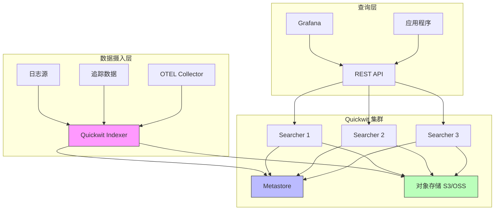

## 概述

Quickwit 是一个云原生的搜索引擎，专为可观测性数据（日志、追踪）设计。它是 Datadog、Elasticsearch、Loki 和 Tempo 的开源替代方案，基于 Rust 开发，底层使用 Tantivy 全文搜索引擎库。

### 核心特性

- **亚秒级搜索**：在对象存储上实现亚秒级查询性能
- **云原生架构**：原生支持 S3、Azure Blob、GCS 等对象存储
- **成本优化**：相比传统方案可节省 10 倍以上存储成本
- **分布式搜索**：支持水平扩展的分布式搜索集群
- **多租户支持**：通过标签和分区实现高效的多租户隔离

## 架构图



## 快速开始

### 1. 安装 Quickwit

#### 方式一：使用安装脚本

```bash
# 下载并安装
curl -L https://install.quickwit.io | sh
cd quickwit-v*/

# 验证安装
./quickwit --version
```

#### 方式二：使用 Docker

```bash
# 创建数据目录
mkdir qwdata

# 运行 Docker 容器
docker run --rm quickwit/quickwit --version

# Apple Silicon Mac 需要指定平台
docker run --rm --platform linux/amd64 quickwit/quickwit --version
```

### 2. 启动 Quickwit 服务

```bash
# 本地启动
./quickwit run

# 使用 Docker 启动
docker run --rm \
  -v $(pwd)/qwdata:/quickwit/qwdata \
  -p 127.0.0.1:7280:7280 \
  quickwit/quickwit run
```

访问 UI：http://localhost:7280

### 3. 创建索引

创建索引配置文件 `index-config.yaml`：

```yaml
version: 0.7
index_id: logs
doc_mapping:
  field_mappings:
    - name: timestamp
      type: datetime
      input_formats:
        - unix_timestamp
      output_format: unix_timestamp_secs
      fast_precision: seconds
      fast: true
    - name: level
      type: text
      tokenizer: raw
    - name: message
      type: text
      tokenizer: default
      record: position
    - name: service
      type: text
      tokenizer: raw
  tag_fields: [service]
  timestamp_field: timestamp
search_settings:
  default_search_fields: [message]
```

创建索引：

```bash
./quickwit index create --index-config index-config.yaml
```

### 4. 摄入数据

准备 NDJSON 格式的日志数据 `logs.json`：

```json
{"timestamp": 1710691200, "level": "INFO", "message": "Application started", "service": "api"}
{"timestamp": 1710691201, "level": "ERROR", "message": "Database connection failed", "service": "api"}
{"timestamp": 1710691202, "level": "WARN", "message": "High memory usage detected", "service": "worker"}
```

摄入数据：

```bash
./quickwit index ingest \
  --index logs \
  --input-path logs.json \
  --force
```

## 对象存储集成

Quickwit 的核心优势之一是原生支持对象存储，可以大幅降低存储成本。

### 支持的存储提供商

- **Amazon S3** 及 S3 兼容存储（MinIO、Garage 等）
- **阿里云 OSS**（通过 S3 兼容 API）
- **Azure Blob Storage**
- **Google Cloud Storage**
- **本地文件系统**

### 配置 S3/OSS 存储

#### 1. 创建配置文件

创建 `config.yaml`：

```yaml
version: 0.7
node_id: quickwit-node-1
listen_address: 0.0.0.0

# Metastore 存储位置
metastore_uri: s3://my-bucket/quickwit/indexes

# 默认索引根目录
default_index_root_uri: s3://my-bucket/quickwit/indexes

# S3 存储配置
storage:
  s3:
    region: us-east-1
    # 可选：自定义端点（用于 OSS 或 MinIO）
    endpoint: https://oss-cn-hangzhou.aliyuncs.com
    # 可选：强制路径风格访问（MinIO 需要）
    force_path_style_access: false
```

#### 2. 配置阿里云 OSS

阿里云 OSS 通过 S3 兼容 API 访问：

```yaml
version: 0.7
node_id: quickwit-oss-node
listen_address: 0.0.0.0

metastore_uri: s3://my-oss-bucket/quickwit/indexes
default_index_root_uri: s3://my-oss-bucket/quickwit/indexes

storage:
  s3:
    region: cn-hangzhou
    endpoint: https://oss-cn-hangzhou.aliyuncs.com
    access_key_id: ${OSS_ACCESS_KEY_ID}
    secret_access_key: ${OSS_SECRET_ACCESS_KEY}
```

#### 3. 配置环境变量

```bash
# 设置 OSS 访问凭证
export OSS_ACCESS_KEY_ID="your-access-key-id"
export OSS_SECRET_ACCESS_KEY="your-secret-access-key"

# 或使用 AWS 环境变量（S3 兼容）
export AWS_ACCESS_KEY_ID="your-access-key-id"
export AWS_SECRET_ACCESS_KEY="your-secret-access-key"
export AWS_REGION="cn-hangzhou"

# 启动 Quickwit
./quickwit run --config config.yaml
```

#### 4. MinIO 配置示例

```yaml
version: 0.7
node_id: quickwit-minio
listen_address: 0.0.0.0

metastore_uri: s3://quickwit-indexes/indexes
default_index_root_uri: s3://quickwit-indexes/indexes

storage:
  s3:
    flavor: minio
    endpoint: http://minio:9000
    access_key_id: minioadmin
    secret_access_key: minioadmin
```

#### 5. Google Cloud Storage 配置

```yaml
version: 0.7
node_id: quickwit-gcs
listen_address: 0.0.0.0

metastore_uri: s3://my-gcs-bucket/quickwit
default_index_root_uri: s3://my-gcs-bucket/quickwit

storage:
  s3:
    flavor: gcs
    region: us-east1
    endpoint: https://storage.googleapis.com
```

### Docker Compose 部署示例

创建 `docker-compose.yml`：

```yaml
version: '3.8'

services:
  # MinIO 对象存储
  minio:
    image: minio/minio:latest
    command: server /data --console-address ":9001"
    ports:
      - "9000:9000"
      - "9001:9001"
    environment:
      MINIO_ROOT_USER: minioadmin
      MINIO_ROOT_PASSWORD: minioadmin
    volumes:
      - minio-data:/data
    healthcheck:
      test: ["CMD", "curl", "-f", "http://localhost:9000/minio/health/live"]
      interval: 30s
      timeout: 20s
      retries: 3

  # Quickwit 服务
  quickwit:
    image: quickwit/quickwit:latest
    command: run
    ports:
      - "7280:7280"
    environment:
      AWS_ACCESS_KEY_ID: minioadmin
      AWS_SECRET_ACCESS_KEY: minioadmin
      QW_S3_ENDPOINT: http://minio:9000
    volumes:
      - ./config.yaml:/quickwit/config.yaml
    depends_on:
      - minio

volumes:
  minio-data:
```

配置文件 `config.yaml`：

```yaml
version: 0.7
node_id: quickwit-docker
listen_address: 0.0.0.0

metastore_uri: s3://quickwit/indexes
default_index_root_uri: s3://quickwit/indexes

storage:
  s3:
    flavor: minio
    endpoint: http://minio:9000
```

启动服务：

```bash
# 启动所有服务
docker-compose up -d

# 查看日志
docker-compose logs -f quickwit

# 创建 MinIO bucket
docker-compose exec minio mc mb /data/quickwit
```

## 全文搜索功能

Quickwit 提供强大的全文搜索能力，支持复杂的查询语法。

### 基础搜索

#### 1. 简单查询

```bash
# 搜索包含 "error" 的文档
curl "http://localhost:7280/api/v1/logs/search?query=error"

# 搜索特定字段
curl "http://localhost:7280/api/v1/logs/search?query=level:ERROR"

# 使用 CLI
./quickwit index search --index logs --query "error"
```

#### 2. 布尔查询

```bash
# AND 查询
curl "http://localhost:7280/api/v1/logs/search?query=error+AND+database"

# OR 查询
curl "http://localhost:7280/api/v1/logs/search?query=error+OR+warning"

# NOT 查询
curl "http://localhost:7280/api/v1/logs/search?query=error+NOT+timeout"

# 组合查询
curl "http://localhost:7280/api/v1/logs/search?query=(error+OR+warning)+AND+service:api"
```

#### 3. 短语搜索

```bash
# 精确短语匹配
curl "http://localhost:7280/api/v1/logs/search?query=\"database+connection+failed\""
```

### 高级搜索

#### 1. 时间范围查询

```bash
# 使用时间戳过滤
curl "http://localhost:7280/api/v1/logs/search?query=error&start_timestamp=1710691200&end_timestamp=1710777600"
```

#### 2. 聚合查询

使用 JSON 格式进行聚合查询：

```bash
curl -X POST "http://localhost:7280/api/v1/logs/search" \
  -H 'Content-Type: application/json' \
  -d '{
    "query": "*",
    "max_hits": 0,
    "aggs": {
      "log_levels": {
        "terms": {
          "field": "level",
          "size": 10
        }
      }
    }
  }'
```

响应示例：

```json
{
  "num_hits": 1000,
  "hits": [],
  "aggregations": {
    "log_levels": {
      "buckets": [
        {"key": "ERROR", "doc_count": 450},
        {"key": "WARN", "doc_count": 300},
        {"key": "INFO", "doc_count": 250}
      ]
    }
  }
}
```

#### 3. 多维度聚合

```bash
curl -X POST "http://localhost:7280/api/v1/logs/search" \
  -H 'Content-Type: application/json' \
  -d '{
    "query": "level:ERROR",
    "max_hits": 10,
    "aggs": {
      "by_service": {
        "terms": {
          "field": "service",
          "size": 5
        },
        "aggs": {
          "by_hour": {
            "date_histogram": {
              "field": "timestamp",
              "fixed_interval": "1h"
            }
          }
        }
      }
    }
  }'
```

#### 4. 范围查询

```bash
# 数值范围
curl "http://localhost:7280/api/v1/logs/search?query=response_time:[100+TO+500]"

# 日期范围
curl "http://localhost:7280/api/v1/logs/search?query=timestamp:[2024-01-01+TO+2024-12-31]"
```

#### 5. 通配符和正则表达式

```bash
# 通配符查询
curl "http://localhost:7280/api/v1/logs/search?query=message:data*"

# 模糊匹配
curl "http://localhost:7280/api/v1/logs/search?query=message:databse~1"
```

### 搜索流式 API

对于大量结果，使用流式 API 更高效：

```bash
# 流式返回所有匹配的文档
curl "http://localhost:7280/api/v1/logs/search/stream?query=level:ERROR&output_format=json"
```

### 查询优化技巧

#### 1. 使用标签字段加速查询

在索引配置中定义标签字段：

```yaml
doc_mapping:
  field_mappings:
    - name: tenant_id
      type: u64
    - name: service
      type: text
      tokenizer: raw
  tag_fields: [tenant_id, service]
```

查询时 Quickwit 会自动过滤不相关的分片：

```bash
curl "http://localhost:7280/api/v1/logs/search?query=tenant_id:123+AND+error"
```

#### 2. 时间分片优化

设置 `timestamp_field` 启用时间分片：

```yaml
doc_mapping:
  timestamp_field: timestamp
```

查询时使用时间范围可以大幅减少扫描的数据量：

```bash
curl "http://localhost:7280/api/v1/logs/search?query=error&start_timestamp=1710691200&end_timestamp=1710777600"
```

#### 3. 分区策略

对于多租户场景，使用分区键：

```yaml
doc_mapping:
  partition_key: tenant_id
  max_num_partitions: 200
```

或组合分区：

```yaml
doc_mapping:
  partition_key: tenant_id,service
  max_num_partitions: 500
```

## 分布式搜索集群部署

### AWS S3 分布式部署

#### 1. 准备工作

```bash
# 设置 S3 路径
export S3_PATH=s3://my-bucket/quickwit/indexes

# 配置 AWS 凭证
export AWS_ACCESS_KEY_ID="your-access-key"
export AWS_SECRET_ACCESS_KEY="your-secret-key"
export AWS_REGION="us-east-1"
```

#### 2. 配置第一个节点

创建 `config-node1.yaml`：

```yaml
version: 0.7
node_id: searcher-1
listen_address: 0.0.0.0
rest:
  listen_port: 7280

metastore_uri: ${S3_PATH}
default_index_root_uri: ${S3_PATH}
```

启动节点：

```bash
./quickwit run --config config-node1.yaml
```

#### 3. 配置其他节点

节点 2 配置 `config-node2.yaml`：

```yaml
version: 0.7
node_id: searcher-2
listen_address: 0.0.0.0
rest:
  listen_port: 7280

metastore_uri: ${S3_PATH}
default_index_root_uri: ${S3_PATH}

# 连接到第一个节点
peer_seeds:
  - <node1-ip>:7280
```

节点 3 配置 `config-node3.yaml`：

```yaml
version: 0.7
node_id: searcher-3
listen_address: 0.0.0.0
rest:
  listen_port: 7280

metastore_uri: ${S3_PATH}
default_index_root_uri: ${S3_PATH}

peer_seeds:
  - <node1-ip>:7280
```

启动其他节点：

```bash
# 在节点 2 上
./quickwit run --service searcher --config config-node2.yaml

# 在节点 3 上
./quickwit run --service searcher --config config-node3.yaml
```

#### 4. 验证集群状态

```bash
# 查看集群成员
curl "http://localhost:7280/api/v1/cluster"
```

### Kubernetes 部署

创建 `quickwit-deployment.yaml`：

```yaml
apiVersion: v1
kind: ConfigMap
metadata:
  name: quickwit-config
data:
  config.yaml: |
    version: 0.7
    node_id: ${POD_NAME}
    listen_address: 0.0.0.0

    metastore_uri: s3://my-bucket/quickwit/indexes
    default_index_root_uri: s3://my-bucket/quickwit/indexes

    peer_seeds:
      - quickwit-0.quickwit-headless:7280
      - quickwit-1.quickwit-headless:7280
      - quickwit-2.quickwit-headless:7280

---
apiVersion: v1
kind: Service
metadata:
  name: quickwit-headless
spec:
  clusterIP: None
  selector:
    app: quickwit
  ports:
    - name: rest
      port: 7280
    - name: grpc
      port: 7281

---
apiVersion: v1
kind: Service
metadata:
  name: quickwit
spec:
  type: LoadBalancer
  selector:
    app: quickwit
  ports:
    - name: rest
      port: 7280
      targetPort: 7280

---
apiVersion: apps/v1
kind: StatefulSet
metadata:
  name: quickwit
spec:
  serviceName: quickwit-headless
  replicas: 3
  selector:
    matchLabels:
      app: quickwit
  template:
    metadata:
      labels:
        app: quickwit
    spec:
      containers:
      - name: quickwit
        image: quickwit/quickwit:latest
        command: ["quickwit", "run", "--service", "searcher"]
        env:
        - name: POD_NAME
          valueFrom:
            fieldRef:
              fieldPath: metadata.name
        - name: AWS_ACCESS_KEY_ID
          valueFrom:
            secretKeyRef:
              name: aws-credentials
              key: access-key-id
        - name: AWS_SECRET_ACCESS_KEY
          valueFrom:
            secretKeyRef:
              name: aws-credentials
              key: secret-access-key
        ports:
        - containerPort: 7280
          name: rest
        - containerPort: 7281
          name: grpc
        volumeMounts:
        - name: config
          mountPath: /quickwit/config.yaml
          subPath: config.yaml
        resources:
          requests:
            memory: "2Gi"
            cpu: "1"
          limits:
            memory: "4Gi"
            cpu: "2"
      volumes:
      - name: config
        configMap:
          name: quickwit-config

---
apiVersion: v1
kind: Secret
metadata:
  name: aws-credentials
type: Opaque
stringData:
  access-key-id: "your-access-key-id"
  secret-access-key: "your-secret-access-key"
```

部署到 Kubernetes：

```bash
# 应用配置
kubectl apply -f quickwit-deployment.yaml

# 查看 Pod 状态
kubectl get pods -l app=quickwit

# 查看日志
kubectl logs -f quickwit-0

# 访问服务
kubectl port-forward svc/quickwit 7280:7280
```

## 生产环境最佳实践

### 1. 性能优化

#### 索引配置优化

```yaml
version: 0.7
index_id: production-logs

doc_mapping:
  field_mappings:
    - name: timestamp
      type: datetime
      fast: true
      fast_precision: seconds
    - name: level
      type: text
      tokenizer: raw
      fast: true  # 启用快速字段用于聚合
    - name: message
      type: text
      tokenizer: default
      record: position  # 启用位置信息用于短语查询
    - name: trace_id
      type: text
      tokenizer: raw
      indexed: true
      stored: true

  # 标签字段用于分片剪枝
  tag_fields: [service, environment, tenant_id]

  # 时间字段用于时间分片
  timestamp_field: timestamp

  # 分区策略
  partition_key: tenant_id
  max_num_partitions: 200

indexing_settings:
  # 提交超时
  commit_timeout_secs: 60

  # 分片大小（字节）
  split_num_docs_target: 10000000

  # 合并策略
  merge_policy:
    type: stable_log
    merge_factor: 10
    max_merge_factor: 12

search_settings:
  default_search_fields: [message]
```

#### 节点配置优化

```yaml
version: 0.7
node_id: production-node

# 监听配置
listen_address: 0.0.0.0
rest:
  listen_port: 7280

# 存储配置
metastore_uri: s3://production-bucket/quickwit/indexes
default_index_root_uri: s3://production-bucket/quickwit/indexes

# 索引器配置
indexer:
  # CPU 核心数
  cpu_capacity: 8
  # 最大并发分片数
  max_concurrent_split_uploads: 4

# 搜索器配置
searcher:
  # 快速字段缓存大小（字节）
  fast_field_cache_capacity: 10GB
  # 分片元数据缓存大小（字节）
  split_footer_cache_capacity: 1GB
  # 部分请求缓存大小（字节）
  partial_request_cache_capacity: 512MB
  # 最大并发流式搜索数
  max_num_concurrent_split_streams: 100

# 存储配置
storage:
  s3:
    region: us-east-1
    # 限制并发请求数
    max_concurrent_requests: 100
```

### 2. 监控和可观测性

#### 暴露 Prometheus 指标

Quickwit 自动在 `/metrics` 端点暴露 Prometheus 指标：

```bash
curl http://localhost:7280/metrics
```

#### Grafana 集成

创建 Prometheus 数据源配置：

```yaml
apiVersion: 1
datasources:
  - name: Quickwit-Metrics
    type: prometheus
    access: proxy
    url: http://quickwit:7280
```

常用监控指标：

- `quickwit_indexing_throughput_bytes` - 索引吞吐量
- `quickwit_search_request_duration_seconds` - 搜索延迟
- `quickwit_split_count` - 分片数量
- `quickwit_cache_hit_rate` - 缓存命中率

### 3. 安全配置

#### 启用 TLS

```yaml
version: 0.7
node_id: secure-node

rest:
  listen_port: 7280
  tls:
    enabled: true
    cert_path: /path/to/cert.pem
    key_path: /path/to/key.pem
```

#### 访问控制

使用反向代理（如 Nginx）实现认证：

```nginx
upstream quickwit {
    server quickwit-1:7280;
    server quickwit-2:7280;
    server quickwit-3:7280;
}

server {
    listen 443 ssl;
    server_name quickwit.example.com;

    ssl_certificate /path/to/cert.pem;
    ssl_certificate_key /path/to/key.pem;

    location / {
        auth_basic "Quickwit Access";
        auth_basic_user_file /etc/nginx/.htpasswd;

        proxy_pass http://quickwit;
        proxy_set_header Host $host;
        proxy_set_header X-Real-IP $remote_addr;
    }
}
```

### 4. 备份和恢复

#### 备份索引配置

```bash
# 导出索引配置
./quickwit index describe --index logs > logs-index-backup.yaml

# 备份到 Git
git add logs-index-backup.yaml
git commit -m "Backup index configuration"
```

#### 数据恢复

由于数据存储在对象存储中，恢复非常简单：

```bash
# 1. 确保对象存储数据完整
# 2. 重新创建索引（使用备份的配置）
./quickwit index create --index-config logs-index-backup.yaml

# 3. 启动 Quickwit，自动从对象存储加载数据
./quickwit run --config config.yaml
```

### 5. 成本优化建议

#### 对象存储成本优化

```yaml
# 使用生命周期策略归档旧数据
# AWS S3 示例
{
  "Rules": [
    {
      "Id": "ArchiveOldLogs",
      "Status": "Enabled",
      "Transitions": [
        {
          "Days": 30,
          "StorageClass": "STANDARD_IA"
        },
        {
          "Days": 90,
          "StorageClass": "GLACIER"
        }
      ]
    }
  ]
}
```

#### 索引优化

```yaml
# 减少存储字段
doc_mapping:
  field_mappings:
    - name: message
      type: text
      indexed: true
      stored: false  # 不存储原始内容，仅索引

# 使用更激进的合并策略
indexing_settings:
  merge_policy:
    type: stable_log
    merge_factor: 15  # 增加合并因子
```

## 实战案例

### 案例 1：日志分析系统

完整的日志分析系统部署：

```bash
# 1. 创建索引
cat > app-logs-config.yaml <<EOF
version: 0.7
index_id: app-logs
doc_mapping:
  field_mappings:
    - name: timestamp
      type: datetime
      fast: true
    - name: level
      type: text
      tokenizer: raw
    - name: service
      type: text
      tokenizer: raw
    - name: message
      type: text
      tokenizer: default
    - name: trace_id
      type: text
      tokenizer: raw
  tag_fields: [service, level]
  timestamp_field: timestamp
search_settings:
  default_search_fields: [message]
EOF

./quickwit index create --index-config app-logs-config.yaml

# 2. 使用 Filebeat 采集日志
cat > filebeat.yml <<EOF
filebeat.inputs:
  - type: log
    paths:
      - /var/log/app/*.log
    json.keys_under_root: true

output.http:
  hosts: ["http://quickwit:7280"]
  index: "app-logs"
  path: "/api/v1/%{[index]}/ingest"
EOF

# 3. 查询错误日志
curl "http://localhost:7280/api/v1/app-logs/search?query=level:ERROR&start_timestamp=1710691200"
```

### 案例 2：多租户 SaaS 日志

```yaml
version: 0.7
index_id: saas-logs

doc_mapping:
  field_mappings:
    - name: tenant_id
      type: u64
    - name: timestamp
      type: datetime
      fast: true
    - name: event_type
      type: text
      tokenizer: raw
    - name: user_id
      type: text
      tokenizer: raw
    - name: data
      type: json  # 灵活的 JSON 字段

  tag_fields: [tenant_id, event_type]
  timestamp_field: timestamp
  partition_key: tenant_id
  max_num_partitions: 1000
```

查询特定租户的数据：

```bash
curl "http://localhost:7280/api/v1/saas-logs/search?query=tenant_id:123+AND+event_type:purchase"
```

## 常见问题

### Q1: 如何选择合适的分片大小？

**A:** 默认 1000 万文档/分片是个好的起点。对于：
- 高查询频率：使用较小的分片（500 万文档）
- 高写入吞吐：使用较大的分片（2000 万文档）

### Q2: 对象存储成本过高怎么办？

**A:**
1. 启用对象存储生命周期策略
2. 减少 `stored` 字段
3. 使用更激进的合并策略
4. 定期删除旧索引

### Q3: 搜索性能不佳如何优化？

**A:**
1. 确保使用 `tag_fields` 和 `timestamp_field`
2. 增加搜索节点数量
3. 调整缓存大小配置
4. 使用更具体的查询条件

### Q4: 如何实现高可用？

**A:**
1. 部署至少 3 个搜索节点
2. 使用负载均衡器分发请求
3. 对象存储本身提供高可用性
4. 使用 Kubernetes 自动重启失败的 Pod

## 总结

Quickwit 是一个强大的云原生搜索引擎，特别适合以下场景：

✅ **适用场景**
- 大规模日志分析和搜索
- 分布式追踪数据存储
- 多租户 SaaS 应用日志
- 需要成本优化的可观测性方案

✅ **核心优势**
- 原生对象存储支持，成本低
- 亚秒级搜索性能
- 水平扩展能力强
- 运维简单，无需管理存储集群

✅ **关键特性**
- 全文搜索和聚合
- 时间和标签分片剪枝
- 分布式搜索集群
- 与 Grafana、Jaeger 等工具集成

通过本文的详细介绍，你应该能够：
1. 快速部署 Quickwit 服务
2. 配置对象存储（S3/OSS）集成
3. 实现高效的全文搜索
4. 构建生产级分布式搜索集群

## 参考资源

- [Quickwit 官方文档](https://quickwit.io/docs)
- [GitHub 仓库](https://github.com/quickwit-oss/quickwit)
- [Tantivy 搜索引擎](https://github.com/quickwit-oss/tantivy)
- [Discord 社区](https://discord.gg/quickwit)


