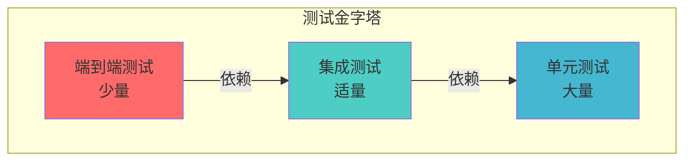

## 概述

在 Spring Boot 项目中建立完善的测试体系是保证代码质量的关键。一个健康的测试金字塔应该包含大量的单元测试、适量的集成测试，以及少量的端到端测试。

本文将系统介绍 Spring Boot 项目中的测试实践，包括单元测试和集成测试的完整技术栈。

## 测试金字塔



| 测试类型 | 目标 | 运行速度 | 隔离性 | 典型占比 |
|----------|------|----------|--------|----------|
| **单元测试** | 验证单个类/方法的行为 | 毫秒级 | 完全隔离 | 70% |
| **集成测试** | 验证组件间的协作 | 秒级 | 部分隔离 | 20% |
| **端到端测试** | 验证完整业务流程 | 分钟级 | 真实环境 | 10% |

## 一、项目依赖配置

### 1.1 核心依赖

在 `pom.xml` 中添加必要的测试依赖：

```xml
<dependencies>
    <!-- Spring Boot Test Starter（已包含在 spring-boot-starter-test 中）-->
    <dependency>
        <groupId>org.springframework.boot</groupId>
        <artifactId>spring-boot-starter-test</artifactId>
        <scope>test</scope>
    </dependency>

    <!-- TestContainers - 容器化集成测试 -->
    <dependency>
        <groupId>org.testcontainers</groupId>
        <artifactId>testcontainers</artifactId>
        <version>1.19.3</version>
        <scope>test</scope>
    </dependency>
    <dependency>
        <groupId>org.testcontainers</groupId>
        <artifactId>postgresql</artifactId>
        <version>1.19.3</version>
        <scope>test</scope>
    </dependency>
    <dependency>
        <groupId>org.testcontainers</groupId>
        <artifactId>junit-jupiter</artifactId>
        <version>1.19.3</version>
        <scope>test</scope>
    </dependency>
</dependencies>
```

**`spring-boot-starter-test` 包含的核心库：**

| 库 | 版本 | 用途 |
|------|------|------|
| **JUnit 5** | 5.10+ | 测试框架 |
| **Mockito** | 5.x | Mock 框架 |
| **AssertJ** | 3.24+ | 断言库 |
| **Hamcrest** | 2.2 | 匹配器 |
| **JsonPath** | 2.8+ | JSON 断言 |
| **JsonAssert** | 1.5+ | JSON 比较 |

### 1.2 测试配置文件

创建 `src/test/resources/application-test.yml`：

```yaml
spring:
  datasource:
    url: jdbc:h2:mem:testdb
    driver-class-name: org.h2.Driver
  jpa:
    hibernate:
      ddl-auto: create-drop
    show-sql: false
  redis:
    host: localhost
    port: 6379
    database: 15  # 使用独立的测试数据库

logging:
  level:
    root: WARN
    com.example.demo: DEBUG
```

## 二、单元测试

### 2.1 单元测试核心原则

单元测试应该遵循 **FIRST** 原则：

| 原则 | 说明 | 实践要点 |
|------|------|----------|
| **F**ast | 快速执行 | 不访问数据库、网络、文件系统 |
| **I**ndependent | 相互独立 | 测试之间无依赖，可并行运行 |
| **R**epeatable | 可重复执行 | 不依赖外部环境，时间等 |
| **S**elf-Validating | 自我验证 | 自动判断成功/失败 |
| **T**imely | 及时编写 | 先写测试，再写代码（TDD） |

### 2.2 Service 层单元测试

测试纯业务逻辑，使用 Mockito 隔离外部依赖：

```java
@ExtendWith(MockitoExtension.class)
class UserServiceTest {

    @Mock
    private UserRepository userRepository;

    @Mock
    private PasswordEncoder passwordEncoder;

    @InjectMocks
    private UserService userService;

    @Test
    @DisplayName("创建用户 - 成功")
    void createUser_Success() {
        // Given
        CreateUserRequest request = new CreateUserRequest(
            "zhangsan@example.com",
            "password123",
            "张三"
        );

        when(userRepository.existsByEmail(request.email()))
            .thenReturn(false);
        when(passwordEncoder.encode(request.password()))
            .thenReturn("$2a$10$encodedPassword");
        when(userRepository.save(any(User.class)))
            .thenAnswer(invocation -> {
                User user = invocation.getArgument(0);
                user.setId(1L);
                return user;
            });

        // When
        Long userId = userService.createUser(request);

        // Then
        assertThat(userId).isEqualTo(1L);

        verify(userRepository).existsByEmail(request.email());
        verify(passwordEncoder).encode(request.password());
        verify(userRepository).save(argThat(user ->
            user.getEmail().equals(request.email()) &&
            user.getPassword().equals("$2a$10$encodedPassword") &&
            user.getName().equals(request.name())
        ));
    }

    @Test
    @DisplayName("创建用户 - 邮箱已存在")
    void createUser_EmailAlreadyExists() {
        // Given
        CreateUserRequest request = new CreateUserRequest(
            "existing@example.com",
            "password123",
            "张三"
        );

        when(userRepository.existsByEmail(request.email()))
            .thenReturn(true);

        // When & Then
        assertThatThrownBy(() -> userService.createUser(request))
            .isInstanceOf(BusinessException.class)
            .hasMessage("邮箱已被注册");

        verify(userRepository, never()).save(any());
    }

    @Test
    @DisplayName("根据ID获取用户 - 存在")
    void getUserById_Exists() {
        // Given
        Long userId = 1L;
        User user = new User(userId, "test@example.com", "encoded", "测试用户");
        when(userRepository.findById(userId))
            .thenReturn(Optional.of(user));

        // When
        UserDto result = userService.getUserById(userId);

        // Then
        assertThat(result).isNotNull();
        assertThat(result.id()).isEqualTo(userId);
        assertThat(result.email()).isEqualTo("test@example.com");
    }

    @Test
    @DisplayName("根据ID获取用户 - 不存在")
    void getUserById_NotExists() {
        // Given
        Long userId = 999L;
        when(userRepository.findById(userId))
            .thenReturn(Optional.empty());

        // When & Then
        assertThatThrownBy(() -> userService.getUserById(userId))
            .isInstanceOf(NotFoundException.class)
            .hasMessage("用户不存在");
    }
}
```

### 2.3 参数化测试

使用 `@ParameterizedTest` 减少重复代码：

```java
@ExtendWith(MockitoExtension.class)
class EmailValidatorTest {

    @ParameterizedTest
    @NullAndEmptySource
    @ValueSource(strings = {"invalid", "invalid@", "@example.com"})
    @DisplayName("验证邮箱格式 - 无效格式")
    void validateEmail_Invalid(String email) {
        assertThatThrownBy(() -> EmailValidator.validate(email))
            .isInstanceOf(ValidationException.class);
    }

    @ParameterizedTest
    @CsvSource({
        "user@example.com, true",
        "user.name@example.com, true",
        "user+tag@example.co.uk, true"
    })
    @DisplayName("验证邮箱格式 - 有效格式")
    void validateEmail_Valid(String email, boolean expected) {
        assertThat(EmailValidator.validate(email)).isTrue();
    }
}
```

### 2.4 Mock 最佳实践

```java
// ✅ 推荐：使用 ArgumentCaptor 捕获参数
@Test
void testWithArgumentCaptor() {
    userService.createUser(request);

    ArgumentCaptor<User> userCaptor = ArgumentCaptor.forClass(User.class);
    verify(userRepository).save(userCaptor.capture());

    User capturedUser = userCaptor.getValue();
    assertThat(capturedUser.getEmail()).isEqualTo(request.email());
}

// ✅ 推荐：使用 argThat 进行灵活匹配
verify(userRepository).save(argThat(user ->
    user.getEmail() != null && user.getEmail().contains("@")
));

// ❌ 避免：过度指定匹配条件
verify(userRepository).save(argThat(user ->
    user.getEmail().equals("exact@example.com") &&
    user.getPassword().equals("$2a$10$exactHash") &&
    user.getName().equals("张三") &&
    user.getCreatedAt() != null &&
    user.getUpdatedAt() != null
));

// ✅ 推荐：使用 lenient() 避免不必要的存根验证
@ExtendWith(MockitoExtension.class)
class TestWithLenientStubs {
    @Mock
    private UserRepository userRepository;

    @Mock
    private EmailService emailService;

    @BeforeEach
    void setUp() {
        lenient().when(emailService.sendEmail(any()))
            .thenReturn(true);
    }
}
```

## 三、集成测试

### 3.1 集成测试注解

Spring Boot 提供多个注解用于集成测试：

| 注解 | 用途 | 性能影响 |
|------|------|----------|
| `@SpringBootTest` | 完整应用上下文 | 重，启动完整容器 |
| `@DataJpaTest` | JPA 相关组件 | 中，只扫描 JPA |
| `@WebMvcTest` | MVC 层组件 | 中，只扫描 Web |
| `@JsonTest` | JSON 序列化 | 轻 |
| `@DataRedisTest` | Redis 操作 | 中 |

### 3.2 Repository 层集成测试

使用 `@DataJpaTest` 测试数据库操作：

```java
@DataJpaTest
@AutoConfigureTestDatabase(replace = AutoConfigureTestDatabase.Replace.NONE)
@Testcontainers
class UserRepositoryTest {

    @Container
    static PostgreSQLContainer<?> postgres = new PostgreSQLContainer<>(
        "postgres:16-alpine"
    )
    .withDatabaseName("testdb")
    .withUsername("test")
    .withPassword("test");

    @DynamicPropertySource
    static void configureProperties(DynamicPropertyRegistry registry) {
        registry.add("spring.datasource.url", postgres::getJdbcUrl);
        registry.add("spring.datasource.username", postgres::getUsername);
        registry.add("spring.datasource.password", postgres::getPassword);
    }

    @Autowired
    private TestEntityManager entityManager;

    @Autowired
    private UserRepository userRepository;

    @Test
    @DisplayName("根据邮箱查找用户 - 存在")
    void findByEmail_Exists() {
        // Given
        User user = new User(null, "test@example.com", "encoded", "张三");
        entityManager.persistAndFlush(user);

        // When
        Optional<User> result = userRepository.findByEmail("test@example.com");

        // Then
        assertThat(result).isPresent();
        assertThat(result.get().getEmail()).isEqualTo("test@example.com");
    }

    @Test
    @DisplayName("根据邮箱查找用户 - 不存在")
    void findByEmail_NotExists() {
        // When
        Optional<User> result = userRepository.findByEmail("nonexistent@example.com");

        // Then
        assertThat(result).isEmpty();
    }

    @Test
    @DisplayName("检查邮箱是否存在")
    void existsByEmail() {
        // Given
        entityManager.persistAndFlush(
            new User(null, "exists@example.com", "encoded", "测试")
        );

        // When & Then
        assertThat(userRepository.existsByEmail("exists@example.com")).isTrue();
        assertThat(userRepository.existsByEmail("notexists@example.com")).isFalse();
    }
}
```

### 3.3 Controller 层集成测试

使用 `@WebMvcTest` 测试 REST API：

```java
@WebMvcTest(UserController.class)
@Import({UserService.class, SecurityConfig.class})
class UserControllerTest {

    @Autowired
    private MockMvc mockMvc;

    @MockBean
    private UserRepository userRepository;

    @MockBean
    private PasswordEncoder passwordEncoder;

    @Autowired
    private ObjectMapper objectMapper;

    @Test
    @WithMockUser
    @DisplayName("GET /api/users/{id} - 成功")
    void getUserById_Success() throws Exception {
        // Given
        Long userId = 1L;
        User user = new User(userId, "test@example.com", "encoded", "张三");
        when(userRepository.findById(userId)).thenReturn(Optional.of(user));

        // When & Then
        mockMvc.perform(get("/api/users/{id}", userId))
            .andExpect(status().isOk())
            .andExpect(jsonPath("$.id").value(userId))
            .andExpect(jsonPath("$.email").value("test@example.com"))
            .andExpect(jsonPath("$.name").value("张三"));
    }

    @Test
    @WithMockUser
    @DisplayName("POST /api/users - 创建成功")
    void createUser_Success() throws Exception {
        // Given
        CreateUserRequest request = new CreateUserRequest(
            "new@example.com",
            "password123",
            "李四"
        );

        when(userRepository.existsByEmail(request.email())).thenReturn(false);
        when(passwordEncoder.encode(request.password())).thenReturn("$2a$10$encoded");
        when(userRepository.save(any(User.class)))
            .thenAnswer(invocation -> {
                User user = invocation.getArgument(0);
                user.setId(2L);
                return user;
            });

        // When & Then
        mockMvc.perform(post("/api/users")
                .contentType(MediaType.APPLICATION_JSON)
                .content(objectMapper.writeValueAsString(request)))
            .andExpect(status().isCreated())
            .andExpect(jsonPath("$.id").value(2))
            .andExpect(jsonPath("$.email").value("new@example.com"));
    }

    @Test
    @DisplayName("POST /api/users - 未认证")
    void createUser_Unauthorized() throws Exception {
        mockMvc.perform(post("/api/users")
                .contentType(MediaType.APPLICATION_JSON)
                .content("{}"))
            .andExpect(status().isUnauthorized());
    }

    @Test
    @WithMockUser
    @DisplayName("POST /api/users - 参数校验失败")
    void createUser_ValidationError() throws Exception {
        // Given - 无效的请求参数
        CreateUserRequest request = new CreateUserRequest(
            "",  // 空邮箱
            "123",  // 密码太短
            ""  // 空名称
        );

        // When & Then
        mockMvc.perform(post("/api/users")
                .contentType(MediaType.APPLICATION_JSON)
                .content(objectMapper.writeValueAsString(request)))
            .andExpect(status().isBadRequest())
            .andExpect(jsonPath("$.errors").isArray())
            .andExpect(jsonPath("$.errors[?(@.field == 'email')]").exists())
            .andExpect(jsonPath("$.errors[?(@.field == 'password')]").exists());
    }
}
```

### 3.4 完整集成测试

使用 `@SpringBootTest` 进行端到端测试：

```java
@SpringBootTest(webEnvironment = SpringBootTest.WebEnvironment.RANDOM_PORT)
@Testcontainers
@AutoConfigureMockMvc
class UserIntegrationTest {

    @Container
    static PostgreSQLContainer<?> postgres = new PostgreSQLContainer<>(
        "postgres:16-alpine"
    )
    .withDatabaseName("integration-test")
    .withUsername("test")
    .withPassword("test");

    @Container
    static GenericContainer<?> redis = new GenericContainer<>(
        "redis:7-alpine"
    )
    .withExposedPorts(6379);

    @DynamicPropertySource
    static void configureProperties(DynamicPropertyRegistry registry) {
        registry.add("spring.datasource.url", postgres::getJdbcUrl);
        registry.add("spring.datasource.username", postgres::getUsername);
        registry.add("spring.datasource.password", postgres::getPassword);
        registry.add("spring.redis.host", redis::getHost);
        registry.add("spring.redis.port", redis::getFirstMappedPort);
    }

    @Autowired
    private MockMvc mockMvc;

    @Autowired
    private ObjectMapper objectMapper;

    @Autowired
    private UserRepository userRepository;

    @Autowired
    private PasswordEncoder passwordEncoder;

    @Test
    @WithMockUser(roles = "ADMIN")
    @DisplayName("完整用户注册流程")
    void completeUserRegistrationFlow() throws Exception {
        // 1. 创建用户
        CreateUserRequest request = new CreateUserRequest(
            "integration@example.com",
            "SecurePass123!",
            "集成测试用户"
        );

        MvcResult result = mockMvc.perform(post("/api/users")
                .contentType(MediaType.APPLICATION_JSON)
                .content(objectMapper.writeValueAsString(request)))
            .andExpect(status().isCreated())
            .andExpect(jsonPath("$.email").value("integration@example.com"))
            .andReturn();

        // 2. 从响应中获取用户ID
        String response = result.getResponse().getContentAsString();
        Long userId = objectMapper.readTree(response).get("id").asLong();

        // 3. 验证数据库中的记录
        User savedUser = userRepository.findById(userId).orElseThrow();
        assertThat(savedUser.getEmail()).isEqualTo("integration@example.com");
        assertThat(passwordEncoder.matches("SecurePass123!", savedUser.getPassword())).isTrue();

        // 4. 测试获取用户信息
        mockMvc.perform(get("/api/users/{id}", userId))
            .andExpect(status().isOk())
            .andExpect(jsonPath("$.email").value("integration@example.com"));
    }
}
```

## 四、测试最佳实践

### 4.1 测试命名规范

使用描述性的测试名称：

```java
// ✅ 推荐：清晰表达测试意图
@Test
@DisplayName("用户登录 - 密码错误返回401")
void login_WithWrongPassword_Returns401() { }

@Test
@DisplayName("创建订单 - 库存不足抛出异常")
void createOrder_WhenInsufficientStock_ThrowsException() { }

// ❌ 避免：模糊的测试名称
@Test
void testLogin() { }
@Test
void testOrder() { }
```

### 4.2 AAA 模式

遵循 **Arrange-Act-Assert** 模式：

```java
@Test
void transferMoney_Success() {
    // Arrange（准备）：设置测试数据
    Account from = new Account(1L, new BigDecimal("1000.00"));
    Account to = new Account(2L, new BigDecimal("500.00"));
    BigDecimal amount = new BigDecimal("200.00");

    when(accountRepository.findById(1L)).thenReturn(Optional.of(from));
    when(accountRepository.findById(2L)).thenReturn(Optional.of(to));

    // Act（执行）：调用被测试方法
    accountService.transfer(1L, 2L, amount);

    // Assert（断言）：验证结果
    assertThat(from.getBalance()).isEqualByComparingTo("800.00");
    assertThat(to.getBalance()).isEqualByComparingTo("700.00");
}
```

### 4.3 测试覆盖率

配置 JaCoCo 生成覆盖率报告：

```xml
<plugin>
    <groupId>org.jacoco</groupId>
    <artifactId>jacoco-maven-plugin</artifactId>
    <version>0.8.11</version>
    <executions>
        <execution>
            <goals>
                <goal>prepare-agent</goal>
            </goals>
        </execution>
        <execution>
            <id>report</id>
            <phase>test</phase>
            <goals>
                <goal>report</goal>
            </goals>
        </execution>
        <execution>
            <id>check</id>
            <goals>
                <goal>check</goal>
            </goals>
            <configuration>
                <rules>
                    <rule>
                        <element>PACKAGE</element>
                        <limits>
                            <limit>
                                <counter>LINE</counter>
                                <value>COVEREDRATIO</value>
                                <minimum>0.80</minimum>
                            </limit>
                        </limits>
                    </rule>
                </rules>
            </configuration>
        </execution>
    </executions>
</plugin>
```

### 4.4 测试配置优化

创建共享测试配置类：

```java
@TestConfiguration
public class TestConfig {

    @Bean
    @Primary
    public PasswordEncoder testPasswordEncoder() {
        return new PasswordEncoder() {
            @Override
            public String encode(CharSequence rawPassword) {
                return "encoded_" + rawPassword;
            }

            @Override
            public boolean matches(CharSequence rawPassword, String encodedPassword) {
                return encodedPassword.equals("encoded_" + rawPassword);
            }
        };
    }

    @Bean
    @Primary
    public Clock testClock() {
        return Clock.fixed(
            Instant.parse("2025-01-25T10:00:00Z"),
            ZoneId.of("Asia/Shanghai")
        );
    }
}
```

## 五、常见场景测试

### 5.1 异常处理测试

```java
@Test
@DisplayName("异常处理 - 业务异常返回400")
void handleBusinessException_Returns400() throws Exception {
    // Given
    when(userService.createUser(any()))
        .thenThrow(new BusinessException("邮箱已被注册"));

    // When & Then
    mockMvc.perform(post("/api/users")
            .contentType(MediaType.APPLICATION_JSON)
            .content(objectMapper.writeValueAsString(request)))
        .andExpect(status().isBadRequest())
        .andExpect(jsonPath("$.message").value("邮箱已被注册"))
        .andExpect(jsonPath("$.errorCode").value("BUSINESS_ERROR"));
}
```

### 5.2 安全测试

```java
@Test
@DisplayName("权限控制 - 普通用户无法访问管理员接口")
void accessAdminEndpoint_AsRegularUser_Forbidden() throws Exception {
    mockMvc.perform(get("/api/admin/users")
            .with(user("user").roles("USER")))
        .andExpect(status().isForbidden());
}

@Test
@DisplayName("权限控制 - 管理员可以访问")
void accessAdminEndpoint_AsAdmin_Success() throws Exception {
    mockMvc.perform(get("/api/admin/users")
            .with(user("admin").roles("ADMIN")))
        .andExpect(status().isOk());
}
```

### 5.3 事务测试

```java
@SpringBootTest
@Transactional
class TransactionalTest {

    @Autowired
    private UserService userService;

    @Autowired
    private UserRepository userRepository;

    @Test
    @DisplayName("事务回滚测试")
    void transactionRollback() {
        Long initialCount = userRepository.count();

        assertThatThrownBy(() -> userService.createUserWithRollback(request))
            .isInstanceOf(RuntimeException.class);

        // 验证事务已回滚
        assertThat(userRepository.count()).isEqualTo(initialCount);
    }
}
```

## 六、持续集成配置

### 6.1 GitHub Actions 配置

```yaml
name: Test

on: [push, pull_request]

jobs:
  test:
    runs-on: ubuntu-latest

    services:
      postgres:
        image: postgres:16-alpine
        env:
          POSTGRES_DB: testdb
          POSTGRES_USER: test
          POSTGRES_PASSWORD: test
        ports:
          - 5432:5432
        options: >-
          --health-cmd pg_isready
          --health-interval 10s
          --health-timeout 5s
          --health-retries 5

      redis:
        image: redis:7-alpine
        ports:
          - 6379:6379
        options: >-
          --health-cmd "redis-cli ping"
          --health-interval 10s
          --health-timeout 5s
          --health-retries 5

    steps:
      - uses: actions/checkout@v4

      - name: Set up JDK 21
        uses: actions/setup-java@v4
        with:
          java-version: '21'
          distribution: 'temurin'
          cache: maven

      - name: Run tests
        run: mvn clean test

      - name: Generate coverage report
        run: mvn jacoco:report

      - name: Upload coverage to Codecov
        uses: codecov/codecov-action@v3
        with:
          files: target/site/jacoco/jacoco.xml
```

## 七、测试性能优化

### 7.1 测试隔离策略

```java
// ✅ 推荐：使用 H2 内存数据库加速单元测试
@DataJpaTest
@AutoConfigureTestDatabase(replace = AutoConfigureTestDatabase.Replace.AUTO_CONFIGURED)
class FastRepositoryTest {
    // 使用 H2，测试快速执行
}

// ✅ 推荐：仅关键集成测试使用真实数据库
@DataJpaTest
@Testcontainers
class RealDatabaseIntegrationTest {
    // 使用 TestContainers + PostgreSQL
    // 仅在关键流程验证时使用
}
```

### 7.2 并行测试执行

配置 JUnit 5 并行执行：

```properties
# junit-platform.properties
junit.jupiter.execution.parallel.enabled=true
junit.jupiter.execution.parallel.mode.default=concurrent
junit.jupiter.execution.parallel.mode.classes.default=concurrent
junit.jupiter.execution.parallel.config.strategy=fixed
junit.jupiter.execution.parallel.config.fixed.parallelism=4
```

## 总结

构建完善的 Spring Boot 测试体系需要理解不同测试类型的定位：

**单元测试**：快速、隔离、大量
- 使用 `@ExtendWith(MockitoExtension.class)`
- Mock 所有外部依赖
- 覆盖核心业务逻辑

**集成测试**：真实协作、适量
- 使用 `@DataJpaTest`、`@WebMvcTest` 等切片测试
- 使用 TestContainers 进行容器化测试
- 验证组件间协作

**关键要点回顾**：

1. **遵循测试金字塔**：70% 单元测试 + 20% 集成测试 + 10% E2E 测试
2. **隔离外部依赖**：单元测试不应访问数据库、网络
3. **使用 TestContainers**：让集成测试更可靠
4. **配置测试覆盖率**：使用 JaCoCo 确保代码质量
5. **优化测试性能**：并行执行、H2 内存数据库、切片测试

## 参考资源

- [Spring Boot Testing Documentation](https://docs.spring.io/spring-boot/docs/current/reference/html/features.html#features.testing)
- [JUnit 5 User Guide](https://junit.org/junit5/docs/current/user-guide/)
- [Mockito Documentation](https://javadoc.io/doc/org.mockito/mockito-core/latest/org/mockito/Mockito.html)
- [TestContainers Guides](https://www.testcontainers.org/guides/)
