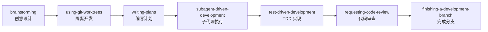
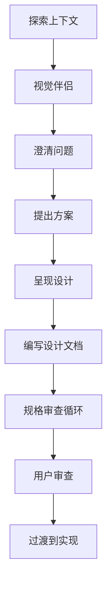
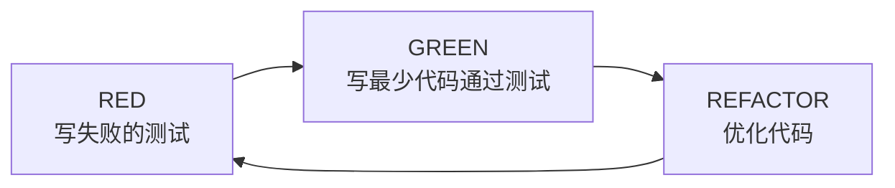

> Superpowers 是由 Obra 公司开发的一个 agentic skills 框架，为编程 Agent 提供可组合的技能集合。它通过标准化的工作流程、严格的 TDD 方法论和系统化的调试流程，让 Claude Code 等 AI 编程助手能够以更专业、更可靠的方式完成复杂开发任务。

## 什么是 Superpowers

Superpowers 是一个为编码 Agent（coding agents）设计的技能框架，其核心理念是：

1. **可组合性** - 技能可以像搭积木一样组合使用
2. **最佳实践** - 内置 TDD、系统化调试等专业方法论
3. **标准化流程** - 为常见开发场景提供统一的工作流程

### 核心价值

传统 AI 编程助手往往直接开始写代码，缺乏系统性的思考和规划。Superpowers 通过引入结构化的技能体系，确保 Agent 在执行任务时遵循经过验证的最佳实践：

- **先规划后编码** - 通过 brainstorming 和 writing-plans 技能确保充分理解需求
- **测试驱动开发** - 强制执行 RED-GREEN-REFACTOR 循环
- **系统化调试** - 4 阶段调试流程，避免盲目修复
- **代码审查闭环** - 确保代码质量达到生产标准

## 在 Claude Code 中安装 Superpowers

### 方法一：通过市场安装（推荐）

```bash
# 直接安装官方插件
/plugin install superpowers@claude-plugins-official
```

### 方法二：通过市场添加后安装

```bash
# 添加插件市场
/plugin marketplace add obra/superpowers

# 安装 superpowers 插件
/plugin install superpowers
```

安装完成后，所有技能将自动可用，无需额外配置。

## Claude Code 中的命令使用详解

### 技能调用方式

在 Claude Code 中，Superpowers 技能可以通过以下方式调用：

#### 方式一：斜杠命令（推荐）

```bash
# 直接调用技能
/brainstorming
/test-driven-development
/writing-plans
/systematic-debugging
```

#### 方式二：自然语言触发

Claude 会根据你的描述自动识别并触发相应技能：

```markdown
用户：帮我设计一个用户认证系统
# Claude 自动触发 brainstorming 技能

用户：这个测试失败了，帮我看看
# Claude 自动触发 systematic-debugging 技能

用户：帮我实现这个功能
# Claude 自动触发 test-driven-development 技能
```

### 核心技能命令速查表

| 技能 | 斜杠命令 | 触发场景 |
|------|----------|----------|
| 头脑风暴 | `/superpowers:brainstorming` | 创建新功能、设计系统 |
| 编写计划 | `/superpowers:writing-plans` | 多步骤任务规划 |
| TDD 开发 | `/superpowers:test-driven-development` | 实现功能或修复 bug |
| 系统化调试 | `/superpowers:systematic-debugging` | 遇到 bug 或测试失败 |
| 代码审查 | `/superpowers:requesting-code-review` | 完成代码后请求审查 |
| Git 工作树 | `/superpowers:using-git-worktrees` | 需要隔离开发环境 |
| 子代理开发 | `/superpowers:subagent-driven-development` | 执行已有计划 |
| 完成分支 | `/superpowers:finishing-a-development-branch` | 开发完成准备合并 |
| 完成前验证 | `/superpowers:verification-before-completion` | 声称完成前验证 |

### 完整实战演练：开发一个待办事项功能

下面通过一个完整示例，演示如何在 Claude Code 中一步步使用 Superpowers。

#### 第一步：启动 Brainstorming

```bash
# 在 Claude Code 中输入
/brainstorming

# 或者直接描述需求
我想为我的应用添加一个待办事项（Todo）功能
```

**Claude 的响应流程**：

```markdown
🔍 使用 brainstorming 技能来探索这个需求...

让我先了解一些细节：

1. **数据存储**
   - 使用本地存储还是需要后端 API？
   - 是否需要持久化？

2. **功能范围**
   - 是否需要分类/标签？
   - 是否需要设置优先级？
   - 是否需要截止日期？
   - 是否需要搜索功能？

3. **用户交互**
   - 是否需要拖拽排序？
   - 是否需要批量操作？

4. **技术约束**
   - 使用什么前端框架？
   - 有无现有的 UI 组件库？

请告诉我你的偏好，我会为你准备 2-3 个设计方案。
```

**你的回答**：

```markdown
- 使用本地存储即可
- 需要分类和优先级
- 不需要拖拽
- 使用 React + TypeScript
```

**Claude 生成设计文档**：

```markdown
📐 正在生成设计文档...

设计文档已保存到: docs/superpowers/specs/2026-03-20--todo-feature.md

## 方案对比

### 方案 A：简单状态管理（推荐）
- 使用 React Context + useReducer
- localStorage 持久化
- 预计开发时间：4 小时

### 方案 B：状态管理库
- 使用 Zustand
- 支持更复杂的状态操作
- 预计开发时间：6 小时

你更倾向哪个方案？
```

#### 第二步：创建隔离开发环境（可选）

```bash
# 使用 git worktrees 创建隔离环境
/using-git-worktrees
```

**Claude 的响应**：

```bash
🌲 创建 Git 工作树...

✅ 工作树已创建：
- 分支: feature/todo-app
- 路径: .claude/worktrees/feature-todo-app/
- 基于分支: main

现在你可以在隔离环境中开发，不会影响主工作区。
开发完成后使用 /worktree done 合并更改。
```

#### 第三步：编写实施计划

```bash
# 触发 writing-plans 技能
/writing-plans
```

**Claude 的响应**：

```markdown
📋 使用 writing-plans 技能编写实施计划...

基于设计文档，我将创建详细的任务分解：

✅ 计划已保存到: docs/superpowers/plans/2026-03-20--todo-feature.md

## 实施计划：待办事项功能

### 阶段 1：类型定义与数据层（30 分钟）
- [ ] 创建 `src/types/todo.ts`
  ```typescript
  export interface Todo {
    id: string;
    title: string;
    completed: boolean;
    priority: 'low' | 'medium' | 'high';
    category: string;
    createdAt: Date;
  }
  ```
  预计：3 分钟

- [ ] 创建 `src/hooks/useTodos.ts`
  预计：10 分钟

- [ ] 编写数据层测试
  预计：15 分钟

### 阶段 2：UI 组件（1 小时）
- [ ] 创建 `src/components/TodoList.tsx`
- [ ] 创建 `src/components/TodoItem.tsx`
- [ ] 创建 `src/components/AddTodoForm.tsx`
- [ ] 编写组件测试

### 阶段 3：集成与优化（30 分钟）
- [ ] 集成所有组件
- [ ] 添加本地存储持久化
- [ ] E2E 测试

## 依赖关系
阶段 1 → 阶段 2 → 阶段 3

准备好开始实施了吗？
```

#### 第四步：TDD 实现

```bash
# 触发 TDD 技能
/test-driven-development
```

**Claude 开始 TDD 循环**：

```markdown
🧪 使用 test-driven-development 技能...

## RED 阶段：编写失败的测试

创建文件: src/types/__tests__/todo.test.ts

```typescript
import { describe, it, expect } from 'vitest';
import { createTodo, toggleTodo } from '../todo';

describe('Todo operations', () => {
  it('should create a todo with default values', () => {
    const todo = createTodo('Buy groceries');
    expect(todo.title).toBe('Buy groceries');
    expect(todo.completed).toBe(false);
    expect(todo.id).toBeDefined();
  });

  it('should toggle todo completion', () => {
    const todo = createTodo('Test task');
    const toggled = toggleTodo(todo);
    expect(toggled.completed).toBe(true);
  });
});
```

运行测试... ❌ 失败（函数未定义）

## GREEN 阶段：实现最小代码

创建文件: src/types/todo.ts

```typescript
export interface Todo {
  id: string;
  title: string;
  completed: boolean;
  createdAt: Date;
}

export function createTodo(title: string): Todo {
  return {
    id: crypto.randomUUID(),
    title,
    completed: false,
    createdAt: new Date(),
  };
}

export function toggleTodo(todo: Todo): Todo {
  return { ...todo, completed: !todo.completed };
}
```

运行测试... ✅ 通过！

## REFACTOR 阶段：优化代码

代码已经足够简洁，无需重构。

---

继续下一个任务：创建 useTodos hook...
```

#### 第五步：遇到问题时的调试

如果在开发过程中遇到测试失败：

```bash
# 触发系统化调试
/systematic-debugging
```

**Claude 的响应**：

```markdown
🔧 使用 systematic-debugging 技能...

## 阶段 1：根因调查

正在收集错误信息：
- 错误类型: TypeError
- 错误消息: Cannot read property 'filter' of undefined
- 发生位置: src/hooks/useTodos.ts:15

检查最近的代码变更...
git diff HEAD~1 src/hooks/useTodos.ts

## 阶段 2：模式分析

搜索类似代码模式...
发现 3 处类似的数组操作

## 阶段 3：假设验证

假设：todos 状态初始化为 null 而非空数组
验证：检查 useState 初始值

```typescript
// 问题代码
const [todos, setTodos] = useState<Todo[] | null>(null);

// 修复方案
const [todos, setTodos] = useState<Todo[]>([]);
```

## 阶段 4：实施修复

1. 先编写回归测试
2. 修复代码
3. 验证所有测试通过

是否继续执行修复？
```

#### 第六步：请求代码审查

```bash
# 完成实现后请求审查
/requesting-code-review
```

**Claude 的响应**：

```markdown
👀 使用 requesting-code-review 技能...

## 代码审查报告

### 功能正确性 ✅
- 所有需求已实现
- 边界情况已处理（空列表、重复添加）

### 代码质量 ✅
- 命名清晰
- 函数职责单一
- 无重复代码

### 测试覆盖 ✅
- 单元测试覆盖率：92%
- 关键路径已覆盖

### 安全性 ✅
- 用户输入已验证
- XSS 防护到位

### 性能 ⚠️
- 建议：TodoList 组件可以使用 React.memo 优化

### 可维护性 ✅
- 代码结构清晰
- 类型定义完整

## 建议的改进
1. 添加 React.memo 到 TodoItem
2. 考虑添加错误边界

是否需要我实施这些改进？
```

#### 第七步：完成前验证

```bash
# 在声称完成之前
/verification-before-completion
```

**Claude 的响应**：

```markdown
✅ 使用 verification-before-completion 技能...

## 验证清单

- [x] 所有测试通过
  ```
  ✓ src/types/__tests__/todo.test.ts (2)
  ✓ src/hooks/__tests__/useTodos.test.ts (5)
  ✓ src/components/__tests__/TodoList.test.tsx (3)

  Test Files  3 passed (3)
  Tests       10 passed (10)
  ```

- [x] 代码已格式化
  ```
  ✓ Prettier 检查通过
  ```

- [x] 无 lint 错误
  ```
  ✓ ESLint 检查通过
  ```

- [x] 文档已更新
  ```
  ✓ README.md 已更新
  ✓ CHANGELOG.md 已更新
  ```

- [ ] 变更已提交
  ```
  ⚠️ 有 5 个文件未提交
  ```

- [ ] CI/CD 通过
  ```
  ⏳ 等待 CI 结果...
  ```

## 下一步
1. 提交变更
2. 等待 CI 通过
3. 合并到主分支
```

#### 第八步：完成分支

```bash
# 准备合并
/finishing-a-development-branch
```

**Claude 的响应**：

```markdown
🏁 使用 finishing-a-development-branch 技能...

## 分支状态检查

- 分支名称: feature/todo-app
- 提交数量: 3
- 状态: 准备合并

## 合并选项

1. **直接合并到 main**
   ```bash
   git checkout main
   git merge feature/todo-app
   ```

2. **创建 Pull Request**
   ```bash
   gh pr create --title "feat: 添加待办事项功能" --body "..."
   ```

3. **Squash 合并**
   ```bash
   git merge --squash feature/todo-app
   ```

你希望使用哪种方式？
```

### 常用命令组合场景

#### 场景 1：快速 Bug 修复

```bash
# 1. 描述问题
登录接口返回 500 错误

# Claude 自动触发 systematic-debugging

# 2. 找到问题后
/test-driven-development
# 写测试复现 bug，然后修复

# 3. 验证
/verification-before-completion

# 4. 提交
/commit
```

#### 场景 2：探索性开发

```bash
# 1. 头脑风暴
/brainstorming

# 2. 确认方案后直接开始
/test-driven-development

# 3. 完成后审查
/requesting-code-review
```

#### 场景 3：大型功能开发

```bash
# 1. 设计
/brainstorming

# 2. 规划
/writing-plans

# 3. 隔离环境
/using-git-worktrees

# 4. 执行计划
/subagent-driven-development

# 5. 审查
/requesting-code-review

# 6. 完成
/finishing-a-development-branch
```

### 技能自动触发规则

Superpowers 技能会在以下情况自动触发：

| 用户输入模式 | 自动触发的技能 |
|--------------|----------------|
| "帮我设计..." / "我想添加..." | brainstorming |
| "实现..." / "开发..." | test-driven-development |
| "报错了" / "测试失败" / "bug" | systematic-debugging |
| "审查代码" / "检查代码" | requesting-code-review |
| "完成了" / "好了" | verification-before-completion |
| "合并分支" / "发布" | finishing-a-development-branch |

### 查看可用技能

```bash
# 列出所有已安装的 superpowers 技能
/skills

# 查看特定技能的帮助
/brainstorming --help
```

## 核心工作流程

Superpowers 定义了一个完整的开发工作流，每个阶段都有对应的技能支持：



### 工作流详解

| 阶段 | 技能 | 目的 |
|------|------|------|
| 1 | brainstorming | 探索需求、设计方案、创建规格文档 |
| 2 | using-git-worktrees | 为功能开发创建隔离的工作树 |
| 3 | writing-plans | 编写详细的实施计划 |
| 4 | subagent-driven-development | 使用子代理执行计划任务 |
| 5 | test-driven-development | 测试驱动实现 |
| 6 | requesting-code-review | 请求代码审查 |
| 7 | finishing-a-development-branch | 完成并集成开发分支 |

## 核心技能详解

### 1. Brainstorming（头脑风暴）

**触发时机**：任何创意工作之前——创建功能、构建组件、设计系统等。

**核心流程**：



**9 步检查清单**：

1. **探索上下文** - 理解项目现状、技术栈、约束条件
2. **视觉伴侣** - 创建图表、原型辅助理解
3. **澄清问题** - 通过苏格拉底式提问明确需求
4. **提出方案** - 提供 2-3 个不同的实现路径
5. **呈现设计** - 展示每个方案的优缺点
6. **编写设计文档** - 保存到 `docs/superpowers/specs/YYYY-MM-DD--design.md`
7. **规格审查循环** - 与用户迭代完善设计
8. **用户审查** - 获得用户对设计的认可
9. **过渡到实现** - 准备进入 writing-plans 阶段

**使用示例**：

```markdown
用户：我想添加一个用户认证系统

Claude（自动触发 brainstorming）：
我需要先了解一些细节：

1. 认证方式偏好？
   - OAuth（Google/GitHub 登录）
   - 邮箱密码 + JWT
   - 无密码登录（魔法链接）

2. 用户规模预期？
3. 现有技术栈是什么？
4. 是否需要多因素认证？

让我为你准备几个设计方案...
```

### 2. Test-Driven Development（测试驱动开发）

**核心原则**：NO PRODUCTION CODE WITHOUT A FAILING TEST FIRST（没有失败的测试，就不写生产代码）

**RED-GREEN-REFACTOR 循环**：



**详细流程**：

1. **RED 阶段**
   - 编写一个描述期望行为的测试
   - 运行测试 - 必须失败
   - 确认失败原因是正确的（不是语法错误）

2. **GREEN 阶段**
   - 编写**最少**的代码使测试通过
   - 运行测试 - 必须通过
   - 不要过度实现

3. **REFACTOR 阶段**
   - 在测试保护下重构代码
   - 每次重构后运行测试确认通过
   - 消除重复、改善命名、简化逻辑

**需要避免的反模式**：

| 反模式 | 说明 |
|--------|------|
| "这个功能太简单，不需要测试" | 简单的 bug 也是 bug |
| "我先写代码，后面补测试" | "后面"永远不会到来 |
| "测试太慢了，跳过吧" | 慢测试比没有测试好 |
| "这个逻辑很难测试" | 难测试通常意味着设计问题 |

**使用示例**：

```markdown
用户：实现一个计算斐波那契数列的函数

Claude（触发 TDD）：
按照 TDD 流程，我先写测试：

def test_fibonacci_base_cases():
    assert fib(0) == 0
    assert fib(1) == 1

def test_fibonacci_sequence():
    assert fib(5) == 5
    assert fib(10) == 55

运行测试... 失败（函数不存在）

现在实现最小代码：
def fib(n):
    if n <= 1:
        return n
    return fib(n-1) + fib(n-2)

运行测试... 通过！

现在重构优化性能...
```

### 3. Writing Plans（编写计划）

**触发时机**：有规格或需求的多步骤任务之前。

**计划结构**：

计划文件保存在 `docs/superpowers/plans/YYYY-MM-DD-.md`，包含：

```markdown
# 实施计划：[功能名称]

## 概述
[简要描述要实现的功能]

## 前置条件
- [ ] 依赖项已安装
- [ ] 环境已配置

## 任务列表

### 阶段 1：基础结构
- [ ] 创建文件 `src/modules/auth/types.ts`
  ```typescript
  export interface User {
    id: string;
    email: string;
  }
  ```
  预计时间：2 分钟

- [ ] 创建文件 `src/modules/auth/repository.ts`
  预计时间：5 分钟

### 阶段 2：核心逻辑
...

## 风险评估
- 潜在风险 1：...
- 缓解措施：...

## 验收标准
- [ ] 所有测试通过
- [ ] 代码审查完成
```

**任务设计原则**：

- 每个任务 2-5 分钟可完成
- 包含确切的文件路径
- 提供完整的代码片段
- 任务之间有清晰的依赖关系

### 4. Systematic Debugging（系统化调试）

**触发时机**：遇到任何 bug、测试失败或意外行为时。

**4 阶段流程**：


**详细步骤**：

1. **根因调查（Root Cause）**
   - 收集所有相关日志和错误信息
   - 使用 `git bisect` 定位引入问题的提交
   - 检查最近的代码变更
   - 确认问题是否可重现

2. **模式分析（Pattern Analysis）**
   - 搜索代码库中类似的模式
   - 检查是否有其他地方存在相同问题
   - 分析问题的系统性特征

3. **假设验证（Hypothesis）**
   - 提出可能的原因
   - 设计最小验证实验
   - 记录实验结果

4. **实施修复（Implementation）**
   - 先编写失败的测试用例
   - 实现修复
   - 验证所有测试通过
   - 更新文档

**调试检查清单**：

- [ ] 我是否理解了错误信息的含义？
- [ ] 我是否确定了问题的根因？
- [ ] 我是否检查了相关代码？
- [ ] 我是否验证了修复不影响其他功能？
- [ ] 我是否添加了回归测试？

### 5. Subagent-Driven Development（子代理驱动开发）

**核心理念**：每个任务由独立的子代理执行，保持上下文清晰。

**工作流程**：

1. 主代理解析计划，识别独立任务
2. 为每个任务启动新的子代理
3. 子代理完成后，进行两阶段审查：
   - 阶段 1：子代理自我审查
   - 阶段 2：主代理审查
4. 所有任务完成后，进行最终集成验证

**优势**：

- 避免上下文污染
- 每个任务有清晰的责任边界
- 更容易追踪和回滚问题

### 6. Requesting Code Review（请求代码审查）

**触发时机**：完成任务、实现主要功能或合并前。

**审查维度**：

| 维度 | 检查项 |
|------|--------|
| 功能正确性 | 是否满足需求？边界情况是否处理？ |
| 代码质量 | 命名是否清晰？逻辑是否简洁？ |
| 测试覆盖 | 测试是否充分？覆盖率是否达标？ |
| 安全性 | 是否有潜在的安全漏洞？ |
| 性能 | 是否有性能问题？ |
| 可维护性 | 代码是否易于理解和修改？ |

### 7. Verification Before Completion（完成前验证）

**触发时机**：声称工作完成、修复完成或测试通过之前。

**验证清单**：

- [ ] 所有测试通过
- [ ] 代码已格式化
- [ ] 无 lint 错误
- [ ] 文档已更新
- [ ] 变更已提交
- [ ] CI/CD 通过

## 其他实用技能

### Using Git Worktrees

为功能开发创建隔离的 Git 工作树：

```bash
# 自动创建工作树
/worktree create feature-auth
# 在隔离环境中开发...
/worktree done
```

### Dispatching Parallel Agents

并行执行多个独立任务：

```markdown
# 启动 3 个并行代理
1. 代理 1：安全分析
2. 代理 2：性能审查
3. 代理 3：类型检查
```

### Finishing a Development Branch

完成开发分支的工作流：

1. 确认所有测试通过
2. 完成代码审查
3. 合并到主分支
4. 清理工作树

## 最佳实践

### 1. 技能触发优先级

当多个技能可能适用时，按以下顺序考虑：

1. **流程技能优先** - brainstorming、debugging 等决定"如何做"
2. **实现技能其次** - frontend-design、mcp-builder 等指导执行

### 2. 不要跳过步骤

Superpowers 的价值在于严格的流程控制。跳过步骤往往导致：

- 理解偏差
- 代码质量问题
- 返工成本

### 3. 让技能引导你

当不确定如何开始时，触发相关技能：

```markdown
用户：我不知道怎么实现这个功能

Claude：让我使用 brainstorming 技能来帮你理清思路...
```

### 4. 善用设计文档

设计文档是 Superpowers 的核心产出物：

- `docs/superpowers/specs/` - 存放设计规格
- `docs/superpowers/plans/` - 存放实施计划

这些文档不仅帮助 Agent 理解任务，也是团队知识库的一部分。

## 与其他工具的对比

| 特性 | Superpowers | 普通 AI 编程 | 传统 IDE |
|------|-------------|--------------|----------|
| 结构化工作流 | ✅ | ❌ | 部分 |
| TDD 强制执行 | ✅ | ❌ | ❌ |
| 系统化调试 | ✅ | ❌ | ❌ |
| 设计文档生成 | ✅ | ❌ | ❌ |
| 并行任务执行 | ✅ | 部分 | ❌ |
| 代码审查闭环 | ✅ | 部分 | 部分 |

## 实际应用场景

### 场景 1：新功能开发（完整流程）

```markdown
# 步骤 1：描述需求
用户：添加用户头像上传功能

# 步骤 2：Claude 自动触发 brainstorming
Claude：🔍 使用 brainstorming 技能...
让我了解一些细节：
- 支持哪些图片格式？(JPEG, PNG, WebP?)
- 大小限制是多少？
- 是否需要裁剪功能？
- 存储到本地还是云服务？

# 步骤 3：用户回答后，编写计划
用户：支持 JPEG/PNG，最大 5MB，需要裁剪，存到阿里云 OSS

Claude：📐 设计文档已保存...
📋 执行 /writing-plans...

# 步骤 4：开始 TDD 实现
Claude：🧪 执行 /test-driven-development...
RED: 编写头像上传测试...
GREEN: 实现上传逻辑...
REFACTOR: 优化代码...

# 步骤 5：代码审查
Claude：👀 执行 /requesting-code-review...
代码审查报告已生成...

# 步骤 6：验证完成
Claude：✅ 执行 /verification-before-completion...
所有检查项通过！

# 步骤 7：完成分支
Claude：🏁 执行 /finishing-a-development-branch...
准备合并到 main 分支
```

### 场景 2：Bug 修复（快速流程）

```markdown
# 步骤 1：报告问题
用户：登录接口有时候返回 500 错误

# 步骤 2：自动触发调试
Claude：🔧 使用 systematic-debugging 技能...

## 阶段 1：根因调查
收集错误日志...
错误定位: src/api/auth.ts:45
错误类型: 数据库连接超时

## 阶段 2：模式分析
发现 3 处类似的数据库调用模式

## 阶段 3：假设验证
假设：连接池配置过小
验证：检查连接池配置...

## 阶段 4：实施修复
需要先写回归测试吗？

# 步骤 3：用户确认
用户：是的，先写测试

# 步骤 4：TDD 修复
Claude：🧪 执行 /test-driven-development...
RED: 编写复现 bug 的测试...
测试失败 ✅ (bug 复现成功)
GREEN: 修复连接池配置...
测试通过 ✅

# 步骤 5：验证
Claude：✅ 验证完成，可以提交
```

### 场景 3：代码重构

```markdown
# 步骤 1：描述重构目标
用户：把用户模块从 JavaScript 重构为 TypeScript

# 步骤 2：触发规划
Claude：📋 执行 /writing-plans...

重构计划：
1. 阶段 1：添加类型定义 (30分钟)
2. 阶段 2：转换核心文件 (2小时)
3. 阶段 3：修复类型错误 (1小时)
4. 阶段 4：验证测试通过 (30分钟)

# 步骤 3：创建隔离环境
用户：/using-git-worktrees

Claude：🌲 创建工作树 refactor/user-typescript...

# 步骤 4：执行重构
用户：开始执行计划

Claude：🧪 使用 TDD 方式重构...
每个文件转换后运行测试...

# 步骤 5：审查与验证
Claude：👀 代码审查...
✅ 验证完成...

# 步骤 6：合并
Claude：🏁 准备合并重构分支
```

### 场景 4：并行开发多个功能

```bash
# 场景：同时开发认证模块和支付模块

# 1. 为每个功能创建工作树
/using-git-worktrees
# 创建 feature/auth

/using-git-worktrees
# 创建 feature/payment

# 2. 在各自工作树中独立开发
# 工作树 1：认证模块
/brainstorming
/test-driven-development

# 工作树 2：支付模块
/brainstorming
/test-driven-development

# 3. 分别完成
/finishing-a-development-branch
```

### 场景 5：紧急生产问题

```markdown
# 生产环境出现紧急问题

用户：生产环境支付失败，需要紧急修复！

Claude：🔧 使用 systematic-debugging 技能（紧急模式）...

## 快速诊断
- 错误日志：支付网关超时
- 影响范围：所有信用卡支付
- 根因：支付网关 API 证书过期

## 快速修复方案
1. 更新证书配置
2. 添加证书过期监控

🧪 执行 TDD（快速模式）...
修复代码已准备

✅ 验证通过
是否立即提交并部署？
```

## 总结

Superpowers 代表了 AI 编程助手发展的新阶段——从"能写代码"到"能专业地写代码"。它通过：

1. **结构化流程** - 确保每个步骤都经过深思熟虑
2. **最佳实践内置** - TDD、代码审查等成为默认行为
3. **可组合技能** - 灵活应对各种开发场景
4. **文档驱动** - 设计和计划文档成为开发的核心产出

如果你正在使用 Claude Code 进行开发，强烈建议安装 Superpowers 插件。它将显著提升你的开发效率和代码质量。

**项目地址**: https://github.com/obra/superpowers

## 参考资料

- [Superpowers GitHub 仓库](https://github.com/obra/superpowers)
- [Claude Code 官方文档](https://docs.anthropic.com/claude-code)
- [测试驱动开发（TDD）最佳实践](https://martinfowler.com/bliki/TestDrivenDevelopment.html)
