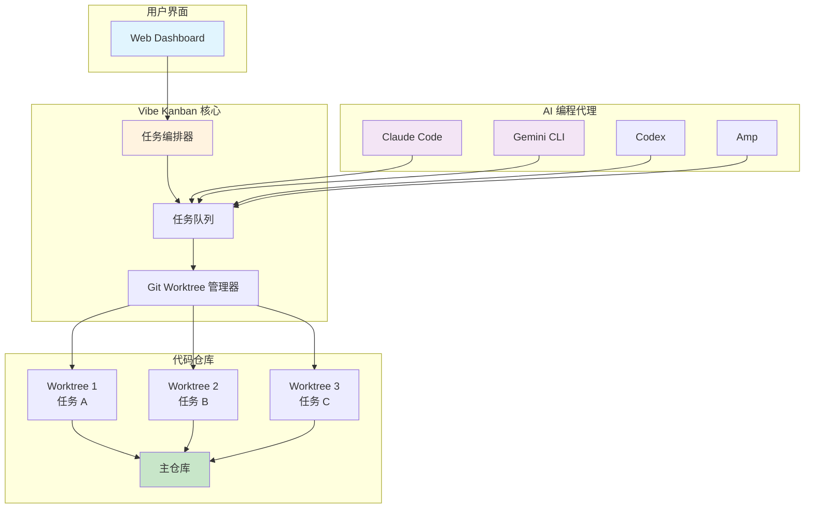
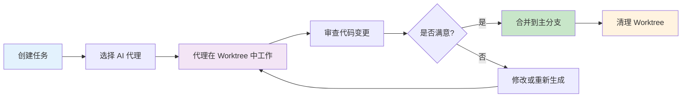
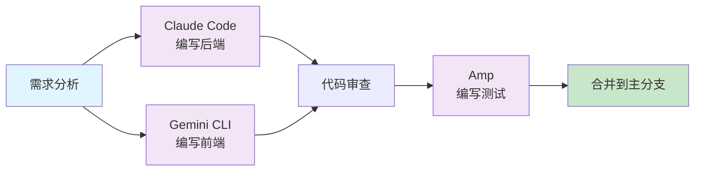

## 概述

Vibe Kanban 是一个 **AI 编程代理的编排平台**，旨在帮助开发者从 Claude Code、Gemini CLI、Codex、Amp 等 AI 编程工具中获得 10 倍的效率提升。

随着 AI 编程代理越来越广泛地编写代码，人类工程师现在花费大部分时间在规划、审查和编排任务上。Vibe Kanban 简化了这一流程，让你能够：

- **灵活切换**：在不同的 AI 编程代理之间轻松切换
- **任务编排**：并行或串行编排多个 AI 编程代理的执行
- **快速审查**：快速审查工作成果并启动开发服务器
- **状态跟踪**：跟踪 AI 代理正在处理的任务状态
- **配置集中化**：集中管理 AI 编程代理的 MCP 配置
- **远程访问**：通过 SSH 在远程服务器上打开项目

## 架构设计

Vibe Kanban 引入了一个以任务为中心的编排层，每个 AI 编程任务通过 git worktrees 完全隔离运行，让你对合并到代码库的内容进行细粒度控制。



## 核心特性

### 🔀 代理切换

在不同的 AI 编程代理之间无缝切换，无需重新配置：

- Claude Code
- Gemini CLI
- Codex
- Amp
- 其他支持的编码代理

### 🎯 任务编排

- **并行执行**：同时运行多个 AI 编程代理处理不同的任务
- **串行执行**：按顺序执行依赖任务
- **任务队列**：管理待处理、进行中和已完成的任务

### 🛡️ 隔离执行

每个 AI 编程任务在独立的 git worktree 中运行：

- 与主代码库完全隔离
- 安全的代码审查流程
- 灵活的合并策略

### 🔧 MCP 集成

- 集中管理所有 AI 编程代理的 MCP 配置
- 支持 Model Context Protocol
- 统一的工具和服务访问

## 快速开始

### 前置条件

确保你已使用自己喜欢的 AI 编程代理进行身份验证。完整的支持列表可以在[官方文档](https://vibekanban.com/docs)中找到。

### 安装运行

```bash
npx vibe-kanban
```

该命令将：
1. 下载并启动 Vibe Kanban 服务器
2. 在浏览器中打开 Web 界面
3. 连接到你的 AI 编程代理

### 基本使用

| 操作 | 命令/快捷键 | 位置 |
|------|-----------|------|
| 启动 Vibe Kanban | `npx vibe-kanban` | 终端 |
| 使用固定端口 | `PORT=8080 npx vibe-kanban` | 终端 |
| 创建新任务 | 按 `c` 或点击 + 图标 | 项目页面 |
| 创建任务并启动 | 选择"创建并开始" | 任务创建对话框 |

## 远程部署

当在远程服务器上运行 Vibe Kanban 时（例如通过 systemctl、Docker 或云托管），你可以配置编辑器通过 SSH 打开项目：

### 配置步骤

1. **通过隧道访问**：使用 Cloudflare Tunnel、ngrok 或类似工具暴露 Web UI
2. **在设置中配置远程 SSH**（设置 → 编辑器集成）：
   - 将 **远程 SSH 主机** 设置为服务器主机名或 IP
   - 将 **远程 SSH 用户** 设置为你的 SSH 用户名（可选）
3. **前提条件**：
   - 从本地机器到远程服务器的 SSH 访问
   - 配置了 SSH 密钥（免密码认证）
   - VSCode Remote-SSH 扩展

配置完成后，"在 VSCode 中打开"按钮将生成类似 `vscode://vscode-remote/ssh-remote+user@host/path` 的 URL，在本地编辑器中打开并连接到远程服务器。

## 工作流程



## 与传统工作流的对比

| 特性 | 传统工作流 | Vibe Kanban |
|------|----------|-------------|
| 代理切换 | 需要重新配置 | 一键切换 |
| 任务隔离 | 手动管理分支 | 自动 Worktree 隔离 |
| 代码审查 | 手动合并 PR | 可视化审查 + 合并 |
| 并行执行 | 需要多个终端 | 统一管理 |
| 远程协作 | 复杂配置 | 内置 SSH 支持 |
| MCP 配置 | 分散管理 | 集中配置 |

## 使用场景

### 1. 多代理协作



### 2. 安全代码审查

每个 AI 生成的内容都在隔离的 Worktree 中，你可以：
- 查看具体的代码变更
- 运行测试验证
- 决定是否合并

### 3. 并行开发

同时处理多个功能或 bug 修复：
- 不同的 AI 代理处理不同的任务
- 任务之间完全隔离
- 统一的状态管理

## 相关资源

- [官方网站](https://vibekanban.com)
- [GitHub 仓库](https://github.com/BloopAI/vibe-kanban)
- [NPM 包](https://www.npmjs.com/package/vibe-kanban)
- [在线文档](https://vibekanban.com/docs)
- [视频介绍](https://youtu.be/TFT3KnZOOAk)

## 总结

Vibe Kanban 是现代 AI 辅助开发的理想工具，特别适合：

- **重度 AI 编程用户**：频繁使用 Claude Code、Gemini CLI 等工具
- **团队协作**：需要统一管理多个 AI 代理的输出
- **安全审查**：需要严格的代码审查流程
- **远程开发**：在远程服务器上进行 AI 编程

通过 Vibe Kanban，你可以将 AI 编程代理的效率提升到极致，同时保持对代码质量和安全的完全控制。
