本文档详细说明如何开发、构建和部署自己开发的 Higress Wasm 插件。

---

## 目录

1. [概述](#1-概述)
2. [环境准备](#2-环境准备)
3. [插件开发](#3-插件开发)
4. [编译构建](#4-编译构建)
5. [镜像打包与推送](#5-镜像打包与推送)
6. [插件部署](#6-插件部署)
7. [本地调试](#7-本地调试)
8. [高级配置](#8-高级配置)
9. [常见问题](#9-常见问题)
10. [参考资料](#10-参考资料)

---

## 1. 概述

Higress 基于 WebAssembly (Wasm) 技术提供了强大的插件扩展能力。通过 Wasm 插件机制，开发者可以使用 Go、Rust、C++ 等语言编写自定义插件，实现请求/响应的拦截、修改、认证鉴权等功能。

### 1.1 Wasm 插件的优势

| 特性 | 说明 |
|------|------|
| **插件生命周期与网关解耦** | 插件更新无需重新部署网关，支持热加载 |
| **高性能多语言支持** | 性能与 Lua 持平，远优于外置插件 |
| **安全沙箱** | Wasm 运行时提供安全隔离，插件异常不会导致网关崩溃 |

> **参考来源**: [30行代码写一个Wasm Go插件](https://github.com/higress-group/higress-group.github.io/blob/main/src/content/blog/30-line-wasm.md)

### 1.2 为什么选择 Go 而不是 Rust？

Higress 支持使用 Go、Rust、C++ 等多种语言编写 Wasm 插件。本文档以 **Go 语言**为主要示例，原因如下：

#### 性能对比

根据 Higress 官方测试数据，对于一段逻辑（循环执行20次请求头设置、获取、移除），不同语言实现的 Wasm 插件性能对比：

| 实现语言 | 请求延时增加 | 性能评价 |
|----------|-------------|----------|
| Lua | 0.20 毫秒 | 基准 |
| **Wasm (C++)** | 0.19 毫秒 | 最优 |
| **Wasm (Go)** | 0.20 毫秒 | 与 Lua 持平 |
| **Wasm (Rust)** | 0.21 毫秒 | 略慢于 Go |
| Wasm (AssemblyScript) | 0.21 毫秒 | 略慢于 Go |

> **结论**: Go 和 Rust 的性能差异极小（仅 0.01 毫秒），在实际生产环境中可以忽略不计。

#### Go vs Rust 详细对比

| 对比维度 | Go | Rust | 推荐场景 |
|----------|-----|------|----------|
| **学习曲线** | ⭐ 简单，语法直观 | ⭐⭐⭐ 陡峭，所有权系统复杂 | Go 适合快速上手 |
| **开发效率** | ⭐ 高，代码量少 | ⭐⭐ 中等，需要处理生命周期 | Go 适合快速迭代 |
| **运行性能** | ⭐⭐ 优秀 | ⭐ 极致（接近 C++） | Rust 适合极致性能 |
| **内存安全** | ⭐⭐ GC 自动管理 | ⭐ 编译期保证，零运行时开销 | Rust 更安全 |
| **编译产物大小** | ⭐⭐ 较大（~1-5MB） | ⭐ 较小（~100KB-1MB） | Rust 产物更小 |
| **生态支持** | ⭐ Higress 官方 SDK 完善 | ⭐⭐ 社区 SDK 可用 | Go 官方支持更好 |
| **调试体验** | ⭐ 简单直观 | ⭐⭐ 需要熟悉工具链 | Go 调试更友好 |
| **团队技能** | 大多数后端团队熟悉 | 需要专门学习 | 取决于团队背景 |

#### 选择建议

**推荐使用 Go 的场景：**
- 🚀 需要快速开发和迭代插件
- 👥 团队主要使用 Go/Java/Python 等语言
- 📚 希望利用 Higress 官方完善的 SDK 和文档
- 🔧 插件逻辑相对简单，不需要极致性能优化
- ⏱️ 项目时间紧迫，需要快速交付

**推荐使用 Rust 的场景：**
- ⚡ 对性能有极致要求（如高频调用的核心插件）
- 💾 需要精确控制内存使用
- 📦 希望生成更小的 Wasm 文件
- 🔒 需要编译期内存安全保证
- 🦀 团队已有 Rust 开发经验

#### 代码量对比示例

**Go 实现（约 30 行）：**
```go
package main

import (
    "github.com/higress-group/wasm-go/pkg/wrapper"
    "github.com/higress-group/proxy-wasm-go-sdk/proxywasm"
    "github.com/higress-group/proxy-wasm-go-sdk/proxywasm/types"
    "github.com/tidwall/gjson"
)

func main() {}

func init() {
    wrapper.SetCtx("my-plugin",
        wrapper.ParseConfigBy(parseConfig),
        wrapper.ProcessRequestHeadersBy(onHttpRequestHeaders),
    )
}

type MyConfig struct { content string }

func parseConfig(json gjson.Result, config *MyConfig, log wrapper.Log) error {
    config.content = json.Get("content").String()
    return nil
}

func onHttpRequestHeaders(ctx wrapper.HttpContext, config MyConfig, log wrapper.Log) types.Action {
    proxywasm.SendHttpResponse(200, nil, []byte(config.content), -1)
    return types.HeaderContinue
}
```

**Rust 实现（约 60+ 行）：**
```rust
use proxy_wasm::traits::*;
use proxy_wasm::types::*;
use serde::Deserialize;

proxy_wasm::main! {{
    proxy_wasm::set_root_context(|_| -> Box<dyn RootContext> {
        Box::new(MyPluginRoot { config: None })
    });
}}

#[derive(Deserialize, Clone)]
struct MyConfig { content: String }

struct MyPluginRoot { config: Option<MyConfig> }
struct MyPlugin { config: MyConfig }

impl Context for MyPluginRoot {}
impl Context for MyPlugin {}

impl RootContext for MyPluginRoot {
    fn on_configure(&mut self, _: usize) -> bool {
        if let Some(config_bytes) = self.get_plugin_configuration() {
            self.config = serde_json::from_slice(&config_bytes).ok();
        }
        true
    }
    fn create_http_context(&self, _: u32) -> Option<Box<dyn HttpContext>> {
        self.config.clone().map(|c| Box::new(MyPlugin { config: c }) as _)
    }
    fn get_type(&self) -> Option<ContextType> { Some(ContextType::HttpContext) }
}

impl HttpContext for MyPlugin {
    fn on_http_request_headers(&mut self, _: usize, _: bool) -> Action {
        self.send_http_response(200, vec![], Some(self.config.content.as_bytes()));
        Action::Pause
    }
}
```

> **参考来源**:
> - [30行代码写一个Wasm Go插件](https://github.com/higress-group/higress-group.github.io/blob/main/src/content/blog/30-line-wasm.md)
> - [Higress 官方性能测试数据](https://www.alibabacloud.com/blog/599847)

### 1.3 插件生效原理

```mermaid
graph LR
    A[编写代码] --> B[编译 Wasm]
    B --> C[构建 Docker 镜像]
    C --> D[推送镜像仓库]
    D --> E[创建 WasmPlugin 资源]
    E --> F[Istio 监听变化]
    F --> G[Gateway 拉取镜像]
    G --> H[Envoy 加载 Wasm]
```



---

## 2. 环境准备

### 2.1 开发环境要求

| 工具 | 版本要求 | 说明 |
|------|----------|------|
| **Go** | >= 1.24 | 原生支持 Wasm 编译 |
| **Docker** | 最新版 | 用于构建和推送镜像 |
| **kubectl** | 最新版 | 用于部署 K8s 资源 |
| **Higress** | >= 2.1.4 | 支持 Go 1.24 编译的 Wasm |

> **注意**: Go 1.24 已原生支持编译 Wasm 文件，Higress 已从 tinygo 0.29 + go 1.20 迁移到 Go 1.24 原生编译。
>
> **参考来源**: [使用 GO 语言开发 WASM 插件](https://higress.cn/docs/latest/user/wasm-go/)

### 2.2 安装 Go 环境

**MacOS:**
```bash
# 下载安装文件
curl -LO https://go.dev/dl/go1.24.4.darwin-amd64.pkg
# 打开安装文件进行安装
open go1.24.4.darwin-amd64.pkg
# 验证安装
go version
```

**Linux:**
```bash
# 下载并解压
rm -rf /usr/local/go && tar -C /usr/local -xzf go1.24.4.linux-amd64.tar.gz
export PATH=$PATH:/usr/local/go/bin
# 验证安装
go version
```

### 2.3 设置 Go 代理（国内环境）

```bash
go env -w GOPROXY=https://proxy.golang.com.cn,direct
```

---

## 3. 插件开发

### 3.1 初始化工程

```bash
# 创建项目目录
mkdir my-higress-plugin && cd my-higress-plugin

# 初始化 Go 模块
go mod init my-higress-plugin

# 下载依赖
go get github.com/higress-group/proxy-wasm-go-sdk@go-1.24
go get github.com/higress-group/wasm-go@main
go get github.com/tidwall/gjson
```

### 3.2 编写插件代码

创建 `main.go` 文件：

```go
package main

import (
    "github.com/higress-group/wasm-go/pkg/wrapper"
    logs "github.com/higress-group/wasm-go/pkg/log"
    "github.com/higress-group/proxy-wasm-go-sdk/proxywasm"
    "github.com/higress-group/proxy-wasm-go-sdk/proxywasm/types"
    "github.com/tidwall/gjson"
)

func main() {}

func init() {
    wrapper.SetCtx(
        "my-plugin",                              // 插件名称
        wrapper.ParseConfigBy(parseConfig),       // 配置解析函数
        wrapper.ProcessRequestHeadersBy(onHttpRequestHeaders), // 请求头处理函数
    )
}

// 自定义插件配置
type MyConfig struct {
    mockEnable bool
    content    string
}

// 解析插件配置（YAML 会自动转换为 JSON）
func parseConfig(json gjson.Result, config *MyConfig, log logs.Log) error {
    config.mockEnable = json.Get("mockEnable").Bool()
    config.content = json.Get("content").String()
    return nil
}

// 处理 HTTP 请求头
func onHttpRequestHeaders(ctx wrapper.HttpContext, config MyConfig, log logs.Log) types.Action {
    proxywasm.AddHttpRequestHeader("X-Custom-Header", "higress-plugin")
    
    if config.mockEnable {
        proxywasm.SendHttpResponse(200, nil, []byte(config.content), -1)
    }
    return types.HeaderContinue
}
```

> **参考来源**: [30行代码写一个Wasm Go插件](https://github.com/higress-group/higress-group.github.io/blob/main/src/content/blog/30-line-wasm.md)

### 3.3 HTTP 处理挂载点

| HTTP 处理阶段 | 触发时机 | 挂载方法 |
|--------------|----------|----------|
| 请求头处理 | 接收到客户端请求头 | `wrapper.ProcessRequestHeadersBy` |
| 请求 Body 处理 | 接收到客户端请求 Body | `wrapper.ProcessRequestBodyBy` |
| 应答头处理 | 接收到后端响应头 | `wrapper.ProcessResponseHeadersBy` |
| 应答 Body 处理 | 接收到后端响应 Body | `wrapper.ProcessResponseBodyBy` |

---

## 4. 编译构建

### 4.1 本地编译 Wasm 文件

```bash
# 整理依赖
go mod tidy

# 编译生成 Wasm 文件
GOOS=wasip1 GOARCH=wasm go build -buildmode=c-shared -o main.wasm ./
```

编译成功后会生成 `main.wasm` 文件。

> **参考来源**: [自定义插件](https://higress.cn/docs/latest/plugins/custom/)

### 4.2 使用 Docker 容器编译（推荐）

如果本地环境配置困难，可以使用官方提供的构建容器：

```bash
GO_VERSION="1.24"
PLUGIN_NAME="my-plugin"
BUILDER_IMAGE="higress-registry.cn-hangzhou.cr.aliyuncs.com/plugins/wasm-go-builder:go${GO_VERSION}"

docker run -v ${PWD}:/workspace -e PLUGIN_NAME=${PLUGIN_NAME} -it --rm ${BUILDER_IMAGE} /bin/bash

# 在容器内执行
cd /workspace
go mod tidy
GOOS=wasip1 GOARCH=wasm go build -buildmode=c-shared -o main.wasm ./
```

---

## 5. 镜像打包与推送

### 5.1 创建 Dockerfile

```dockerfile
FROM scratch
COPY main.wasm plugin.wasm
```

### 5.2 构建并推送镜像

```bash
# 构建镜像
docker build -t your-registry.com/plugins/my-plugin:1.0.0 .

# 推送镜像
docker push your-registry.com/plugins/my-plugin:1.0.0
```

### 5.3 使用 OCI 格式推送（高级）

对于需要在插件市场发布的标准插件，可以使用 OCI 格式：

```bash
# 安装 oras 工具
# 打包 wasm 文件
tar czvf plugin.tar.gz main.wasm

# 推送 OCI 镜像
oras push your-registry.com/plugins/my-plugin:1.0.0 \
    ./spec.yaml:application/vnd.module.wasm.spec.v1+yaml \
    ./README.md:application/vnd.module.wasm.doc.v1+markdown \
    ./plugin.tar.gz:application/vnd.oci.image.layer.v1.tar+gzip
```

> **参考来源**: [Wasm 插件镜像规范](https://higress.cn/docs/latest/user/wasm-image-spec/)

---

## 6. 插件部署

### 6.1 方式一：使用 Higress 控制台

1. 登录 Higress 控制台
2. 进入 **插件市场** → 点击 **创建** 按钮
3. 填写插件信息：
   - **插件名称**: my-plugin
   - **镜像地址**: `oci://your-registry.com/plugins/my-plugin:1.0.0`
4. 点击 **确定** 创建插件
5. 点击插件卡片的 **配置** 按钮，填入配置并开启

### 6.2 方式二：使用 WasmPlugin CRD

创建 `wasmplugin.yaml` 文件：

```yaml
apiVersion: extensions.higress.io/v1alpha1
kind: WasmPlugin
metadata:
  name: my-plugin
  namespace: higress-system
spec:
  # 全局默认配置
  defaultConfig:
    mockEnable: false
    content: "hello higress"
  # 插件镜像地址（需要以 oci:// 开头）
  url: oci://your-registry.com/plugins/my-plugin:1.0.0
  # 插件执行阶段：AUTHN, AUTHZ, STATS, UNSPECIFIED_PHASE
  phase: UNSPECIFIED_PHASE
  # 插件优先级（数值越大优先级越高）
  priority: 100
```

应用配置：

```bash
kubectl apply -f wasmplugin.yaml
```

> **参考来源**: [30行代码写一个Wasm Go插件](https://github.com/higress-group/higress-group.github.io/blob/main/src/content/blog/30-line-wasm.md)

### 6.3 路由/域名级配置

```yaml
apiVersion: extensions.higress.io/v1alpha1
kind: WasmPlugin
metadata:
  name: my-plugin
  namespace: higress-system
spec:
  defaultConfig:
    mockEnable: false
  matchRules:
    # 路由级配置
    - ingress:
        - default/api-route    # namespace/ingress-name
      config:
        mockEnable: true
        content: "hello api"
    # 域名级配置
    - domain:
        - "*.example.com"
      config:
        mockEnable: true
        content: "hello example"
  url: oci://your-registry.com/plugins/my-plugin:1.0.0
```

---

## 7. 本地调试

### 7.1 使用 Docker Compose 调试

创建 `docker-compose.yaml`：

```yaml
version: '3.7'
services:
  envoy:
    image: higress-registry.cn-hangzhou.cr.aliyuncs.com/higress/gateway:v2.1.5
    entrypoint: /usr/local/bin/envoy
    command: -c /etc/envoy/envoy.yaml --component-log-level wasm:debug
    depends_on:
      - httpbin
    ports:
      - "10000:10000"
    volumes:
      - ./envoy.yaml:/etc/envoy/envoy.yaml
      - ./main.wasm:/etc/envoy/main.wasm

  httpbin:
    image: kennethreitz/httpbin:latest
    ports:
      - "12345:80"
```

创建 `envoy.yaml`：

```yaml
admin:
  address:
    socket_address:
      protocol: TCP
      address: 0.0.0.0
      port_value: 9901

static_resources:
  listeners:
    - name: listener_0
      address:
        socket_address:
          protocol: TCP
          address: 0.0.0.0
          port_value: 10000
      filter_chains:
        - filters:
            - name: envoy.filters.network.http_connection_manager
              typed_config:
                "@type": type.googleapis.com/envoy.extensions.filters.network.http_connection_manager.v3.HttpConnectionManager
                stat_prefix: ingress_http
                route_config:
                  name: local_route
                  virtual_hosts:
                    - name: local_service
                      domains: ["*"]
                      routes:
                        - match:
                            prefix: "/"
                          route:
                            cluster: httpbin
                http_filters:
                  - name: wasmdemo
                    typed_config:
                      "@type": type.googleapis.com/udpa.type.v1.TypedStruct
                      type_url: type.googleapis.com/envoy.extensions.filters.http.wasm.v3.Wasm
                      value:
                        config:
                          name: wasmdemo
                          vm_config:
                            runtime: envoy.wasm.runtime.v8
                            code:
                              local:
                                filename: /etc/envoy/main.wasm
                          configuration:
                            "@type": "type.googleapis.com/google.protobuf.StringValue"
                            value: |
                              {
                                "mockEnable": false
                              }
                  - name: envoy.filters.http.router
                    typed_config:
                      "@type": type.googleapis.com/envoy.extensions.filters.http.router.v3.Router

  clusters:
    - name: httpbin
      connect_timeout: 30s
      type: LOGICAL_DNS
      dns_lookup_family: V4_ONLY
      lb_policy: ROUND_ROBIN
      load_assignment:
        cluster_name: httpbin
        endpoints:
          - lb_endpoints:
              - endpoint:
                  address:
                    socket_address:
                      address: httpbin
                      port_value: 80
```

启动调试环境：

```bash
docker compose up
```

测试插件：

```bash
# 直接访问 httpbin
curl http://127.0.0.1:12345/get

# 通过网关访问（插件生效）
curl http://127.0.0.1:10000/get
```

> **参考来源**: [使用 GO 语言开发 WASM 插件](https://higress.cn/docs/latest/user/wasm-go/)

---

## 8. 高级配置

### 8.1 在插件中请求外部服务

```go
func onHttpRequestHeaders(ctx wrapper.HttpContext, config MyConfig, log logs.Log) types.Action {
    err := config.client.Get("/api/auth", nil,
        func(statusCode int, responseHeaders http.Header, responseBody []byte) {
            if statusCode != http.StatusOK {
                proxywasm.SendHttpResponse(http.StatusUnauthorized, nil, []byte("Unauthorized"), -1)
                return
            }
            // 继续处理请求
            proxywasm.ResumeHttpRequest()
        })

    if err != nil {
        return types.HeaderContinue
    }
    // 等待异步回调完成
    return types.HeaderStopAllIterationAndWatermark
}
```

### 8.2 在插件中调用 Redis

```go
func parseConfig(json gjson.Result, config *RedisConfig, log logs.Log) error {
    serviceName := json.Get("serviceName").String()
    servicePort := json.Get("servicePort").Int()

    config.client = wrapper.NewRedisClusterClient(wrapper.FQDNCluster{
        FQDN: serviceName,
        Port: servicePort,
    })
    return config.client.Init(username, password, timeout)
}
```

### 8.3 Header 状态管理

| 状态 | 说明 |
|------|------|
| `HeaderContinue` | 当前 filter 处理完毕，继续下一个 filter |
| `HeaderStopIteration` | Header 暂停，等待 Body 处理 |
| `HeaderStopAllIterationAndWatermark` | 停止所有迭代，需调用 `ResumeHttpRequest()` 恢复 |

---

## 9. 常见问题

### Q1: 插件更新后如何生效？

构建新版本镜像并使用不同的 tag，然后更新 WasmPlugin 资源中的镜像地址。Envoy 使用 ECDS 机制实现热加载，不会中断连接。

### Q2: 如何查看插件日志？

```bash
kubectl logs -n higress-system deployment/higress-gateway -f | grep wasm
```

### Q3: 插件配置格式是什么？

控制台中使用 YAML 格式配置，下发给插件时会自动转换为 JSON 格式。

### Q4: 从 tinygo 迁移到 Go 1.24 需要注意什么？

1. 将初始化逻辑从 `main()` 函数移到 `init()` 函数
2. 将 `types.ActionPause` 改为 `types.HeaderStopAllIterationAndWatermark`
3. 如果使用了 `go-re2`，需替换为官方 `regexp` 库

---

## 10. 参考资料

| 资源 | 链接 |
|------|------|
| Higress 官方文档 | https://higress.cn/docs/latest/ |
| 使用 GO 语言开发 WASM 插件 | https://higress.cn/docs/latest/user/wasm-go/ |
| 自定义插件 | https://higress.cn/docs/latest/plugins/custom/ |
| Wasm 插件镜像规范 | https://higress.cn/docs/latest/user/wasm-image-spec/ |
| 30行代码写一个Wasm Go插件 | https://github.com/higress-group/higress-group.github.io/blob/main/src/content/blog/30-line-wasm.md |
| Higress Wasm SDK | https://github.com/higress-group/wasm-go |
| proxy-wasm-go-sdk | https://github.com/higress-group/proxy-wasm-go-sdk |
| 官方插件示例 | https://github.com/alibaba/higress/tree/main/plugins/wasm-go/extensions |
| Istio WasmPlugin API | https://istio.io/latest/docs/reference/config/proxy_extensions/wasm-plugin/ |

---

## 附录：完整示例项目结构

```
my-higress-plugin/
├── main.go              # 插件主代码
├── go.mod               # Go 模块定义
├── go.sum               # 依赖校验
├── Dockerfile           # Docker 构建文件
├── wasmplugin.yaml      # K8s 部署配置
├── docker-compose.yaml  # 本地调试配置
├── envoy.yaml           # Envoy 配置
└── README.md            # 插件说明文档
```


