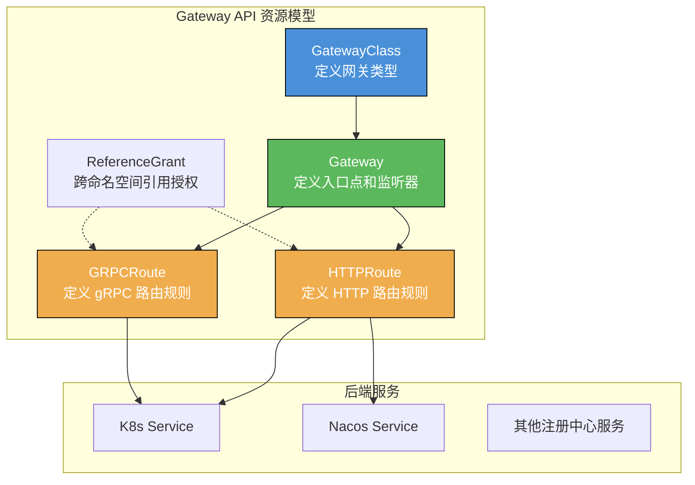

本文档基于 [Higress 官方博客](https://github.com/higress-group/higress-group.github.io/blob/main/src/content/blog/) 和 [Kubernetes Gateway API 官方文档](https://gateway-api.sigs.k8s.io/) 整理，详细介绍 Higress 对 Gateway API 的支持能力和使用方法。

> **说明**：本文档介绍的是 Kubernetes Gateway API（声明式 CRD 配置）。如需了解 Higress 的 REST API 编程接口，请参考 [Higress REST API 使用指南](./higress-rest-api-guide.md)。

---

## 1. 概述

### 1.1 什么是 Gateway API

Gateway API 是 Kubernetes 官方项目，专注于 L4 和 L7 路由，代表了 Kubernetes Ingress、负载均衡和服务网格 API 的下一代标准。相比传统的 Ingress API，Gateway API 具有以下优势：

- **角色导向**：通过不同资源类型实现职责分离（基础设施提供者、集群运维、应用开发者）
- **可移植性**：标准化 API，多种实现支持
- **表达能力强**：原生支持 Header 匹配、流量权重、重定向等高级功能
- **可扩展性**：支持在 API 各层级链接自定义资源

### 1.2 Higress 对 Gateway API 的支持

Higress 从 1.3 版本开始支持 Gateway API，目前支持的 API 版本为 **v1.0.0**，包括：

| 资源类型 | API 版本 | 状态 |
|---------|---------|------|
| GatewayClass | `gateway.networking.k8s.io/v1` | GA |
| Gateway | `gateway.networking.k8s.io/v1` | GA |
| HTTPRoute | `gateway.networking.k8s.io/v1` | GA |
| GRPCRoute | `gateway.networking.k8s.io/v1` | 支持 |
| ReferenceGrant | `gateway.networking.k8s.io/v1beta1` | 支持 |

---

## 2. 架构设计



### 2.1 角色与职责分离

| 角色 | 职责 | 管理的资源 |
|------|------|-----------|
| **基础设施提供者** | 管理网关控制器 | GatewayClass |
| **集群运维 (SRE)** | 管理域名、证书、入口配置 | Gateway |
| **应用开发者** | 管理业务路由规则 | HTTPRoute, GRPCRoute |

---

## 3. 环境准备

### 3.1 安装 Gateway API CRDs

```bash
# 安装 Gateway API v1.0.0 CRDs
kubectl apply -f https://github.com/kubernetes-sigs/gateway-api/releases/download/v1.0.0/experimental-install.yaml
```

### 3.2 部署支持 Gateway API 的 Higress

#### 方式一：使用 Helm

```bash
# 添加 Higress Helm 仓库
helm repo add higress.io https://higress.io/helm-charts

# 安装 Higress 并启用 Gateway API
helm install higress higress.io/higress \
  -n higress-system \
  --create-namespace \
  --set global.enableGatewayAPI=true
```

#### 方式二：使用 hgctl

```bash
# 下载 hgctl
curl -Ls https://raw.githubusercontent.com/alibaba/higress/main/tools/hack/get-hgctl.sh | VERSION=latest bash

# 安装 Higress（交互式选择 local-k8s 模式，默认安装 Gateway API CRD）
hgctl install
```

#### 方式三：升级现有 Higress 实例

```bash
helm upgrade higress higress.io/higress \
  -n higress-system \
  --set global.enableGatewayAPI=true \
  --reuse-values
```

---

## 4. 核心资源配置

### 4.1 GatewayClass

GatewayClass 定义了网关控制器类型，由 Higress 控制器管理。

```yaml
apiVersion: gateway.networking.k8s.io/v1
kind: GatewayClass
metadata:
  name: higress-gateway
spec:
  controllerName: "higress.io/gateway-controller"
```

### 4.2 Gateway

Gateway 定义了流量入口点，包括监听的端口、协议和域名。

#### 基础 HTTP Gateway

```yaml
apiVersion: gateway.networking.k8s.io/v1
kind: Gateway
metadata:
  name: higress-gateway
  namespace: higress-system
spec:
  gatewayClassName: higress-gateway
  listeners:
    - name: http
      hostname: "*.example.com"
      port: 80
      protocol: HTTP
      allowedRoutes:
        namespaces:
          from: All
```

#### 配置 HTTPS Gateway

```yaml
apiVersion: gateway.networking.k8s.io/v1
kind: Gateway
metadata:
  name: higress-gateway
  namespace: higress-system
spec:
  gatewayClassName: higress-gateway
  listeners:
    # HTTP 监听器
    - name: http
      hostname: "*.example.com"
      port: 80
      protocol: HTTP
      allowedRoutes:
        namespaces:
          from: All
    # HTTPS 监听器
    - name: https
      hostname: "*.example.com"
      port: 443
      protocol: HTTPS
      allowedRoutes:
        namespaces:
          from: All
      tls:
        mode: Terminate
        certificateRefs:
          - kind: Secret
            name: wildcard-example-com-tls
```

### 4.3 HTTPRoute

HTTPRoute 定义 HTTP 路由规则，是最常用的路由资源。

#### 基础路由

```yaml
apiVersion: gateway.networking.k8s.io/v1
kind: HTTPRoute
metadata:
  name: api-route
  namespace: default
spec:
  parentRefs:
    - name: higress-gateway
      namespace: higress-system
  hostnames:
    - "api.example.com"
  rules:
    - matches:
        - path:
            type: PathPrefix
            value: /
      backendRefs:
        - name: api-service
          port: 8080
```

#### 路径匹配路由

```yaml
apiVersion: gateway.networking.k8s.io/v1
kind: HTTPRoute
metadata:
  name: multi-path-route
  namespace: default
spec:
  parentRefs:
    - name: higress-gateway
      namespace: higress-system
  hostnames:
    - "www.example.com"
  rules:
    # /api 路径路由到 api-service
    - matches:
        - path:
            type: PathPrefix
            value: /api
      backendRefs:
        - name: api-service
          port: 8080
    # /web 路径路由到 web-service
    - matches:
        - path:
            type: PathPrefix
            value: /web
      backendRefs:
        - name: web-service
          port: 80
```

#### Header 匹配路由

```yaml
apiVersion: gateway.networking.k8s.io/v1
kind: HTTPRoute
metadata:
  name: header-match-route
  namespace: default
spec:
  parentRefs:
    - name: higress-gateway
      namespace: higress-system
  hostnames:
    - "api.example.com"
  rules:
    - matches:
        - headers:
            - name: X-Version
              value: v2
      backendRefs:
        - name: api-v2-service
          port: 8080
    - matches:
        - path:
            type: PathPrefix
            value: /
      backendRefs:
        - name: api-v1-service
          port: 8080
```

#### 流量权重分配（灰度发布）

```yaml
apiVersion: gateway.networking.k8s.io/v1
kind: HTTPRoute
metadata:
  name: canary-route
  namespace: default
spec:
  parentRefs:
    - name: higress-gateway
      namespace: higress-system
  hostnames:
    - "api.example.com"
  rules:
    - matches:
        - path:
            type: PathPrefix
            value: /
      backendRefs:
        # 90% 流量到稳定版本
        - name: api-stable
          port: 8080
          weight: 90
        # 10% 流量到金丝雀版本
        - name: api-canary
          port: 8080
          weight: 10
```

#### 请求头修改

```yaml
apiVersion: gateway.networking.k8s.io/v1
kind: HTTPRoute
metadata:
  name: header-modifier-route
  namespace: default
spec:
  parentRefs:
    - name: higress-gateway
      namespace: higress-system
  hostnames:
    - "api.example.com"
  rules:
    - matches:
        - path:
            type: PathPrefix
            value: /
      filters:
        - type: RequestHeaderModifier
          requestHeaderModifier:
            add:
              - name: X-Gateway
                value: higress
            set:
              - name: X-Forwarded-Proto
                value: https
            remove:
              - X-Internal-Header
      backendRefs:
        - name: api-service
          port: 8080
```

#### URL 重定向

```yaml
apiVersion: gateway.networking.k8s.io/v1
kind: HTTPRoute
metadata:
  name: redirect-route
  namespace: default
spec:
  parentRefs:
    - name: higress-gateway
      namespace: higress-system
  hostnames:
    - "old.example.com"
  rules:
    - matches:
        - path:
            type: PathPrefix
            value: /
      filters:
        - type: RequestRedirect
          requestRedirect:
            hostname: new.example.com
            statusCode: 301
```

#### URL 重写

```yaml
apiVersion: gateway.networking.k8s.io/v1
kind: HTTPRoute
metadata:
  name: rewrite-route
  namespace: default
spec:
  parentRefs:
    - name: higress-gateway
      namespace: higress-system
  hostnames:
    - "api.example.com"
  rules:
    - matches:
        - path:
            type: PathPrefix
            value: /v1/users
      filters:
        - type: URLRewrite
          urlRewrite:
            path:
              type: ReplacePrefixMatch
              replacePrefixMatch: /api/users
      backendRefs:
        - name: user-service
          port: 8080
```

---

## 5. 高级功能

### 5.1 对接多种服务发现

Higress 的独特优势是支持在 Gateway API 下对接多种服务发现机制。

#### 配置 McpBridge

```yaml
apiVersion: networking.higress.io/v1
kind: McpBridge
metadata:
  name: default
  namespace: higress-system
spec:
  registries:
    # Nacos 注册中心
    - name: my-nacos
      type: nacos2
      domain: nacos.example.com
      port: 8848
      nacosGroups:
        - DEFAULT_GROUP
    # Zookeeper 注册中心
    - name: my-zk
      type: zookeeper
      domain: zk.example.com
      port: 2181
    # Eureka 注册中心
    - name: my-eureka
      type: eureka
      domain: eureka.example.com
      port: 8761
    # Consul 注册中心
    - name: my-consul
      type: consul
      domain: consul.example.com
      port: 8500
      consulDatacenter: dc1
```

#### 混合路由（K8s Service + Nacos Service）

```yaml
apiVersion: gateway.networking.k8s.io/v1
kind: HTTPRoute
metadata:
  name: hybrid-route
  namespace: default
spec:
  parentRefs:
    - name: higress-gateway
      namespace: higress-system
  hostnames:
    - "api.example.com"
  rules:
    - matches:
        - path:
            type: PathPrefix
            value: /
      backendRefs:
        # Nacos 注册的服务（90% 流量）
        - name: service-provider.DEFAULT-GROUP.public.nacos
          group: networking.higress.io
          port: 8080
          weight: 90
        # K8s Service（10% 流量）
        - name: k8s-service
          port: 8080
          weight: 10
```

### 5.2 跨命名空间路由

使用 ReferenceGrant 允许跨命名空间引用后端服务。

#### 创建 ReferenceGrant

```yaml
apiVersion: gateway.networking.k8s.io/v1beta1
kind: ReferenceGrant
metadata:
  name: allow-from-default
  namespace: backend-ns
spec:
  from:
    - group: gateway.networking.k8s.io
      kind: HTTPRoute
      namespace: default
  to:
    - group: ""
      kind: Service
```

#### 跨命名空间 HTTPRoute

```yaml
apiVersion: gateway.networking.k8s.io/v1
kind: HTTPRoute
metadata:
  name: cross-ns-route
  namespace: default
spec:
  parentRefs:
    - name: higress-gateway
      namespace: higress-system
  hostnames:
    - "api.example.com"
  rules:
    - matches:
        - path:
            type: PathPrefix
            value: /backend
      backendRefs:
        - name: backend-service
          namespace: backend-ns  # 跨命名空间引用
          port: 8080
```

### 5.3 GRPCRoute 配置

```yaml
apiVersion: gateway.networking.k8s.io/v1
kind: GRPCRoute
metadata:
  name: grpc-route
  namespace: default
spec:
  parentRefs:
    - name: higress-gateway
      namespace: higress-system
  hostnames:
    - "grpc.example.com"
  rules:
    - matches:
        - method:
            service: myapp.UserService
            method: GetUser
      backendRefs:
        - name: user-grpc-service
          port: 9090
```

---

## 6. 与 Ingress API 的对比和选择

### 6.1 功能对比

| 功能 | Ingress API | Gateway API |
|------|-------------|-------------|
| 路径匹配 | ✅ | ✅ |
| Host 匹配 | ✅ | ✅ |
| Header 匹配 | ❌ (需注解) | ✅ |
| 流量权重 | ❌ (需注解) | ✅ |
| 请求头修改 | ❌ (需注解) | ✅ |
| URL 重写 | ❌ (需注解) | ✅ |
| 跨命名空间路由 | ❌ | ✅ |
| 角色分离 | ❌ | ✅ |
| TLS 配置 | ✅ | ✅ |

### 6.2 选择建议

**推荐使用 Gateway API 的场景：**

1. 大型团队需要 SRE 和开发者职责分离
2. 需要跨命名空间路由
3. 需要集中式证书管理
4. 需要原生支持高级路由功能（Header 匹配、流量权重等）

**继续使用 Ingress API 的场景：**

1. 简单用例，Ingress 已满足需求
2. 团队熟悉 Ingress，迁移成本高
3. 现有工具链依赖 Ingress

### 6.3 混合使用

Higress 支持 Gateway API 和 Ingress API 混合使用：

- Gateway API 下的域名路由优先匹配
- 相同资源名称的 HTTPRoute 会继承 WASM 插件配置
- 可以平滑地从 Ingress API 演进到 Gateway API

---

## 7. 验证和调试

### 7.1 检查资源状态

```bash
# 查看 GatewayClass
kubectl get gatewayclass

# 查看 Gateway
kubectl get gateway -n higress-system

# 查看 HTTPRoute
kubectl get httproute -A

# 查看详细状态
kubectl describe gateway higress-gateway -n higress-system
kubectl describe httproute api-route -n default
```

### 7.2 使用 hgctl 调试

```bash
# 查看网关配置
hgctl gateway-config route

# 查看监听器配置
hgctl gateway-config listener

# 查看集群配置
hgctl gateway-config cluster
```

### 7.3 测试路由

```bash
# 获取网关 IP
GATEWAY_IP=$(kubectl get svc -n higress-system higress-gateway -o jsonpath='{.status.loadBalancer.ingress[0].ip}')

# 测试 HTTP 路由
curl -H "Host: api.example.com" http://$GATEWAY_IP/

# 测试 Header 匹配
curl -H "Host: api.example.com" -H "X-Version: v2" http://$GATEWAY_IP/
```

---

## 8. 最佳实践

### 8.1 资源组织

1. **GatewayClass**：集群级别，由基础设施团队管理
2. **Gateway**：部署在 `higress-system` 命名空间，由 SRE 团队管理
3. **HTTPRoute**：部署在应用命名空间，由开发团队管理

### 8.2 命名规范

```yaml
# GatewayClass 命名
name: higress-gateway

# Gateway 命名：{用途}-gateway
name: production-gateway
name: internal-gateway

# HTTPRoute 命名：{应用}-{功能}-route
name: user-api-route
name: order-service-route
```

### 8.3 安全配置

1. 使用 `allowedRoutes` 限制可关联的命名空间
2. 使用 ReferenceGrant 控制跨命名空间访问
3. 为 HTTPS 监听器配置 TLS 证书

```yaml
# 限制只允许特定命名空间的路由
listeners:
  - name: http
    allowedRoutes:
      namespaces:
        from: Selector
        selector:
          matchLabels:
            gateway-access: "true"
```

---

## 9. 常见问题

### Q1: Gateway API 和 Ingress API 可以同时使用吗？

可以。Higress 支持同时启用两种 API，Gateway API 的路由优先级更高。

### Q2: 如何从 Ingress 迁移到 Gateway API？

1. 先启用 Gateway API 支持
2. 创建 GatewayClass 和 Gateway 资源
3. 逐步将 Ingress 转换为 HTTPRoute
4. 验证功能后删除旧的 Ingress 资源

### Q3: Higress 支持哪个版本的 Gateway API？

目前支持 Gateway API v1.0.0，包括 GatewayClass、Gateway、HTTPRoute 等 GA 资源。

### Q4: 如何配置 WASM 插件与 Gateway API 配合使用？

WASM 插件配置与 Ingress API 相同，通过 WasmPlugin CRD 配置，可以通过 `matchRules` 匹配 HTTPRoute。

---

## 10. 参考资料

- [Higress 开源一周年：新版本，新标准，新工具，新征程](https://github.com/higress-group/higress-group.github.io/blob/main/src/content/blog/release-1.3.md)
- [Kubernetes Gateway API 官方文档](https://gateway-api.sigs.k8s.io/)
- [Higress 官方文档 - Helm 部署](https://higress.io/docs/latest/ops/deploy-by-helm/)
- [Higress Gateway API 示例](https://github.com/alibaba/higress/blob/main/samples/gateway-api/demo.yaml)
- [Gateway API 规范](https://gateway-api.sigs.k8s.io/reference/spec/)

