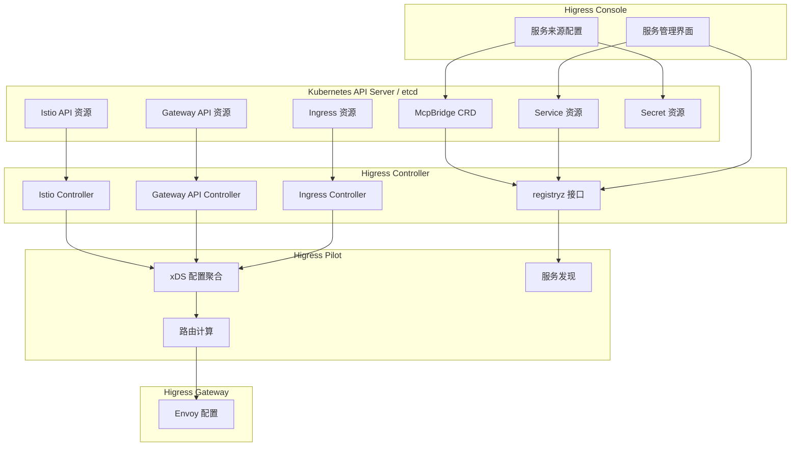
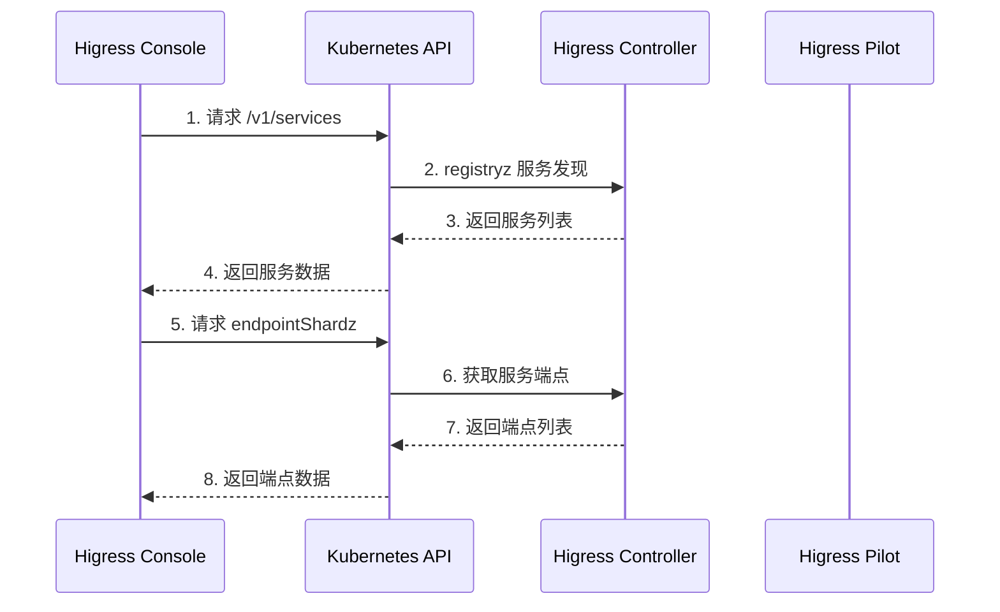
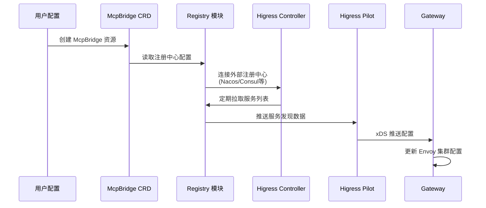
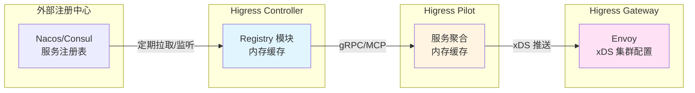
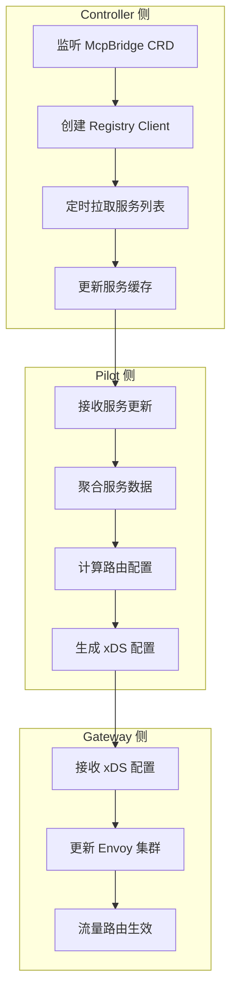
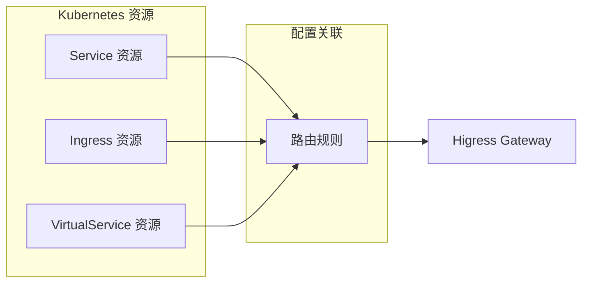
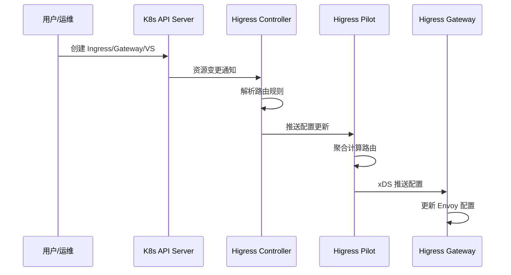

# Higress 路由与服务在 Kubernetes 中的存储位置

本文档详细说明 Higress 使用 Helm 方式部署时，创建的路由、服务和配置如何存储在 Kubernetes 集群中。

## 目录

- [架构概览](#架构概览)
- [支持的 API 类型](#支持的-api-类型)
- [配置存储位置](#配置存储位置)
- [配置同步流程](#配置同步流程)
- [查看配置的方法](#查看配置的方法)

---

## 架构概览



---

## 支持的 API 类型

Higress 支持三种主要的 Kubernetes API 来定义路由规则：

### 1. Kubernetes Ingress API

```yaml
# 存储位置: Kubernetes Ingress 资源
apiVersion: networking.k8s.io/v1
kind: Ingress
metadata:
  name: example-ingress
  namespace: default
  annotations:
    # Higress 特定注解
    higress.io/destination: "example-service:8080"
spec:
  ingressClassName: higress
  rules:
    - host: example.com
      http:
        paths:
          - path: /
            pathType: Prefix
            backend:
              service:
                name: example-service
                port:
                  number: 8080
```

### 2. Gateway API (Kubernetes Gateway)

```yaml
# 存储位置: Gateway API CRD
apiVersion: gateway.networking.k8s.io/v1beta1
kind: Gateway
metadata:
  name: example-gateway
  namespace: default
spec:
  gatewayClassName: higress-gateway
  listeners:
    - name: http
      protocol: HTTP
      port: 80
      hostname: example.com
---
apiVersion: gateway.networking.k8s.io/v1beta1
kind: HTTPRoute
metadata:
  name: example-http-route
  namespace: default
spec:
  parentRefs:
    - name: example-gateway
  hostnames:
    - example.com
  rules:
    - backendRefs:
        - name: example-service
          port: 8080
```

### 3. Istio API

```yaml
# 存储位置: Istio CRD
apiVersion: networking.istio.io/v1beta1
kind: VirtualService
metadata:
  name: example-vs
  namespace: default
spec:
  hosts:
    - example.com
  gateways:
    - higress-gateway
  http:
    - route:
        - destination:
            host: example-service
            port:
              number: 8080
```

---

## 配置存储位置

### 1. Ingress 资源存储

**存储位置**: Kubernetes 原生 Ingress 资源

```bash
# 查看 Ingress 资源
kubectl get ingress -A

# 查看特定 Ingress 详情
kubectl describe ingress <name> -n <namespace>

# 查看 Ingress 的 YAML 定义
kubectl get ingress <name> -n <namespace> -o yaml
```

**存储特点**:
- 存储在 `etcd` 中，通过 Kubernetes API Server 访问
- Higress Controller 通过 `informers` 机制监听 Ingress 变化
- 支持 `ingressClass` 过滤，仅处理指定 class 的 Ingress

### 2. Gateway API 资源存储

**存储位置**: Kubernetes Gateway API CRD

```bash
# 查看 Gateway 资源
kubectl get gateway -A

# 查看 HTTPRoute 资源
kubectl get httproute -A

# 查看 GatewayClass 资源
kubectl get gatewayclass

# 查看特定资源详情
kubectl get gateway <name> -n <namespace> -o yaml
```

**相关 CRD**:
- `Gateway`: 定义网关监听器
- `HTTPRoute`: HTTP 路由规则
- `HTTPSRoute`: HTTPS 路由规则
- `TCPRoute`: TCP 路由规则
- `TLSRoute`: TLS 路由规则
- `GatewayClass`: 网关类定义
- `ReferenceGrant`: 跨命名空间引用授权

### 3. Istio API 资源存储

**存储位置**: Istio CRD

```bash
# 查看 VirtualService 资源
kubectl get virtualservice -A

# 查看 DestinationRule 资源
kubectl get destinationrule -A

# 查看 EnvoyFilter 资源
kubectl get envoyfilter -A

# 查看特定资源详情
kubectl get virtualservice <name> -n <namespace> -o yaml
```

**相关 CRD**:
- `VirtualService`: 虚拟服务，定义路由规则
- `DestinationRule`: 目标规则，定义流量行为
- `Gateway`: 网关定义
- `ServiceEntry`: 外部服务条目
- `EnvoyFilter`: Envoy 过滤器扩展

### 4. Higress 配置存储

**存储位置**: ConfigMap

```bash
# 查看 Higress Controller ConfigMap
kubectl get configmap -n higress-system

# 查看特定 ConfigMap
kubectl describe configmap higress-config -n higress-system
```

Higress 将以下配置存储在 ConfigMap 中：

#### 4.1 全局配置 ConfigMap

```yaml
apiVersion: v1
kind: ConfigMap
metadata:
  name: higress-config
  namespace: higress-system
data:
  # 全局配置项
  enableStatus: "true"
  ingressClass: "higress"
  watchNamespace: ""
```

#### 4.2 插件配置 ConfigMap

```yaml
apiVersion: v1
kind: ConfigMap
metadata:
  name: higress-plugins
  namespace: higress-system
data:
  # 插件配置
  plugins: |
    - name: request-block
      priority: 2900
      phase: AUTHN
```

#### 4.3 Wasm 插件配置

```yaml
apiVersion: v1
kind: ConfigMap
metadata:
  name: wasm-plugins
  namespace: higress-system
data:
  plugins.yaml: |
    - name: custom-auth-plugin
      phase: AUTHN
      priority: 2000
```

### 5. Secret 资源存储

**存储位置**: Kubernetes Secret

```bash
# 查看 TLS Secret
kubectl get secret -A | grep tls

# 查看特定 Secret 详情
kubectl describe secret <name> -n <namespace>
```

**用途**:
- TLS 证书存储
- 基本认证凭证
- mTLS 证书
- 服务来源认证凭证

### 6. 服务发现与 Service 资源存储

**重要说明**: Higress Console 中的"服务"实际上是 **Kubernetes Service 资源的镜像视图**，而非独立存储。

#### 6.1 服务发现机制

Higress Console 通过以下方式获取服务列表：



**源码路径**:
- `backend/console/src/main/java/com/alibaba/higress/console/controller/ServicesController.java`
- `backend/sdk/src/main/java/com/alibaba/higress/sdk/service/ServiceServiceImpl.java`
- `backend/sdk/src/main/java/com/alibaba/higress/sdk/service/kubernetes/KubernetesClientService.java`

```java
// ServiceServiceImpl.java 关键代码
public PaginatedResult<Service> list(CommonPageQuery query) {
    // 从 Controller 的 registryz 接口获取服务列表
    List<RegistryzService> registryzServices = kubernetesClientService.gatewayServiceList();

    // 获取服务端点信息
    Map<String, Map<String, IstioEndpointShard>> serviceEndpoint =
        kubernetesClientService.gatewayServiceEndpoint();
    ...
}

// KubernetesClientService.java 关键代码
public List<RegistryzService> gatewayServiceList() throws IOException {
    // 调用 Higress Controller 的 /debug/registryz 接口
    Request request = buildControllerRequest("/debug/registryz");
    ...
}
```

#### 6.2 服务的实际存储位置

**Kubernetes Services** 存储在以下位置：

```bash
# 查看所有 Service 资源
kubectl get service -A

# 查看特定 Service
kubectl get service <name> -n <namespace> -o yaml

# 查看 Service 对应的 Endpoints
kubectl get endpoints <name> -n <namespace>
```

**存储结构**:
```
etcd (Kubernetes 数据存储)
└── /registry
    └── services
        └── <namespace>
            └── <service-name>    # Service 配置
    └── endpoints
        └── <namespace>
            └── <service-name>    # Endpoints 列表
```

**Service 资源包含**:
- `metadata.name`: 服务名称
- `metadata.namespace`: 命名空间
- `spec.ports`: 服务端口列表
- `spec.selector`: Pod 选择器
- `spec.type`: 服务类型 (ClusterIP/NodePort/LoadBalancer)

### 7. 服务来源 (Service Source) 存储

Higress 支持从外部注册中心导入服务，这些配置存储在 **McpBridge CRD** 中。

#### 7.1 McpBridge CRD 存储

```bash
# 查看 McpBridge 资源
kubectl get mcpbridge -n higress-system -o yaml

# 查看 McpBridge 详情
kubectl describe mcpbridge default-mcp-bridge -n higress-system
```

**McpBridge CRD 结构**:

```yaml
apiVersion: mcp.higress.io/v1alpha1
kind: McpBridge
metadata:
  name: default-mcp-bridge
  namespace: higress-system
spec:
  registries:
    # Nacos 注册中心
    - name: my-nacos
      type: nacos2
      domain: 192.168.1.100
      port: 8848
      nacosNamespaceId: "public"
      nacosGroups:
        - DEFAULT_GROUP
      authSecretName: nacos-auth-secret
      protocol: http

    # Consul 注册中心
    - name: my-consul
      type: consul
      domain: consul.example.com
      port: 8500
      consulDataCenter: dc1
      protocol: http

    # Zookeeper 注册中心
    - name: my-zk
      type: zookeeper
      domain: 192.168.1.101
      port: 2181
      zkServicesPath:
        - /services
      protocol: dubbo

    # DNS 注册中心
    - name: my-dns
      type: dns
      domain: example.com
      protocol: tcp

    # Eureka 注册中心
    - name: my-eureka
      type: eureka
      domain: eureka.example.com
      port: 8761
      protocol: http
```

**源码路径**:
- `backend/sdk/src/main/java/com/alibaba/higress/sdk/service/ServiceSourceServiceImpl.java`
- `backend/sdk/src/main/java/com/alibaba/higress/sdk/service/kubernetes/crd/mcp/V1McpBridge.java`
- `backend/sdk/src/main/java/com/alibaba/higress/sdk/service/kubernetes/crd/mcp/V1RegistryConfig.java`

#### 7.2 服务来源认证存储

外部注册中心的认证信息存储在 **Kubernetes Secret** 中：

```yaml
apiVersion: v1
kind: Secret
metadata:
  name: nacos-auth-secret
  namespace: higress-system
type: Opaque
data:
  username: YWRtaW4=          # base64 编码
  password: cGFzc3dvcmQ=
```

**支持的注册中心类型**:

| 类型 | type 值 | 支持的协议 |
|------|---------|-----------|
| Nacos 1.x | nacos | http, https |
| Nacos 2.x | nacos2 | http, https |
| Zookeeper | zookeeper | dubbo |
| Consul | consul | http, https |
| Eureka | eureka | http, https |
| DNS | dns | tcp |

#### 7.3 服务来源操作

```bash
# 查看所有服务来源
kubectl get mcpbridge default-mcp-bridge -n higress-system -o jsonpath='{.spec.registries}' | jq

# 查看特定服务来源配置
kubectl get mcpbridge default-mcp-bridge -n higress-system -o jsonpath='{.spec.registries[?(@.name=="my-nacos")]}'

# 查看服务来源认证 Secret
kubectl get secret nacos-auth-secret -n higress-system -o yaml
```

---

## McpBridge 服务发现原理

### 8.1 服务发现架构

McpBridge 是 Higress 用于对接外部注册中心的核心组件，负责从外部服务注册中心发现服务并将服务信息同步到 Higress 网关。



### 8.2 服务发现实现

#### 代码路径

Higress 通过 **registry 模块** 实现服务发现：

```
higress/
├── cmd/                    # 命令行参数解析
├── pkg/ingress/           # Ingress 资源转换
├── pkg/bootstrap/         # 启动 server
├── registry/              # 服务发现核心模块 ⭐
│   ├── nacos/            # Nacos 注册中心适配
│   ├── zookeeper/        # Zookeeper 注册中心适配
│   ├── consul/           # Consul 注册中心适配
│   ├── eureka/           # Eureka 注册中心适配
│   ├── dns/              # DNS 服务发现
│   └── static/           # 静态 IP 配置
└── plugins/              # 插件代码
```

#### 支持的注册中心类型

| 类型 | type 值 | 说明 | 刷新间隔 |
|------|---------|------|---------|
| Nacos 1.x | nacos | HTTP API | 30 秒 |
| Nacos 2.x | nacos2 | gRPC API | 30 秒 |
| Nacos 3.x | nacos3 | 支持开启 MCPServer | 30 秒 |
| Zookeeper | zookeeper | Watch 监听 | 实时 |
| Consul | consul | HTTP API | 30 秒 |
| Eureka | eureka | REST API | 30 秒 |
| 静态 IP | static | 固定 IP 列表 | - |
| DNS | dns | DNS 解析 | - |

### 8.3 服务数据存储位置

**重要说明**: McpBridge 发现的服务 **不会持久化到 Kubernetes 资源**，而是通过内存缓存进行流转。



| 存储层级 | 说明 | 持久化 |
|---------|------|-------|
| **外部注册中心** | 服务的真实来源（Nacos/Consul 等） | ✅ 是 |
| **Registry 内存** | Controller 中的服务发现缓存 | ❌ 否 |
| **Pilot 内存** | 聚合后的服务配置 | ❌ 否 |
| **Gateway 内存** | Envoy 的集群配置 | ❌ 否 |

### 8.4 数据同步机制

#### 刷新间隔配置

不同注册中心支持不同的刷新间隔：

**Nacos 刷新配置**:
```yaml
apiVersion: networking.higress.io/v1
kind: McpBridge
metadata:
  name: default
  namespace: higress-system
spec:
  registries:
    - name: my-nacos
      type: nacos2
      domain: 192.168.1.100
      port: 8848
      nacosRefreshInterval: 30000000000  # 30秒，单位纳秒
```

**Consul 刷新配置**:
```yaml
- name: my-consul
  type: consul
  domain: consul.example.com
  port: 8500
  consulRefreshInterval: 30000000000  # 30秒，单位纳秒
```

#### 数据同步流程



### 8.5 McpBridge 配置详解

#### 8.5.1 基本配置结构

```yaml
apiVersion: networking.higress.io/v1
kind: McpBridge
metadata:
  name: default          # 必须是 default
  namespace: higress-system
spec:
  registries:           # 注册中心配置数组
    - name: my-nacos    # 自定义名称
      type: nacos2      # 注册中心类型
      domain: 192.168.1.100
      port: 8848
      # 其他配置...
```

#### 8.5.2 各注册中心配置示例

**Nacos 2.x 配置**:
```yaml
- name: my-nacos
  type: nacos2
  domain: 192.168.1.100
  port: 8848
  nacosNamespaceId: "public"
  nacosGroups:
    - DEFAULT_GROUP
  authSecretName: nacos-auth-secret
  protocol: http
```

**Zookeeper 配置**:
```yaml
- name: my-zk
  type: zookeeper
  domain: 192.168.1.101
  port: 2181
  zkServicesPath:
    - /services          # Spring Cloud 服务
    - /dubbo            # Dubbo 服务
  protocol: dubbo
```

**Consul 配置**:
```yaml
- name: my-consul
  type: consul
  domain: consul.example.com
  port: 8500
  consulDataCenter: dc1
  consulServiceTag: higress
  authSecretName: consul-auth-secret
  protocol: http
```

**静态 IP 配置**:
```yaml
- name: static-service
  type: static
  domain: "1.1.1.1:80,2.2.2.2:80"
  port: 80
```

**DNS 配置**:
```yaml
- name: dns-service
  type: dns
  domain: www.example.com
  port: 443
  protocol: HTTPS
  sni: www.example.com
```

### 8.6 认证信息存储

外部注册中心的认证信息存储在 **Kubernetes Secret** 中：

#### Nacos 认证 Secret

```yaml
apiVersion: v1
kind: Secret
metadata:
  name: nacos-auth-secret
  namespace: higress-system
type: Opaque
data:
  # base64 编码的用户名和密码
  nacosUsername: YWRtaW4=      # admin
  nacosPassword: cGFzc3dvcmQ=  # password
```

#### Consul 认证 Secret

```yaml
apiVersion: v1
kind: Secret
metadata:
  name: consul-auth-secret
  namespace: higress-system
type: Opaque
data:
  # base64 编码的 token
  consulToken: NGFkZDE2NjUtNTM5NC03YzU1LTIzYTUtNzA4MDZkNTFiYzQy
```

### 8.7 查看服务发现状态

#### 查看 McpBridge 配置

```bash
# 查看 McpBridge 资源
kubectl get mcpbridge -n higress-system -o yaml

# 查看注册中心配置
kubectl get mcpbridge default -n higress-system -o jsonpath='{.spec.registries}' | jq

# 查看特定注册中心配置
kubectl get mcpbridge default -n higress-system -o jsonpath='{.spec.registries[?(@.name=="my-nacos")]}'
```

#### 查看服务注册情况

```bash
# 通过 Controller 的 registryz 接口查看服务注册情况
kubectl exec -n higress-system deploy/higress-controller -- \
  curl -s http://localhost:8888/debug/registryz | jq

# 查看 Controller 日志中的服务发现信息
kubectl logs -n higress-system deploy/higress-controller | grep -i "registry\|service"
```

#### 查看 Gateway 中的服务配置

```bash
# 查看 Gateway 的 xDS 配置中的集群信息
kubectl exec -n higress-system <gateway-pod> -- \
  curl -s localhost:15000/config_dump | jq '.configs[] | select(.@type=="type.googleapis.com/envoy.admin.v3.ClustersConfig")'

# 查看特定服务的集群配置
kubectl exec -n higress-system <gateway-pod> -- \
  curl -s localhost:15000/clusters | jq '.cluster_stats[] | select(.name | contains("service-name"))'
```

### 8.8 故障排查

#### 问题 1: 服务未被发现

```bash
# 1. 检查 McpBridge 配置
kubectl get mcpbridge -n higress-system -o yaml

# 2. 检查认证 Secret 是否存在
kubectl get secret -n higress-system | grep auth

# 3. 检查 Controller 日志
kubectl logs -n higress-system deploy/higress-controller | grep -i "error\|failed"

# 4. 测试注册中心连通性
kubectl exec -n higress-system deploy/higress-controller -- \
  curl -v http://<nacos-address>:8848/nacos/v1/ns/operator/metrics
```

#### 问题 2: 服务端点未更新

```bash
# 1. 检查刷新间隔配置
kubectl get mcpbridge default -n higress-system -o jsonpath='{.spec.registries[*].nacosRefreshInterval}'

# 2. 查看 Pilot 日志
kubectl logs -n higress-system deploy/higress-pilot | grep -i "endpoint\|service"

# 3. 检查 xDS 推送是否成功
kubectl exec -n higress-system <gateway-pod> -- \
  curl -s localhost:15000/config_dump | jq '.configs[2].dynamicRouteConfigs'
```

### 8.9 最佳实践

1. **合理设置刷新间隔**: 根据业务变更频率调整刷新间隔，避免过于频繁的拉取
2. **使用命名空间隔离**: Nacos 使用 namespaceId 进行服务隔离
3. **配置服务分组**: Nacos 使用 groups 进行服务分组管理
4. **监控服务发现**: 定期检查 registryz 接口确保服务正常发现
5. **备份配置**: 定期备份 McpBridge 和 Secret 配置

---

## 服务与路由的关系



**重要概念**:
1. **Service 资源**: 定义后端服务的地址和端口，存储在 Kubernetes etcd 中
2. **路由资源** (Ingress/VirtualService/HTTPRoute): 定义流量如何路由到服务
3. **服务来源** (McpBridge): 配置外部注册中心的连接信息
4. **Higress Console**: 提供界面管理这些资源，但不单独存储服务数据

---

## 配置同步流程



### 配置监听机制

Higress Controller 使用 Kubernetes Informer 机制监听资源变化：

```go
// 伪代码示例
controller.informerFactory.NewInformer(
    &corev1.Ingress{},
    time.Minute*10,
    cache.ResourceEventHandlerFuncs{
        AddFunc:    controller.onIngressAdd,
        UpdateFunc: controller.onIngressUpdate,
        DeleteFunc: controller.onIngressDelete,
    },
)
```

### 配置优先级

当同一服务使用多种 API 定义时，优先级如下：

1. **Istio API** (VirtualService) - 最高优先级
2. **Gateway API** (HTTPRoute) - 中等优先级
3. **Ingress API** (Ingress) - 最低优先级

---

## 查看配置的方法

### 1. 查看服务资源

```bash
# 查看所有 Service
kubectl get service -A

# 查看特定命名空间的 Service
kubectl get service -n <namespace>

# 查看 Service 详情
kubectl describe service <name> -n <namespace>

# 查看 Service 对应的 Endpoints
kubectl get endpoints <name> -n <namespace>

# 通过 Controller 接口查看服务注册情况
kubectl exec -n higress-system deploy/higress-controller -- curl -s http://localhost:8888/debug/registryz | jq
```

### 2. 查看服务来源配置

```bash
# 查看 McpBridge 资源
kubectl get mcpbridge -n higress-system -o yaml

# 查看 McpBridge 中的注册中心配置
kubectl get mcpbridge default-mcp-bridge -n higress-system -o jsonpath='{.spec.registries}' | jq

# 查看服务来源认证 Secret
kubectl get secret -n higress-system | grep auth

# 查看特定认证 Secret 详情
kubectl describe secret <secret-name> -n higress-system
```

### 3. 查看路由资源

```bash
# 查看所有 Ingress
kubectl get ingress -A

# 查看 Gateway API 资源
kubectl get gateway,httproute,tlsrcert -A

# 查看 Istio API 资源
kubectl get virtualservice,destinationrule,gateway -A
```

### 4. 查看 Higress Controller 日志

```bash
# 查看 Controller 日志
kubectl logs -f -n higress-system deploy/higress-controller

# 查看 Pilot 日志
kubectl logs -f -n higress-system deploy/higress-pilot
```

### 5. 查看 xDS 配置

```bash
# 进入 Gateway Pod
kubectl exec -it -n higress-system <gateway-pod> -- sh

# 查看当前 xDS 配置
curl -s localhost:15000/config_dump | jq '.configs'
```

### 6. 使用 Higress Console

访问 Higress Console 可以查看所有配置：

```bash
# 端口转发
kubectl port-forward -n higress-system svc/higress-console 8080:80

# 访问
open http://localhost:8080
```

---

## 配置示例

### 示例 1: 使用 Ingress 创建路由

```yaml
# 1. 创建部署
apiVersion: apps/v1
kind: Deployment
metadata:
  name: nginx-app
  namespace: default
spec:
  replicas: 2
  selector:
    matchLabels:
      app: nginx
  template:
    metadata:
      labels:
        app: nginx
    spec:
      containers:
        - name: nginx
          image: nginx:latest
          ports:
            - containerPort: 80
---
# 2. 创建服务
apiVersion: v1
kind: Service
metadata:
  name: nginx-service
  namespace: default
spec:
  selector:
    app: nginx
  ports:
    - port: 80
      targetPort: 80
---
# 3. 创建 Ingress 路由
apiVersion: networking.k8s.io/v1
kind: Ingress
metadata:
  name: nginx-ingress
  namespace: default
  annotations:
    higress.io/timeout: "10s"
spec:
  ingressClassName: higress
  rules:
    - host: nginx.example.com
      http:
        paths:
          - path: /
            pathType: Prefix
            backend:
              service:
                name: nginx-service
                port:
                  number: 80
```

**存储位置**:
- Deployment: `apps/v1 deployments` (default namespace)
- Service: `core/v1 services` (default namespace)
- Ingress: `networking.k8s.io/v1 ingresses` (default namespace)

### 示例 2: 使用 VirtualService 创建路由

```yaml
apiVersion: networking.istio.io/v1beta1
kind: Gateway
metadata:
  name: bookinfo-gateway
  namespace: default
spec:
  selector:
    higress: default-gateway
  servers:
    - port:
        number: 80
        name: http
        protocol: HTTP
      hosts:
        - bookinfo.example.com
---
apiVersion: networking.istio.io/v1beta1
kind: VirtualService
metadata:
  name: bookinfo-vs
  namespace: default
spec:
  hosts:
    - bookinfo.example.com
  gateways:
    - bookinfo-gateway
  http:
    - match:
        - uri:
            prefix: /productpage
      route:
        - destination:
            host: productpage
            port:
              number: 9080
```

**存储位置**:
- Gateway: `networking.istio.io/v1beta1 gateways` (default namespace)
- VirtualService: `networking.istio.io/v1beta1 virtualservices` (default namespace)

---

## 配置验证

### 验证 Ingress 配置

```bash
# 查看 Ingress 状态
kubectl get ingress nginx-ingress -n default

# 查看 Ingress 详情
kubectl describe ingress nginx-ingress -n default

# 查看后端服务状态
kubectl get endpoints nginx-service -n default
```

### 验证 Gateway 配置

```bash
# 查看 Gateway 状态
kubectl get gateway bookinfo-gateway -n default

# 查看 Gateway Class
kubectl get gatewayclass higress-gateway -o yaml

# 查看 HTTPRoute 状态
kubectl get httproute -n default
```

### 验证 Istio 配置

```bash
# 查看 VirtualService
kubectl get virtualservice bookinfo-vs -n default -o yaml

# 验证配置与 Gateway 的关联
kubectl get gateway bookinfo-gateway -n default -o jsonpath='{.spec}' | jq
```

---

## 故障排查

### 1. 路由未生效

```bash
# 检查 Ingress 是否被 Higress 识别
kubectl get ingress -A -o json | jq '.items[] | select(.spec.ingressClassName=="higress")'

# 检查 Controller 日志
kubectl logs -n higress-system deploy/higress-controller | grep -i "error\|warning"

# 检查 Pilot 是否收到配置
kubectl logs -n higress-system deploy/higress-pilot | grep -i "route\|config"
```

### 2. 服务无法访问

```bash
# 检查 Service 和 Endpoints
kubectl get svc,ep -n <namespace>

# 检查 Gateway Pod 状态
kubectl get pod -n higress-system -l app=higress-gateway

# 检查 Gateway 配置
kubectl exec -n higress-system <gateway-pod> -- curl -s localhost:15000/config_dump | jq '.configs[2].dynamicRouteConfigs'
```

---

## 配置备份与恢复

### 备份所有配置

```bash
#!/bin/bash
# 备份脚本

# 备份 Ingress
kubectl get ingress -A -o yaml > ingress-backup.yaml

# 备份 Gateway API
kubectl get gateway,httproute,tlsrcert -A -o yaml > gateway-api-backup.yaml

# 备份 Istio API
kubectl get virtualservice,destinationrule -A -o yaml > istio-config-backup.yaml

# 备份 Service 资源
kubectl get service -A -o yaml > service-backup.yaml

# 备份 McpBridge 资源
kubectl get mcpbridge -n higress-system -o yaml > mcpbridge-backup.yaml

# 备份服务来源认证 Secret
kubectl get secret -n higress-system -l "higress.higress.io/resource-definer=console" -o yaml > service-source-secret-backup.yaml

# 备份 Higress ConfigMap
kubectl get configmap -n higress-system -o yaml > higress-configmap-backup.yaml
```

### 恢复配置

```bash
# 恢复 Service 资源
kubectl apply -f service-backup.yaml

# 恢复 McpBridge 资源
kubectl apply -f mcpbridge-backup.yaml

# 恢复服务来源认证 Secret
kubectl apply -f service-source-secret-backup.yaml

# 恢复 Ingress
kubectl apply -f ingress-backup.yaml

# 恢复 Gateway API
kubectl apply -f gateway-api-backup.yaml

# 恢复 Istio API
kubectl apply -f istio-config-backup.yaml
```

---

## 相关文档

- [Higress Values 配置参数详解](./higress-values-reference.md)
- [Higress Gateway API 指南](./higress-gateway-api-guide.md)
- [Higress Pilot 工作原理](./higress-pilot-working-principle.md)
- [Higress 运维指南](./higress-operation-guide.md)
