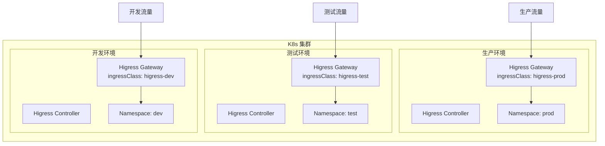
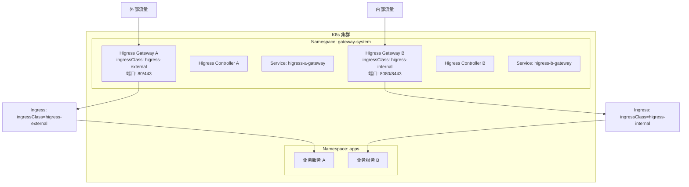

本文档基于 [Higress 官方博客](https://github.com/higress-group/higress-group.github.io/blob/main/src/content/blog/) 和 [Higress 官方文档](https://higress.io/docs/latest/) 整理，介绍如何在 Kubernetes 集群中部署多个 Higress 网关实例。

---

## 1. 概述

在企业级应用场景中，通常需要在同一个 K8s 集群中部署多个 Higress 网关实例，以实现：

- **环境隔离**：开发、测试、预发、生产环境使用独立的网关实例
- **业务隔离**：不同业务线使用独立的网关实例
- **命名空间隔离**：按 Namespace 划分网关职责范围
- **流量分层**：内部流量与外部流量使用不同网关

---

## 2. 架构设计



---

## 3. 核心配置参数

根据 [Higress 配置参数指南](https://higress.io/docs/latest/user/configurations/)，多实例部署的关键参数如下：

| 参数 | 说明 | 默认值 |
|------|------|--------|
| `global.ingressClass` | IngressClass 用于筛选 Higress Controller 监听的 Ingress 资源。多网关部署时用于区分各网关职责范围 | `higress` |
| `global.watchNamespace` | 限制 Higress Controller 只监听指定 Namespace 的资源 | `""` (监听所有) |
| `global.enableStatus` | 是否更新 Ingress 资源的 status 字段 | `true` |

### 3.1 IngressClass 特殊值说明

- 设置为 `nginx`：Higress Controller 将监听 `ingress.class: nginx` 或无 IngressClass 的 Ingress 资源
- 设置为空 `""`：Higress Controller 将监听集群中所有 Ingress 资源

---

## 4. 部署方式

### 4.1 方式一：基于 IngressClass 隔离

适用于多个网关实例共享集群资源，但处理不同类型流量的场景。

#### 部署生产环境网关

```bash
# 创建命名空间
kubectl create namespace higress-prod

# 部署生产环境 Higress 实例
helm repo add higress.io https://higress.io/helm-charts
helm install higress-prod higress.io/higress \
  -n higress-prod \
  --set global.ingressClass=higress-prod \
  --set higress-core.gateway.replicas=3 \
  --set higress-core.gateway.resources.requests.cpu=2000m \
  --set higress-core.gateway.resources.requests.memory=2048Mi
```

#### 部署测试环境网关

```bash
# 创建命名空间
kubectl create namespace higress-test

# 部署测试环境 Higress 实例
helm install higress-test higress.io/higress \
  -n higress-test \
  --set global.ingressClass=higress-test \
  --set higress-core.gateway.replicas=2 \
  --set higress-core.gateway.resources.requests.cpu=500m \
  --set higress-core.gateway.resources.requests.memory=512Mi
```

#### 部署开发环境网关

```bash
# 创建命名空间
kubectl create namespace higress-dev

# 部署开发环境 Higress 实例
helm install higress-dev higress.io/higress \
  -n higress-dev \
  --set global.ingressClass=higress-dev \
  --set global.local=true \
  --set higress-core.gateway.replicas=1
```

### 4.2 方式二：基于 Namespace 隔离

适用于按业务命名空间划分网关职责的场景。

```bash
# 部署只监听 app-a 命名空间的网关
helm install higress-app-a higress.io/higress \
  -n higress-app-a \
  --create-namespace \
  --set global.ingressClass=higress \
  --set global.watchNamespace=app-a

# 部署只监听 app-b 命名空间的网关
helm install higress-app-b higress.io/higress \
  -n higress-app-b \
  --create-namespace \
  --set global.ingressClass=higress \
  --set global.watchNamespace=app-b
```

### 4.3 方式三：同一 Namespace 下的多实例隔离

适用于资源受限或需要在同一命名空间部署多个 Higress 实例的场景。

> **关键隔离机制**：通过 `global.ingressClass` 参数实现逻辑隔离，各实例只处理匹配自己 IngressClass 的 Ingress 资源。

#### 架构示意



#### 部署实例 A（处理外部流量）

```bash
# 部署实例 A - 监听外部流量
helm install higress-external higress.io/higress \
  -n gateway-system \
  --create-namespace \
  --set global.ingressClass=higress-external \
  --set global.enableStatus=true \
  --set higress-core.gateway.httpPort=80 \
  --set higress-core.gateway.httpsPort=443 \
  --set higress-core.gateway.replicas=2 \
  --set higress-core.gateway.resources.requests.cpu=1000m \
  --set higress-core.gateway.resources.requests.memory=1024Mi
```

#### 部署实例 B（处理内部流量）

```bash
# 部署实例 B - 监听内部流量
helm install higress-internal higress.io/higress \
  -n gateway-system \
  --set global.ingressClass=higress-internal \
  --set global.enableStatus=true \
  --set higress-core.gateway.httpPort=8080 \
  --set higress-core.gateway.httpsPort=8443 \
  --set higress-core.gateway.replicas=2 \
  --set higress-core.gateway.resources.requests.cpu=500m \
  --set higress-core.gateway.resources.requests.memory=512Mi
```

> **注意**：同一 Namespace 下部署多个实例时，必须为每个实例配置不同的 HTTP/HTTPS 端口，避免端口冲突。

#### Ingress 资源配置

**外部流量 Ingress**：
```yaml
apiVersion: networking.k8s.io/v1
kind: Ingress
metadata:
  name: external-api
  namespace: apps
spec:
  ingressClassName: higress-external  # 由实例 A 处理
  rules:
    - host: api.example.com
      http:
        paths:
          - path: /
            pathType: Prefix
            backend:
              service:
                name: api-service
                port:
                  number: 8080
```

**内部流量 Ingress**：
```yaml
apiVersion: networking.k8s.io/v1
kind: Ingress
metadata:
  name: internal-api
  namespace: apps
spec:
  ingressClassName: higress-internal  # 由实例 B 处理
  rules:
    - host: api.internal.example.com
      http:
        paths:
          - path: /
            pathType: Prefix
            backend:
              service:
                name: api-service
                port:
                  number: 8080
```

#### 验证隔离效果

```bash
# 查看同一命名空间下的两个 Higress 实例
kubectl get pods -n gateway-system -l app.kubernetes.io/instance

# 查看实例 A 的 Ingress 处理情况
kubectl logs -n gateway-system -l app.kubernetes.io/instance=higress-external,app.kubernetes.io/component=controller

# 查看实例 B 的 Ingress 处理情况
kubectl logs -n gateway-system -l app.kubernetes.io/instance=higress-internal,app.kubernetes.io/component=controller

# 查看 Service 端口分配
kubectl get svc -n gateway-system
```

#### 隔离机制说明

| 隔离维度 | 隔离方式 | 说明 |
|---------|---------|------|
| **配置隔离** | `ingressClass` | 各实例只监听匹配自己 IngressClass 的 Ingress 资源 |
| **资源隔离** | Helm Release 名称 | 生成独立的 Deployment、Service、Pod |
| **端口隔离** | 不同 HTTP/HTTPS 端口 | 避免同 Namespace 下的端口冲突 |
| **插件隔离** | 插件命名空间 | WasmPlugin 等插件通过 Namespace 或 Ingress 选择器隔离 |

### 4.4 全局插件的冲突与隔离

> **重要说明**：同一 Namespace 下部署多个 Higress 实例时，**全局插件存在共享风险**。

#### 插件共享机制

WasmPlugin 是 Namespace 级别的 Kubernetes 资源，同一 Namespace 下的所有 Higress 实例都会监听该 Namespace 下的 WasmPlugin 资源。

```yaml
# 配置在 gateway-system 命名空间下的全局插件
# 会被该命名空间下的所有 Higress 实例加载
apiVersion: extensions.higress.io/v1alpha1
kind: WasmPlugin
metadata:
  name: request-block
  namespace: gateway-system  # 两个实例都在这个命名空间
spec:
  defaultConfig:             # 全局生效配置
    block_urls:
      - admin
  url: oci://higress-registry.cn-hangzhou.cr.aliyuncs.com/plugins/request-block:1.0.0
```

#### 隔离方案

**方案一：使用 matchRules.ingress 精确匹配**

```yaml
apiVersion: extensions.higress.io/v1alpha1
kind: WasmPlugin
metadata:
  name: request-block
  namespace: gateway-system
spec:
  # 不设置 defaultConfig，避免全局生效
  matchRules:
    # 仅对外部流量的 Ingress 生效
    - ingress:
        - apps/external-api
      config:
        block_urls:
          - admin
    # 内部流量的 Ingress 不受此插件影响
  url: oci://higress-registry.cn-hangzhou.cr.aliyuncs.com/plugins/request-block:1.0.0
```

**方案二：为不同实例创建独立的 WasmPlugin**

```yaml
# 实例 A 专用的插件
apiVersion: extensions.higress.io/v1alpha1
kind: WasmPlugin
metadata:
  name: request-block-external
  namespace: gateway-system
spec:
  defaultConfig:
    block_urls:
      - admin
  # 通过 matchRules 限制只处理外部流量相关的 Ingress
  matchRules:
    - ingress:
        - apps/external-*
  url: oci://higress-registry.cn-hangzhou.cr.aliyuncs.com/plugins/request-block:1.0.0
---
# 实例 B 专用的插件
apiVersion: extensions.higress.io/v1alpha1
kind: WasmPlugin
metadata:
  name: request-block-internal
  namespace: gateway-system
spec:
  defaultConfig:
    block_urls:
      - secret
  matchRules:
    - ingress:
        - apps/internal-*
  url: oci://higress-registry.cn-hangzhou.cr.aliyuncs.com/plugins/request-block:1.0.0
```

**方案三：为每个实例部署独立的 Namespace（推荐）**

这是最彻底的隔离方案：

```bash
# 实例 A 部署在独立命名空间
helm install higress-external higress.io/higress \
  -n higress-external \
  --set global.ingressClass=higress-external

# 实例 B 部署在独立命名空间
helm install higress-internal higress.io/higress \
  -n higress-internal \
  --set global.ingressClass=higress-internal

# 插件也分别部署在各自命名空间
kubectl apply -f wasmplugin-external.yaml -n higress-external
kubectl apply -f wasmplugin-internal.yaml -n higress-internal
```

#### 插件生效优先级

无论采用哪种方案，需记住插件生效的优先级：

```
路由级配置 (matchRules.ingress) > 域名级配置 (matchRules.domain) > 全局配置 (defaultConfig)
```

#### 最佳实践建议

| 场景 | 推荐方案 | 原因 |
|-----|---------|------|
| 插件配置差异大 | 独立 Namespace | 完全隔离，避免相互干扰 |
| 插件配置相似 | matchRules.ingress | 通过 Ingress 选择器精确控制 |
| 需要共享部分插件 | matchRules + defaultConfig | defaultConfig 作为公共配置，matchRules 作为差异配置 |

---

## 5. 创建 Ingress 资源

### 5.1 指定 IngressClass 的 Ingress

```yaml
apiVersion: networking.k8s.io/v1
kind: Ingress
metadata:
  name: prod-api
  namespace: prod
spec:
  ingressClassName: higress-prod  # 指定使用生产环境网关
  rules:
    - host: api.example.com
      http:
        paths:
          - path: /
            pathType: Prefix
            backend:
              service:
                name: api-service
                port:
                  number: 8080
```

### 5.2 测试环境 Ingress

```yaml
apiVersion: networking.k8s.io/v1
kind: Ingress
metadata:
  name: test-api
  namespace: test
spec:
  ingressClassName: higress-test  # 指定使用测试环境网关
  rules:
    - host: api-test.example.com
      http:
        paths:
          - path: /
            pathType: Prefix
            backend:
              service:
                name: api-service
                port:
                  number: 8080
```

---

## 6. 多实例插件配置

每个 Higress 实例可以独立配置插件。以 AI Proxy 插件为例：

### 6.1 生产环境 AI Proxy 配置

```yaml
apiVersion: extensions.higress.io/v1alpha1
kind: WasmPlugin
metadata:
  name: ai-proxy
  namespace: higress-prod
spec:
  phase: UNSPECIFIED_PHASE
  priority: 100
  matchRules:
    - config:
        provider:
          type: qwen
          apiTokens:
            - ${PROD_API_TOKEN}
      ingress:
        - qwen
  url: oci://higress-registry.cn-hangzhou.cr.aliyuncs.com/plugins/ai-proxy:1.0.0
```

### 6.2 测试环境 AI Proxy 配置

```yaml
apiVersion: extensions.higress.io/v1alpha1
kind: WasmPlugin
metadata:
  name: ai-proxy
  namespace: higress-test
spec:
  phase: UNSPECIFIED_PHASE
  priority: 100
  matchRules:
    - config:
        provider:
          type: qwen
          apiTokens:
            - ${TEST_API_TOKEN}
      ingress:
        - qwen
  url: oci://higress-registry.cn-hangzhou.cr.aliyuncs.com/plugins/ai-proxy:1.0.0
```

---

## 7. 验证部署

### 7.1 检查各实例状态

```bash
# 查看所有 Higress 实例
kubectl get pods -n higress-prod
kubectl get pods -n higress-test
kubectl get pods -n higress-dev

# 查看各实例的 Service
kubectl get svc -n higress-prod
kubectl get svc -n higress-test
kubectl get svc -n higress-dev
```

### 7.2 验证 IngressClass 隔离

```bash
# 查看各实例监听的 Ingress
kubectl get ingress -A -o wide

# 验证生产网关只处理 higress-prod 类型的 Ingress
kubectl logs -n higress-prod -l app=higress-controller | grep "ingress"
```

### 7.3 测试路由

```bash
# 获取各网关的外部 IP
PROD_IP=$(kubectl get svc -n higress-prod higress-gateway -o jsonpath='{.status.loadBalancer.ingress[0].ip}')
TEST_IP=$(kubectl get svc -n higress-test higress-gateway -o jsonpath='{.status.loadBalancer.ingress[0].ip}')

# 测试生产环境
curl -H "Host: api.example.com" http://$PROD_IP/

# 测试测试环境
curl -H "Host: api-test.example.com" http://$TEST_IP/
```

---

## 8. 高级配置

### 8.1 资源配置建议

| 环境 | Gateway 副本数 | CPU 请求 | 内存请求 | 说明 |
|------|---------------|---------|---------|------|
| 生产 | 3+ | 2000m | 2048Mi | 高可用，多副本 |
| 预发 | 2 | 1000m | 1024Mi | 模拟生产配置 |
| 测试 | 2 | 500m | 512Mi | 中等配置 |
| 开发 | 1 | 200m | 256Mi | 最小配置 |

### 8.2 使用 values.yaml 文件部署

创建 `values-prod.yaml`：

```yaml
global:
  ingressClass: higress-prod
  enableStatus: true
  onlyPushRouteCluster: true

higress-core:
  gateway:
    replicas: 3
    httpPort: 80
    httpsPort: 443
    resources:
      requests:
        cpu: 2000m
        memory: 2048Mi
      limits:
        cpu: 4000m
        memory: 4096Mi
    autoscaling:
      enabled: true
      minReplicas: 3
      maxReplicas: 10
      targetCPUUtilizationPercentage: 80

  controller:
    replicas: 2
    resources:
      requests:
        cpu: 500m
        memory: 512Mi
```

部署命令：

```bash
helm install higress-prod higress.io/higress \
  -n higress-prod \
  --create-namespace \
  -f values-prod.yaml
```

### 8.3 启用 Gateway API 支持

```bash
# 安装 Gateway API CRDs
kubectl apply -f https://github.com/kubernetes-sigs/gateway-api/releases/download/v1.0.0/experimental-install.yaml

# 部署支持 Gateway API 的 Higress 实例
helm install higress-prod higress.io/higress \
  -n higress-prod \
  --set global.ingressClass=higress-prod \
  --set global.enableGatewayAPI=true
```

### 8.4 启用 Istio API 支持

```bash
# 安装 Istio CRDs
helm repo add istio https://istio-release.storage.googleapis.com/charts
helm install istio-base istio/base -n istio-system --create-namespace

# 部署支持 Istio API 的 Higress 实例
helm install higress-prod higress.io/higress \
  -n higress-prod \
  --set global.ingressClass=higress-prod \
  --set global.enableIstioAPI=true
```

---

## 9. 最佳实践

### 9.1 环境隔离策略

1. **IngressClass 隔离**：每个环境使用独立的 IngressClass
2. **Namespace 隔离**：每个 Higress 实例部署在独立的 Namespace
3. **资源隔离**：根据环境重要性配置不同的资源配额

### 9.2 配置管理

1. **GitOps**：使用 Git 管理各环境的 Helm values 文件
2. **版本控制**：每次变更都记录版本，便于回滚
3. **配置模板**：使用 Kustomize 管理多环境配置差异

### 9.3 监控告警

1. **独立监控**：每个实例配置独立的 Prometheus 监控
2. **统一大盘**：使用 Grafana 统一展示各实例指标
3. **告警分级**：生产环境告警优先级最高

### 9.4 安全配置

1. **RBAC 隔离**：每个实例使用独立的 ServiceAccount
2. **网络策略**：配置 NetworkPolicy 限制跨环境访问
3. **证书管理**：各环境使用独立的 TLS 证书

---

## 10. 常见问题

### Q1: 多个 Higress 实例会冲突吗？

不会。只要配置不同的 `ingressClass`，各实例只会处理匹配自己 IngressClass 的 Ingress 资源。

### Q2: 如何从 Nginx Ingress 迁移？

设置 `global.ingressClass=nginx`，Higress 将监听 `ingress.class: nginx` 的 Ingress 资源。同时设置 `global.enableStatus=false` 避免覆盖 Ingress 的 status 字段。

### Q3: 如何实现跨环境的配置同步？

推荐使用 GitOps 工具（如 ArgoCD、Flux）管理配置，通过 Git 分支或目录区分环境。

---

## 11. 参考资料

- [Higress 官方文档 - Helm 部署](https://higress.io/docs/latest/ops/deploy-by-helm/)
- [Higress 配置参数指南](https://higress.io/docs/latest/user/configurations/)
- [多层网关统一成趋势，如何构建全能型网关](https://higress.io/blog/higress-gvr7dx_awbbpb_dxp91huk34ts4nik/)
- [Higress GitHub 仓库](https://github.com/alibaba/higress)

