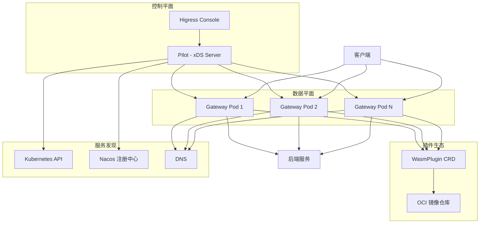
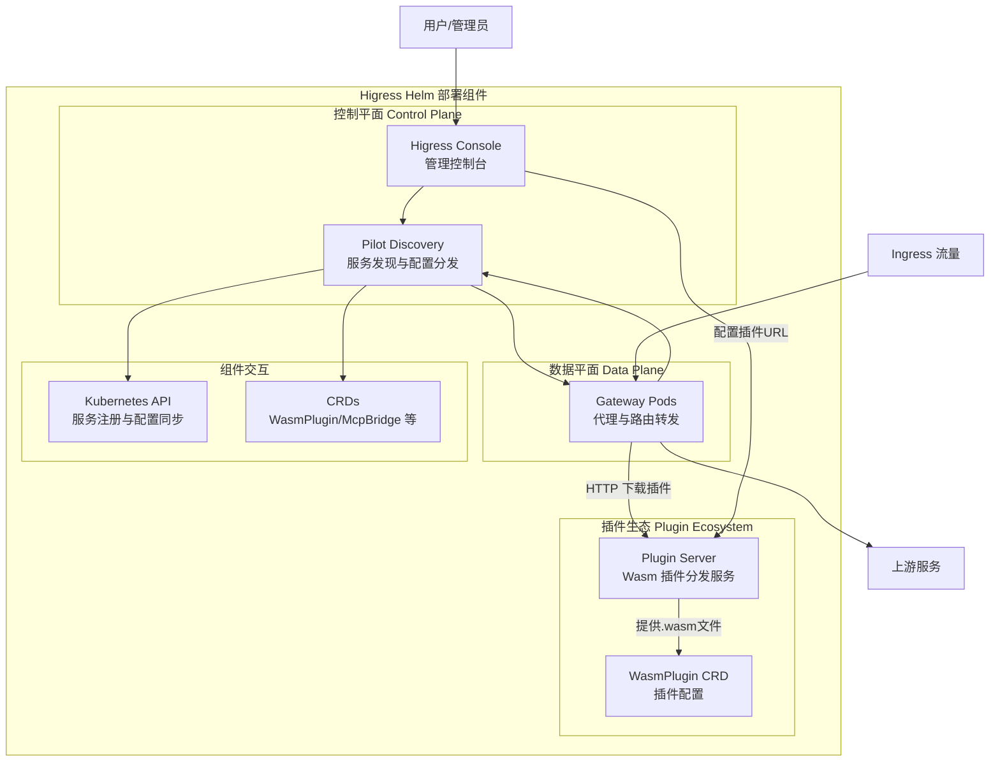
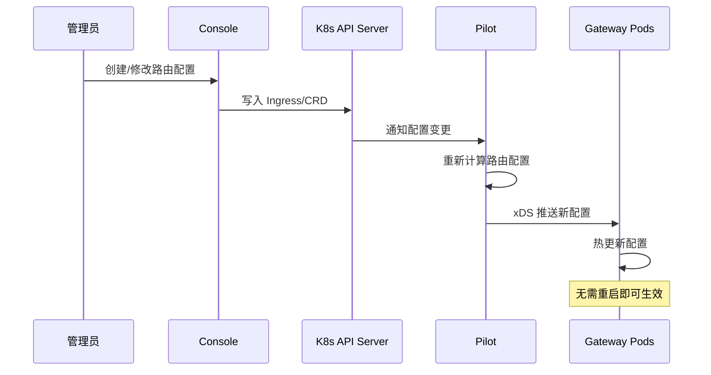
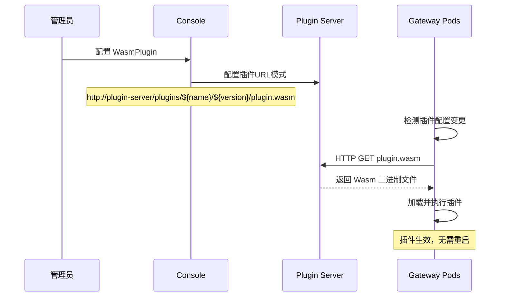
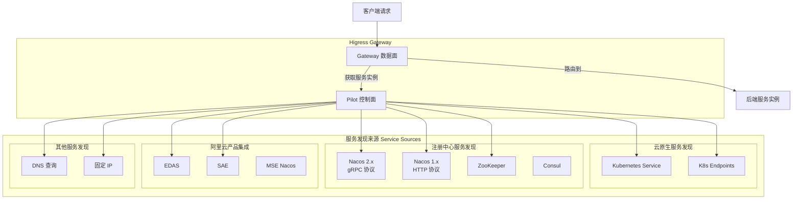
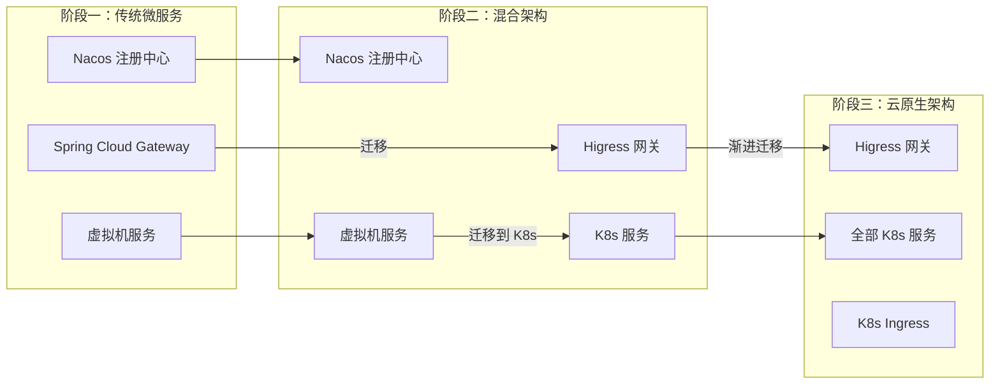

# Higress 操作指南

本文档说明 Higress 的部署、配置和运维操作方法。

---

## 1. 概述

### 1.1 Higress 架构



### 1.2 核心组件

#### 1.2.1 Helm Chart 部署架构

Higress 通过 Helm Chart 部署时，包含以下核心组件：



#### 1.2.2 组件详细说明

| 组件 | 功能描述 | 镜像 | 副本数建议 |
|------|---------|------|-----------|
| **Gateway** | 数据平面组件，基于 Envoy 构建，负责：<br>• HTTP/gRPC/WebSocket 代理与负载均衡<br>• 动态路由配置与 TLS 终止<br>• Wasm 插件加载与执行<br>• 指标收集与访问日志 | `higress-registry.cn-hangzhou.cr.aliyuncs.com/higress/higress` | 3+ |
| **Pilot** | 控制平面核心，负责：<br>• 服务发现（K8s Service/Nacos/DNS）<br>• xDS 协议配置分发（CDS/LDS/RDS/EDS）<br>• 路由规则计算与推送<br>• 配置变更监听与热更新 | `higress-registry.cn-hangzhou.cr.aliyuncs.com/higress/gateway` | 2 |
| **Console** | Web 管理界面，提供：<br>• 路由规则可视化配置<br>• 插件管理与参数配置<br>• 服务来源管理<br>• 监控指标展示与告警 | `higress-registry.cn-hangzhou.cr.aliyuncs.com/higress/console` | 1 |
| **Plugin Server** | Wasm 插件分发服务（可选），负责：<br>• HTTP 协议提供插件文件下载<br>• 插件版本管理与元数据提供<br>• 私有化环境的插件分发<br>• 与 Console 自动集成 | `higress-registry.cn-hangzhou.cr.aliyuncs.com/higress/plugin-server` | 2 |

> **说明**: Plugin Server 是可选组件，适用于私有化部署环境。通过 `--set global.enablePluginServer=true` 启用。

#### 1.2.3 组件交互流程

**配置分发流程**



**插件加载流程（使用 Plugin Server）**



---

## 2. 部署安装

### 2.1 镜像准备

```bash
# 拉取 Higress 镜像
docker pull higress-registry.cn-hangzhou.cr.aliyuncs.com/higress/gateway:2.1.9
docker pull higress-registry.cn-hangzhou.cr.aliyuncs.com/higress/higress:2.1.9
docker pull higress-registry.cn-hangzhou.cr.aliyuncs.com/higress/console:2.1.9
# 拉取 Plugin Server 镜像（可选）
docker pull higress-registry.cn-hangzhou.cr.aliyuncs.com/higress/plugin-server:1.0.0

# 重新打标签到内网仓库
docker tag higress-registry.cn-hangzhou.cr.aliyuncs.com/higress/gateway:2.1.9 \
    image.midea.com/midea-middleware/higress-gateway:2.1.9
docker tag higress-registry.cn-hangzhou.cr.aliyuncs.com/higress/plugin-server:1.0.0 \
    image.midea.com/midea-middleware/higress-plugin-server:1.0.0
```

### 2.2 Helm 部署

```bash
helm repo add higress https://higress.cn/helm-charts
helm repo update

helm install higress higress/higress \
    --namespace higress-system \
    --create-namespace \
    --version 2.1.9 \
    --set global.imageRegistry=image.midea.com/midea-middleware

# 验证安装
kubectl get pods -n higress-system
kubectl get svc -n higress-system
```

### 2.3 启用 Plugin Server

从 Higress v2.1.5 开始，可通过以下方式启用 Plugin Server：

```bash
helm install higress higress/higress \
    --namespace higress-system \
    --create-namespace \
    --version 2.1.9 \
    --set global.imageRegistry=image.midea.com/midea-middleware \
    --set global.enablePluginServer=true

# 验证 Plugin Server
kubectl get pods -n higress-system -l app=higress-plugin-server
kubectl get svc -n higress-system | grep plugin-server
```

### 2.4 自定义配置安装

```bash
cat > higress-custom-values.yaml << 'EOF'
global:
  imageRegistry: image.midea.com/midea-middleware
  imageTag: 2.1.9
  # 启用 Plugin Server
  enablePluginServer: true

gateway:
  replicaCount: 3
  resources:
    requests:
      cpu: 500m
      memory: 512Mi
    limits:
      cpu: 2000m
      memory: 2Gi

pilot:
  replicaCount: 2
console:
  replicaCount: 1

# Plugin Server 配置
pluginServer:
  replicaCount: 2
  resources:
    requests:
      cpu: 100m
      memory: 128Mi
    limits:
      cpu: 500m
      memory: 256Mi
EOF

helm install higress higress/higress \
    --namespace higress-system \
    --create-namespace \
    --version 2.1.9 \
    -f higress-custom-values.yaml
```

---

## 3. 服务发现

### 3.1 多类型服务发现架构

Higress 通过 McpBridge CRD 实现统一的多类型服务发现机制，支持以下服务来源：



### 3.2 服务发现类型

#### 3.2.1 Kubernetes Service（默认）

Higress 原生支持 Kubernetes 服务发现，自动监听 K8s Service 和 Endpoints 资源。

**特点**：
- 自动感知 Pod IP 变化
- 支持 Headless Service
- 支持 Service selectors
- 实时监听 Endpoints 变更

**适用场景**：
- 服务部署在 K8s 集群内
- 标准 K8s 微服务架构

#### 3.2.2 Nacos

Nacos 是 Higress 最常用的注册中心集成方式，支持 HTTP 和 gRPC 两种协议。

**Nacos 2.x（推荐，使用 gRPC 协议）**

```yaml
apiVersion: networking.higress.io/v1
kind: McpBridge
metadata:
  name: mcp-bridge
  namespace: higress-system
spec:
  registries:
    # 定义一个名为 "production" 的服务来源
    - name: production
      # 注册中心类型是 Nacos 2.x，支持 gRPC 协议
      type: nacos2
      # 注册中心的访问地址，可以是域名或者 IP
      domain: 192.xxx.xx.32
      # 注册中心的访问端口，Nacos 默认是 8848
      port: 8848
      # Nacos 命名空间 ID
      nacosNamespaceId: d8ac64f3-xxxx-xxxx-xxxx-47a814ecf358
      # Nacos 服务分组
      nacosGroups:
        - DEFAULT_GROUP
```

**Nacos 1.x（HTTP 协议）**

```yaml
apiVersion: networking.higress.io/v1
kind: McpBridge
metadata:
  name: mcp-bridge
  namespace: higress-system
spec:
  registries:
    # 定义一个名为 "uat" 的服务来源
    - name: uat
      # 注册中心类型是 Nacos 1.x，只支持 HTTP 协议
      type: nacos
      domain: 192.xxx.xx.31
      port: 8848
      nacosNamespaceId: 98ac6df3-xxxx-xxxx-xxxx-ab98115dfde4
      nacosGroups:
        - DEFAULT_GROUP
```

**优势**：
- 更快速地感知服务变化（gRPC 长连接）
- 消耗更少的 Nacos 服务端资源
- 支持多命名空间、多分组
- 可实现不同环境服务共用一个网关

#### 3.2.3 ZooKeeper

支持 ZooKeeper 作为服务注册中心。

```yaml
apiVersion: networking.higress.io/v1
kind: McpBridge
metadata:
  name: mcp-bridge
  namespace: higress-system
spec:
  registries:
    - name: zk-service
      type: zookeeper
      domain: zk.default.svc.cluster.local
      port: 2181
```

**适用场景**：
- 传统 Dubbo 微服务架构
- 遗留系统迁移

#### 3.2.4 EDAS / SAE

阿里云 EDAS 和 SAE 的服务发现集成。

```yaml
apiVersion: networking.higress.io/v1
kind: McpBridge
metadata:
  name: mcp-bridge
  namespace: higress-system
spec:
  registries:
    - name: edas-service
      type: edas
      domain: edas.mse.aliyuncs.com
      port: 8848
```

#### 3.2.5 DNS

支持标准 DNS 查询进行服务发现。

```yaml
apiVersion: networking.higress.io/v1
kind: McpBridge
metadata:
  name: mcp-bridge
  namespace: higress-system
spec:
  registries:
    - name: dns-service
      type: dns
      domain:
        - api.external.com
      port: 443
      protocol: HTTPS
```

**适用场景**：
- 外部服务集成
- 第三方 API 调用
- 非 K8s 部署的服务

#### 3.2.6 固定 IP

用于静态配置后端服务地址。

```yaml
apiVersion: networking.higress.io/v1
kind: McpBridge
metadata:
  name: mcp-bridge
  namespace: higress-system
spec:
  registries:
    - name: fixed-service
      type: fixed
      address:
        - 192.168.1.10
        - 192.168.1.11
      port: 8080
```

**适用场景**：
- 物理机部署的服务
- 虚拟机服务
- 临时测试环境

### 3.3 渐进式云原生架构演进

Higress 的多类型服务发现能力，支持传统微服务架构渐进式向云原生 K8s 架构演进：



**演进路径**：

1. **阶段一：传统微服务**
   - 使用 Spring Cloud Gateway / Zuul
   - Nacos 作为注册中心
   - 服务部署在虚拟机

2. **阶段二：混合架构（使用 Higress + Nacos）**
   - 替换网关为 Higress
   - 通过 Nacos 发现 K8s 外部服务
   - 新服务部署到 K8s，老服务保持不变

3. **阶段三：云原生架构**
   - 所有服务迁移到 K8s
   - 使用 K8s 原生 Service
   - 可选择性移除 Nacos

### 3.4 使用 McpBridge 服务配置路由

配置 Ingress 时使用 McpBridge 中的服务：

```yaml
apiVersion: networking.k8s.io/v1
kind: Ingress
metadata:
  name: demo
  namespace: default
  annotations:
    # 指定 Nacos 服务为目标
    # 格式: 服务名称.服务分组.命名空间ID.nacos
    # 注意: 服务分组中的下划线会被转换成横杠
    higress.io/destination: service-provider.DEFAULT-GROUP.d8ac64f3-xxxx-xxxx-xxxx-47a814ecf358.nacos
spec:
  rules:
    - http:
        paths:
          - path: /
            pathType: Prefix
            backend:
              # 引用 McpBridge 资源
              resource:
                apiGroup: networking.higress.io
                kind: McpBridge
                name: mcp-bridge
```

**服务命名规范**：

| 服务来源 | 命名格式 | 示例 |
|---------|---------|------|
| Nacos | `{service}.{group}.{namespaceId}.nacos` | `myapp.DEFAULT-GROUP.public.nacos` |
| ZooKeeper | `{service}.zk` | `myapp.zk` |
| DNS | `{domain}` | `api.example.com` |
| 固定 IP | `{name}` | `fixed-service` |

### 3.5 灰度发布支持

Higress 完全兼容 Nginx Ingress 的金丝雀（Canary）注解：

```yaml
apiVersion: networking.k8s.io/v1
kind: Ingress
metadata:
  name: demo-canary
  namespace: default
  annotations:
    # 灰度服务
    higress.io/destination: service-provider-canary.DEFAULT-GROUP.uat.nacos
    # 启用金丝雀
    nginx.ingress.kubernetes.io/canary: "true"
    # 基于 Header 流量切分
    nginx.ingress.kubernetes.io/canary-by-header: x-user-id
    nginx.ingress.kubernetes.io/canary-by-header-value: "100"
    # 或基于流量百分比
    nginx.ingress.kubernetes.io/canary-weight: "10"
spec:
  rules:
    - http:
        paths:
          - path: /
            pathType: Prefix
            backend:
              resource:
                apiGroup: networking.higress.io
                kind: McpBridge
                name: mcp-bridge
```

**支持的灰度策略**：
- 基于 HTTP Header
- 基于 Cookie
- 基于流量百分比
- 与 OpenKruise Rollout 联动实现渐进式交付

---

## 4. 路由配置

### 4.1 Ingress 路由

```yaml
apiVersion: networking.k8s.io/v1
kind: Ingress
metadata:
  name: demo-ingress
  namespace: default
  annotations:
    higress.io/destination: demo-service.default.svc.cluster.local
spec:
  ingressClassName: higress
  rules:
    - host: example.com
      http:
        paths:
          - path: /
            pathType: Prefix
            backend:
              service:
                name: demo-service
                port:
                  number: 8080
```

### 4.2 McpBridge 路由

```yaml
apiVersion: networking.higress.io/v1
kind: McpBridge
metadata:
  name: mcp-bridge
  namespace: higress-system
spec:
  nacos:
    - name: nacos-service
      address: nacos.default.svc.cluster.local:8848
      namespaceId: public
      serviceGroups:
        - group: DEFAULT_GROUP
          namespaces:
            - public
  dns:
    - name: dns-service
      domain: example.com
      port: 443
      protocol: HTTPS
```

---

## 5. 插件管理

### 5.1 WasmPlugin 基础配置

```yaml
apiVersion: extensions.higress.io/v1alpha1
kind: WasmPlugin
metadata:
  name: my-wasm-plugin
  namespace: higress-system
spec:
  url: oci://registry.example.com/my-plugin:1.0.0
  phase: AUTHN  # AUTHN | AUTHZ | DEFAULT
  priority: 100
  matchRules:
    - domain:
        - example.com
      config:
        key1: value1
  defaultConfig:
    enabled: true
```

### 5.2 常用插件配置

#### 请求认证插件

```yaml
apiVersion: extensions.higress.io/v1alpha1
kind: WasmPlugin
metadata:
  name: auth-plugin
  namespace: higress-system
spec:
  url: oci://ghcr.io/higress-group/wasm-go/auth:latest
  phase: AUTHN
  priority: 100
  matchRules:
    - config:
        auth_service: auth-service.default.svc.cluster.local:8080
        auth_path: /api/auth/verify
        timeout: 3000
```

#### AI Proxy 插件

```yaml
apiVersion: extensions.higress.io/v1alpha1
kind: WasmPlugin
metadata:
  name: ai-proxy-plugin
  namespace: higress-system
spec:
  url: oci://ghcr.io/higress-group/wasm-go/ai-proxy:latest
  phase: DEFAULT
  priority: 300
  matchRules:
    - config:
        services:
          - provider: openai
            api_tokens: ["sk-xxx"]
            endpoint: https://api.openai.com/v1
```

---

## 6. 监控和日志

### 6.1 Prometheus 监控

```yaml
apiVersion: v1
kind: Service
metadata:
  name: higress-gateway-metrics
  namespace: higress-system
spec:
  ports:
    - name: metrics
      port: 15090
      targetPort: 15090
  selector:
    app: higress-gateway
```

### 6.2 常用监控指标

| 指标 | 说明 |
|------|------|
| `istio_requests_total` | 请求总数 |
| `istio_request_duration_milliseconds` | 请求延迟 |
| `envoy_cluster_upstream_cx_active` | 上游连接数 |

---

## 7. 运维操作

### 7.1 查看 Gateway 状态

```bash
# 查看 Pod 状态
kubectl get pods -n higress-system -l app=higress-gateway

# 查看 Gateway 日志
kubectl logs -n higress-system -l app=higress-gateway --tail=100 -f

# 查看配置
kubectl get WasmPlugin -n higress-system
kubectl get McpBridge -n higress-system
```

### 7.2 扩缩容

```bash
# 手动扩缩容
kubectl scale deployment/higress-gateway -n higress-system --replicas=5

# HPA 自动扩缩容
kubectl autoscale deployment/higress-gateway \
    -n higress-system \
    --min=3 --max=10 \
    --cpu-percent=70
```

### 7.3 故障排查

```bash
# 检查配置是否生效
kubectl exec -n higress-system deployment/higress-gateway -- \
    curl -s localhost:15000/config_dump | jq '.configs'

# 查看插件加载状态
kubectl exec -n higress-system deployment/higress-gateway -- \
    curl -s localhost:15000/clusters | jq '.clusters[] | select(.name | contains("wasm"))'
```

---

## 8. 常用命令速查

```bash
# ============ 部署相关 ============
helm install higress higress/higress -n higress-system --create-namespace
helm upgrade higress higress/higress -n higress-system -f values.yaml
helm uninstall higress -n higress-system

# ============ 状态查看 ============
kubectl get pods -n higress-system
kubectl get svc -n higress-system
kubectl get WasmPlugin -n higress-system

# ============ 故障排查 ============
kubectl exec -n higress-system deployment/higress-gateway -- \
    curl -s localhost:15000/config_dump
kubectl exec -n higress-system deployment/higress-gateway -- \
    curl -s localhost:15000/clusters
```

---

## 9. 程序化控制 Higress

### 9.1 控制方式对比

| 控制方式 | 适用场景 | 权限要求 | 详细文档 |
|---------|---------|---------|---------|
| **Kubernetes CRD API** | 创建/更新路由、插件配置 | RBAC 权限 | [HTTP API 指南](./higress-http-api-guide.md#4-kubernetes-api) |
| **Console REST API** | 通过控制台界面操作 | Console 登录凭证 | [HTTP API 指南](./higress-http-api-guide.md#3-console-rest-api) |
| **Envoy Admin API** | 实时查看/调试配置 | Pod 访问权限 | [HTTP API 指南](./higress-http-api-guide.md#2-envoy-admin-api) |

### 9.2 多数据面管理

对于需要统一管理多个 Higress 集群的场景，请参考：
- [多数据面快速入门](./higress-multi-dataplane-quickstart.md)
- [HTTP API 指南 - 多数据面管理](./higress-http-api-guide.md#5-多数据面管理方案-多集群)

---

## 10. 参考资料

- [Higress 官方文档](https://higress.cn/docs)
- [Higress GitHub](https://github.com/alibaba/higress)
- [Higress WASM Go SDK](https://github.com/higress-group/wasm-go)
- [Plugin Server 使用指南](./higress-plugin-server-guide.md)
- [HTTP API 使用指南](./higress-http-api-guide.md)
- [多数据面快速入门](./higress-multi-dataplane-quickstart.md)
