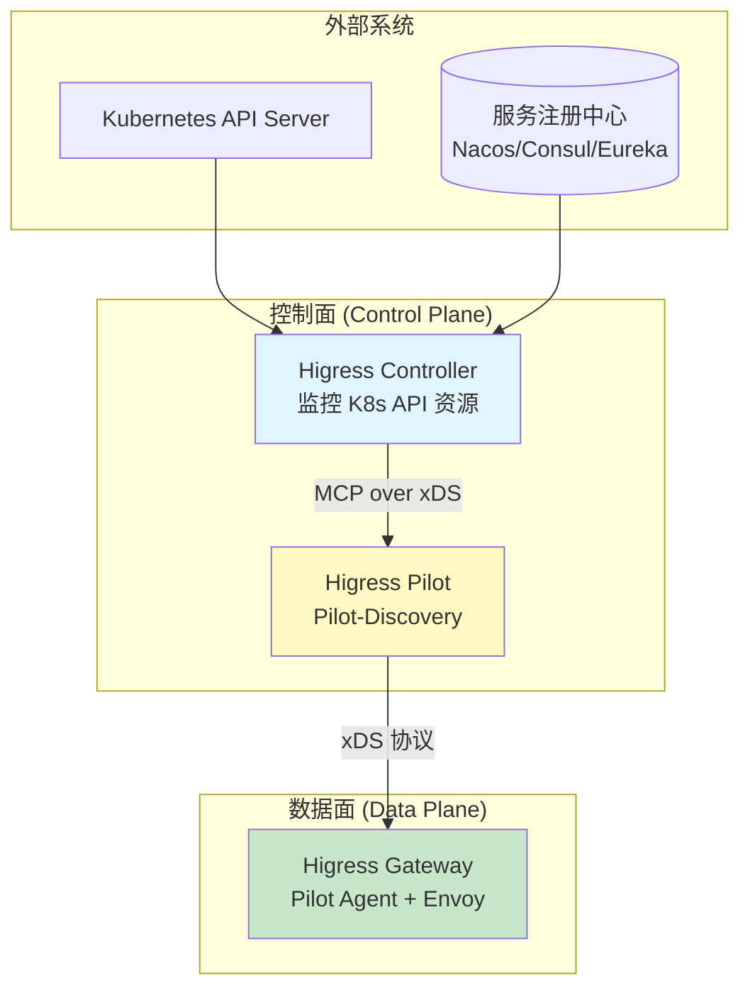
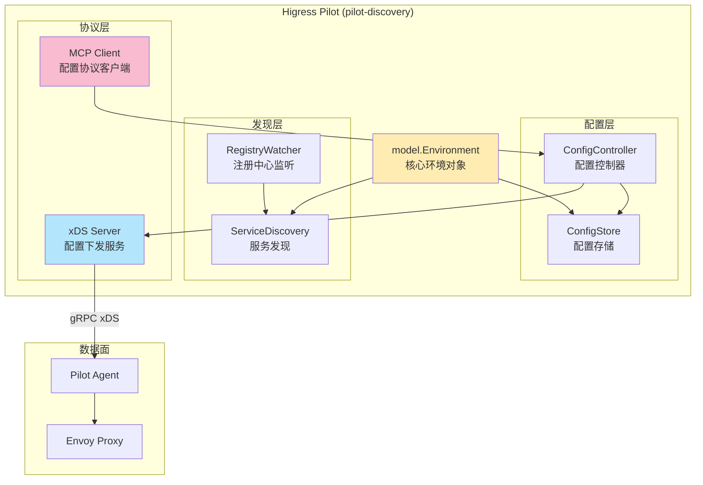
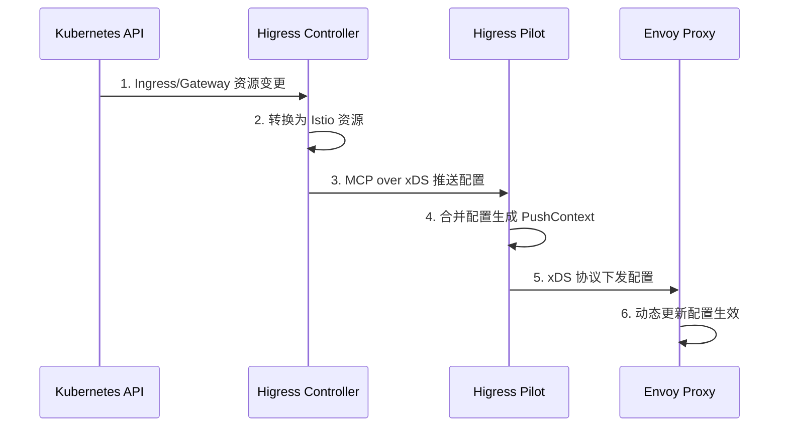
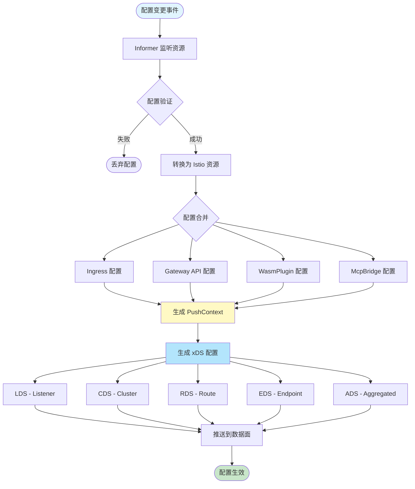
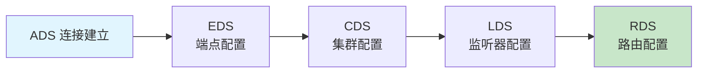
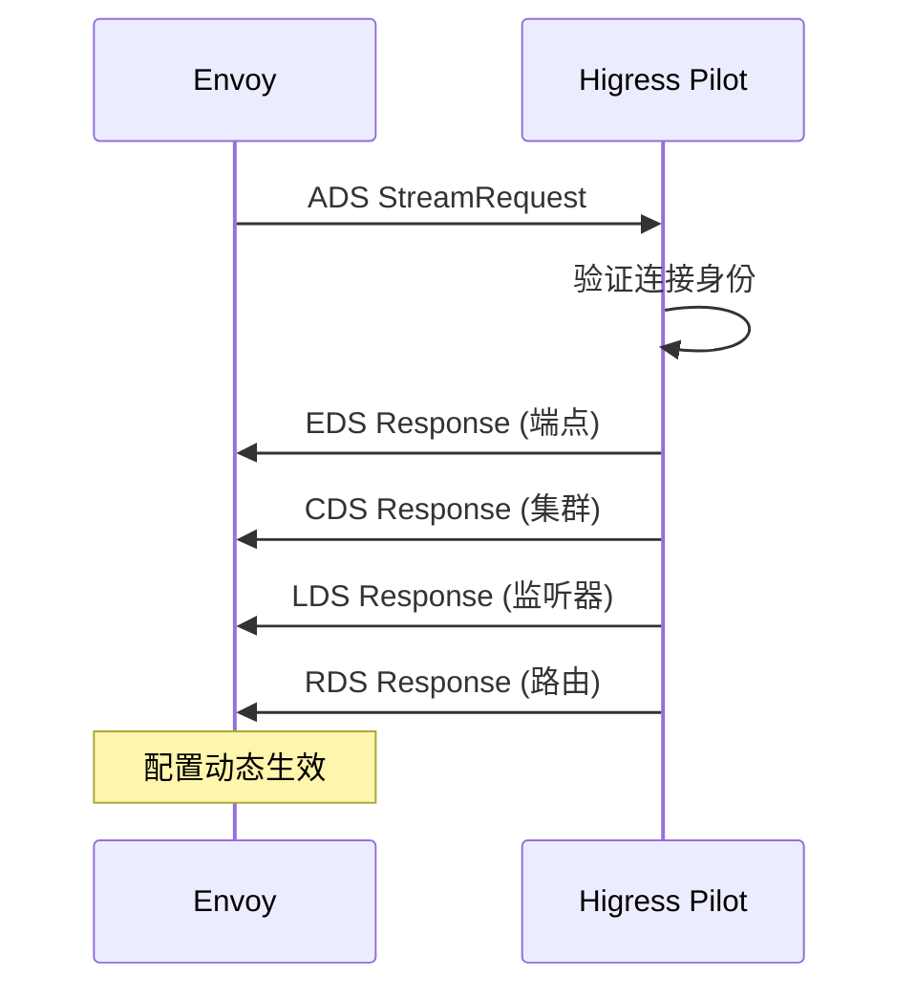
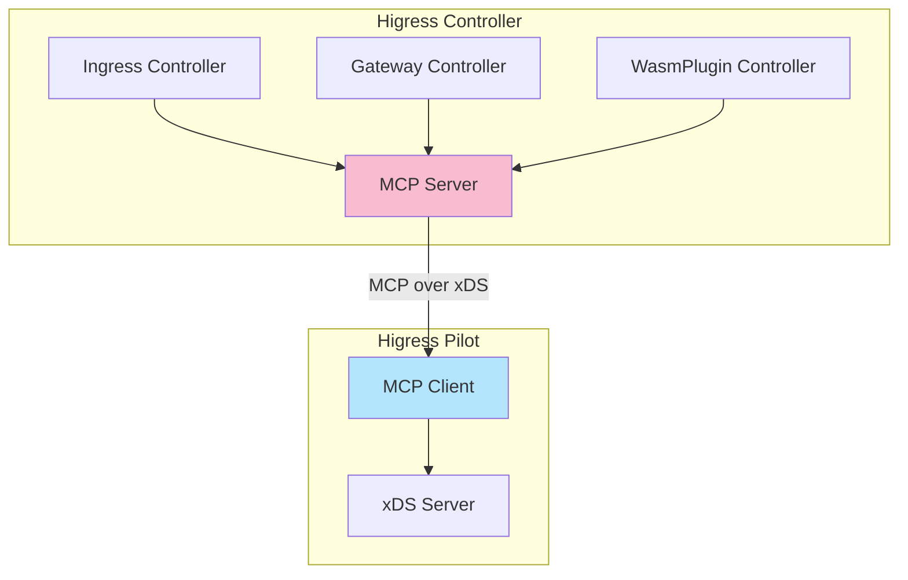
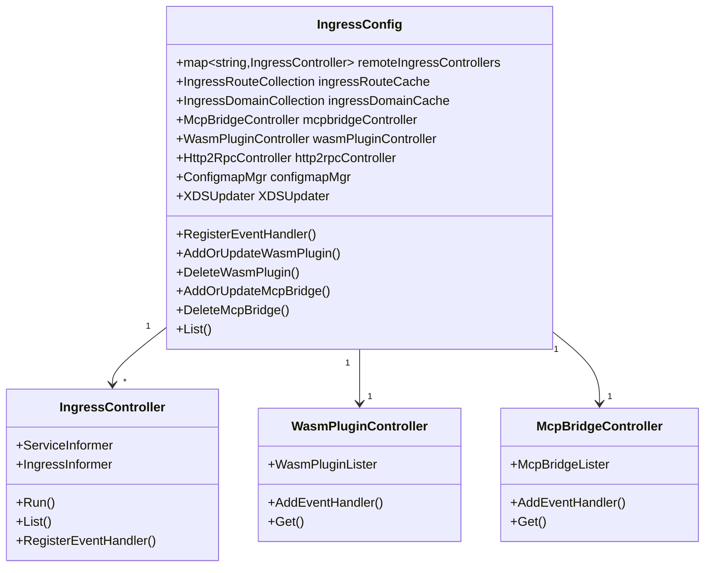
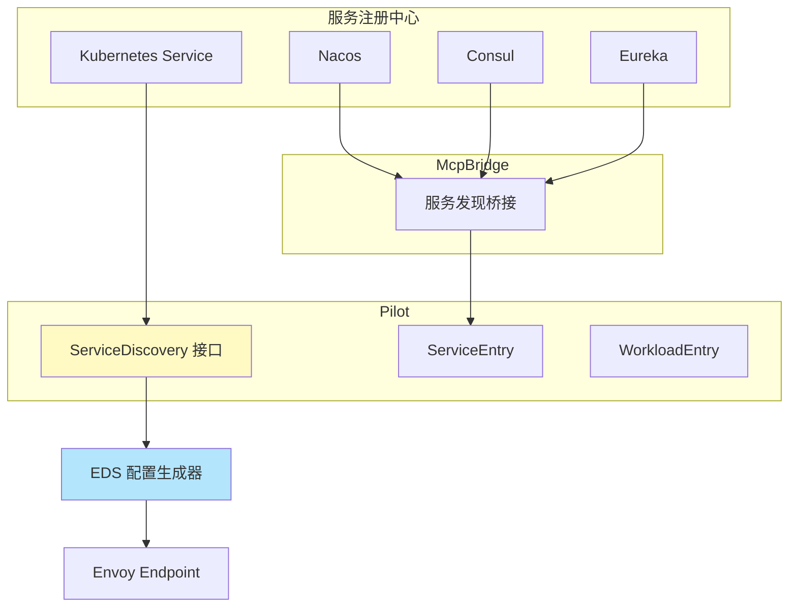
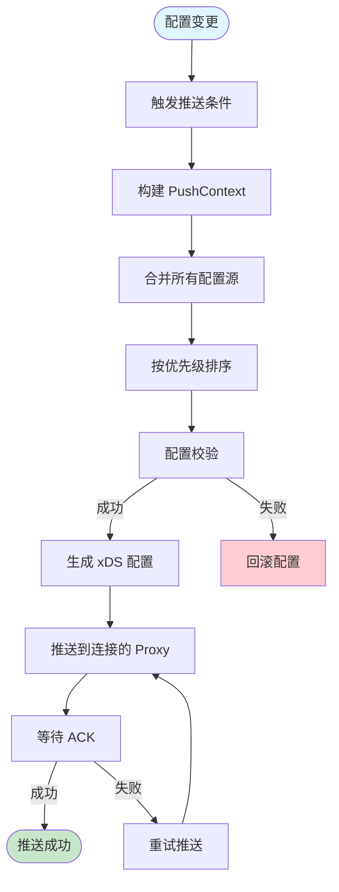

# Higress Pilot 工作原理详解

本文档详细说明 Higress Pilot 组件的架构设计和工作原理，帮助开发者深入理解 Higress 控制面的核心机制。

---

## 1. 概述

### 1.1 什么是 Higress Pilot

Higress Pilot 是 Higress 控制面的核心组件之一（另一个是 Controller），它基于 **Istio Pilot-Discovery** 进行二次定制化开发，主要负责：

- **服务发现**：监控服务注册中心，实时感知服务实例变化
- **配置管理**：将高级路由规则转换为 Envoy 配置
- **配置下发**：通过 xDS 协议动态下发配置到数据面
- **流量调度**：控制流量路由规则和负载均衡策略

### 1.2 在 Higress 架构中的位置



---

## 2. 核心架构

### 2.1 Pilot 内部组件结构



### 2.2 核心对象：model.Environment

`model.Environment` 是 Pilot 中的核心环境对象，集成了多个关键组件：

```go
type Environment struct {
    // 推送上下文
    PushContext *PushContext

    // 域名后缀
    DomainSuffix string

    // 服务发现接口
    ServiceDiscovery ServiceDiscovery

    // 配置存储
    IstioConfigStore ConfigStoreCache

    // MCP 模式开关
    MCPMode bool

    // Ledger - 状态版本管理
    Ledger Ledger
}
```

---

## 3. 工作流程

### 3.1 配置流转全流程



### 3.2 详细处理流程



---

## 4. xDS 协议详解

### 4.1 xDS 协议类型

xDS（Discovery Service）是 Envoy 的动态配置协议，Higress Pilot 支持以下类型：

| xDS 类型 | 全称 | 作用 |
|----------|------|------|
| **ADS** | Aggregated Discovery Service | 聚合发现服务，按顺序下发所有配置 |
| **LDS** | Listener Discovery Service | 监听器发现，配置监听器和过滤器链 |
| **CDS** | Cluster Discovery Service | 集群发现，配置上游服务集群 |
| **RDS** | Route Discovery Service | 路由发现，配置 HTTP 路由规则 |
| **EDS** | Endpoint Discovery Service | 端点发现，配置服务实例地址 |

### 4.2 xDS 配置下发顺序



### 4.3 ADS 聚合下发流程



---

## 5. MCP 协议

### 5.1 MCP 在 Higress 中的角色

MCP（Mesh Configuration Protocol）是一种基于 xDS 协议的配置管理协议。



### 5.2 MCP 配置同步流程

1. **Higress Controller** 监听 Kubernetes 资源变化
2. **Higress Core** 将资源转换为 Istio 配置
3. **MCP Server** 通过 MCP over xDS 推送到 Pilot
4. **Pilot** 将配置合并到 PushContext
5. **xDS Server** 通过 xDS 协议下发到 Envoy

---

## 6. 配置控制器详解

### 6.1 IngressConfig 控制器结构



### 6.2 核心控制器说明

| 控制器 | 功能 | 监听资源 | 输出资源 |
|--------|------|----------|----------|
| **Ingress Controller** | K8s Ingress 转换 | Ingress | Gateway, VirtualService, DestinationRule |
| **Gateway Controller** | Gateway API 转换 | Gateway, HTTPRoute | Gateway, VirtualService |
| **McpBridge Controller** | 注册中心桥接 | McpBridge | ServiceEntry, WorkloadEntry |
| **WasmPlugin Controller** | Wasm 插件管理 | WasmPlugin | Istio WasmPlugin |
| **Http2Rpc Controller** | 协议转换 | Http2Rpc | VirtualService |
| **ConfigmapMgr** | 全局配置管理 | ConfigMap | EnvoyFilter |

---

## 7. 服务发现机制

### 7.1 服务发现架构



### 7.2 服务发现流程

1. **Kubernetes 原生服务**：直接通过 ServiceInformer 获取
2. **外部注册中心**：通过 McpBridge 配置桥接，转换为 ServiceEntry
3. **DNS 服务**：通过 DNS 解析获取服务地址
4. **固定地址**：通过 WorkloadEntry 配置静态服务

---

## 8. 配置推送机制

### 8.1 PushContext 生成



### 8.2 推送触发条件

配置推送在以下情况触发：

- **配置资源变更**：Ingress/Gateway/WasmPlugin 等资源更新
- **服务实例变化**：Service Endpoint 变化
- **密钥变更**：Secret 资源更新
- **定时全量推送**：根据配置的间隔时间

---

## 9. 本地开发调试

### 9.1 环境准备

```bash
# 1. 克隆 Higress 仓库
git clone https://github.com/alibaba/higress.git
cd higress

# 2. 初始化子模块（包含 Istio 上游代码）
git submodule update --init

# 3. 应用 Higress 补丁
make prebuild
```

### 9.2 提取配置文件

```bash
# 创建配置目录
mkdir -p /tmp/pilot-config
cd /tmp/pilot-config

# 提取配置
kubectl get configmap higress-config -n higress-system \
    -o=jsonpath='{.data.mesh}' > ./mesh

kubectl get configmap higress-config -n higress-system \
    -o=jsonpath='{.data.meshNetworks}' > ./meshNetworks
```

### 9.3 配置环境变量

```bash
export CUSTOM_CA_CERT_NAME=higress-ca-root-cert
export JWT_POLICY=none
export PILOT_ENABLE_GATEWAY_API=true
export PILOT_SCOPE_GATEWAY_TO_NAMESPACE=true
export POD_NAME=higress-controller
export POD_NAMESPACE=higress-system
export REVISION=default
export VALIDATION_ENABLED=false
```

### 9.4 启动 Pilot

```bash
# 启动 Pilot Discovery
cd external/istio
go run pilot/cmd/pilot-discovery/main.go \
    discovery \
    --monitoringAddr=:15014 \
    --log_output_level=default:info \
    --domain cluster.local \
    --meshConfig /tmp/pilot-config/mesh \
    --networksConfig /tmp/pilot-config/meshNetworks
```

### 9.5 调试配置

修改 `higress-config` ConfigMap 使 Gateway 连接到本地 Pilot：

```yaml
apiVersion: v1
kind: ConfigMap
metadata:
  name: higress-config
  namespace: higress-system
data:
  mesh: |
    discoveryAddress: 192.168.1.100:15010  # 修改为本地 IP
    controlPlaneAuthPolicy: NONE            # 添加认证豁免
```

重启 Gateway 使配置生效：

```bash
kubectl rollout restart deployment/higress-gateway -n higress-system
```

---

## 10. 核心源码分析

### 10.1 启动流程

```go
// pkg/cmd/server.go
func NewServer(args *ServerArgs) (*Server, error) {
    // 1. 初始化 Environment
    e := &model.Environment{
        PushContext:  model.NewPushContext(),
        DomainSuffix: constants.DefaultKubernetesDomain,
        MCPMode:      true,
    }

    // 2. 设置 Ledger
    e.SetLedger(buildLedger(args.RegistryOptions))

    // 3. 设置服务发现
    e.ServiceDiscovery = aggregate.NewController(...)

    // 4. 创建 Server
    s := &Server{
        environment: e,
        server:      server.New(),
    }

    // 5. 初始化各个组件
    initFuncList := []func() error{
        s.initKubeClient,
        s.initXdsServer,
        s.initHttpServer,
        s.initConfigController,
        s.initRegistryEventHandlers,
    }

    for _, f := range initFuncList {
        if err := f(); err != nil {
            return nil, err
        }
    }

    return s, nil
}
```

### 10.2 xDS 服务初始化

```go
func (s *Server) initXdsServer() error {
    // 创建 xDS Server
    s.xdsServer = xds.NewDiscoveryServer(
        s.environment,
        nil,
        PodName,
        PodNamespace,
        s.RegistryOptions.KubeOptions.ClusterAliases,
    )

    // 注册 MCP 生成器
    s.xdsServer.McpGenerators[gvk.WasmPlugin.String()] = &mcp.WasmpluginGenerator{Server: s.xdsServer}
    s.xdsServer.McpGenerators[gvk.Gateway.String()] = &mcp.GatewayGenerator{Server: s.xdsServer}
    s.xdsServer.McpGenerators[gvk.VirtualService.String()] = &mcp.VirtualServiceGenerator{Server: s.xdsServer}

    // 配置推送条件
    s.xdsServer.ProxyNeedsPush = func(proxy *model.Proxy, req *model.PushRequest) bool {
        return true
    }

    return nil
}
```

---

## 11. 与 Istio Pilot 的差异

| 特性 | Istio Pilot | Higress Pilot |
|------|-------------|---------------|
| **定位** | Service Mesh 控制面 | API 网关控制面 |
| **配置来源** | Kubernetes + MCP | Kubernetes (Ingress/Gateway API) |
| **MCP 模式** | 可选 | 默认启用 |
| **Gateway API** | 实验性支持 | 完整支持 |
| **Wasm 插件** | 基础支持 | 扩展支持（多级配置） |
| **注册中心** | Kubernetes | K8s + Nacos/Consul/Eureka |
| **轻量化** | 较重 | 轻量化设计 |

---

## 12. 参考资料

- [Higress 官方文档](https://higress.io/docs)
- [Higress Pilot 调试教程](https://higress.io/zh-cn/blog/pilot-debug/)
- [Higress 源码分析](https://higress.cn/blog/higress-code/)
- [Istio xDS 协议说明](https://istio.io/latest/docs/reference/protocols/extensible-zds/)
- [Envoy xDS 协议](https://www.envoyproxy.io/docs/envoy/latest/api-docs/xds_protocol)

---
