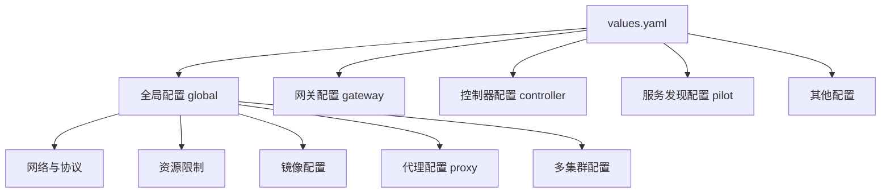

本文档详细说明 Higress Helm Chart 的 `values.yaml` 文件中各个配置参数的作用。

## 目录结构



---

## 1. 全局配置 (global)

全局配置影响 Higress 的所有组件。

### 1.1 网络与协议

| 参数 | 类型 | 默认值 | 说明 |
|------|------|--------|------|
| `enableH3` | bool | `false` | 是否启用 HTTP/3 协议支持 |
| `enableIPv6` | bool | `false` | 是否启用 IPv6 支持 |
| `enableProxyProtocol` | bool | `false` | 是否启用 Proxy Protocol，用于传递客户端真实 IP |
| `disableAlpnH2` | bool | `false` | 是否禁用 ALPN 中的 HTTP/2 |

### 1.2 缓存与推送

| 参数 | 类型 | 默认值 | 说明 |
|------|------|--------|------|
| `enableLDSCache` | bool | `false` | 是否启用 LDS (Listener Discovery Service) 缓存 |
| `enablePushAllMCPClusters` | bool | `true` | 是否推送所有 MCP (Mesh Configuration Protocol) 集群 |
| `liteMetrics` | bool | `false` | 是否启用轻量级指标，减少指标数量 |

### 1.3 性能与资源

| 参数 | 类型 | 默认值 | 说明 |
|------|------|--------|------|
| `xdsMaxRecvMsgSize` | string | `"104857600"` | XDS (Istio Discovery Service) 最大接收消息大小 (100MB) |
| `defaultUpstreamConcurrencyThreshold` | int | `10000` | 默认上游并发阈值 |

### 1.4 RDS (Route Discovery Service)

| 参数 | 类型 | 默认值 | 说明 |
|------|------|--------|------|
| `enableSRDS` | bool | `true` | 是否启用 SRDS (Shared Route Discovery Service) |
| `onDemandRDS` | bool | `false` | 是否按需加载 RDS 配置 |
| `hostRDSMergeSubset` | bool | `false` | 是否合并主机级别的 RDS 子集 |
| `onlyPushRouteCluster` | bool | `true` | 是否仅推送路由集群配置 |

### 1.5 插件与扩展

| 参数 | 类型 | 默认值 | 说明 |
|------|------|--------|------|
| `enableRedis` | bool | `false` | 是否启用 Redis (redis-stack-server) |
| `enablePluginServer` | bool | `true` | 是否启用插件服务器 |

### 1.6 Ingress 配置

| 参数 | 类型 | 默认值 | 说明 |
|------|------|--------|------|
| `ingressClass` | string | `"higress"` | Ingress 类名，用于过滤监听的 Ingress 资源 |
| `watchNamespace` | string | `""` | 限制监听的命名空间，空值表示监听所有命名空间 |

**特殊 ingressClass 值：**
- `"nginx"`: 监听带有 nginx ingress class 或无 ingress class 的资源
- `""`: 监听集群中所有 Ingress 资源

### 1.7 控制器行为

| 参数 | 类型 | 默认值 | 说明 |
|------|------|--------|------|
| `enableStatus` | bool | `true` | 是否更新 Ingress 资源的 status 字段 |
| `enableIstioAPI` | bool | `true` | 是否监听 Istio API 资源 |
| `enableGatewayAPI` | bool | `true` | 是否监听 Gateway API 资源 |

### 1.8 部署环境

| 参数 | 类型 | 默认值 | 说明 |
|------|------|--------|------|
| `local` | bool | `false` | 是否为本地集群 (如 kind) 部署 |
| `autoscalingv2API` | bool | `true` | 是否使用 autoscaling/v2 HPA 模板 |

### 1.9 Istio 集成

| 参数 | 类型 | 默认值 | 说明 |
|------|------|--------|------|
| `istioNamespace` | string | `"istio-system"` | Istiod 所在的命名空间 |
| `enableAnalysis` | bool | `false` | 是否启用分析功能 |

### 1.10 Pod 中断预算

```yaml
defaultPodDisruptionBudget:
  enabled: false    # 是否启用 PDB，用于确保控制平面组件的优雅升级
```

### 1.11 资源配置

```yaml
defaultResources:
  requests:
    cpu: 10m        # 最小 CPU 请求，确保 HPA 正常工作
```

各组件可通过各自的 `resources` 配置覆盖这些默认值。

### 1.12 镜像配置

| 参数 | 类型 | 默认值 | 说明 |
|------|------|--------|------|
| `hub` | string | `image.midea.com/midea-middleware/higress` | 镜像仓库地址 |
| `imagePullPolicy` | string | `""` | 镜像拉取策略 (Always/IfNotPresent) |
| `imagePullSecrets` | list | `[]` | 私有仓库的镜像拉取密钥列表 |

### 1.13 日志配置

| 参数 | 类型 | 默认值 | 说明 |
|------|------|--------|------|
| `logAsJson` | bool | `false` | 是否以 JSON 格式输出日志 |
| `logging.level` | string | `"default:info"` | 日志级别，格式 `<scope>:<level>` |

### 1.14 优先级

| 参数 | 类型 | 默认值 | 说明 |
|------|------|--------|------|
| `priorityClassName` | string | `""` | Pod 优先级类，防止被低优先级 Pod 驱逐 |

---

## 2. 代理配置 (global.proxy)

### 2.1 基本信息

| 参数 | 类型 | 默认值 | 说明 |
|------|------|--------|------|
| `image` | string | `"proxyv2"` | Envoy 代理镜像名称 |
| `autoInject` | string | `"enabled"` | Sidecar 自动注入策略 |

### 2.2 网络配置

| 参数 | 类型 | 默认值 | 说明 |
|------|------|--------|------|
| `clusterDomain` | string | `"cluster.local"` | Kubernetes 集群域名 |

### 2.3 日志级别

| 参数 | 类型 | 默认值 | 说明 |
|------|------|--------|------|
| `logLevel` | string | `"warning"` | 代理日志级别 |
| `componentLogLevel` | string | `"misc:error"` | 组件级日志级别 |

### 2.4 流量捕获

**入站端口捕获：**
```yaml
excludeInboundPorts: ""      # 排除的入站端口
includeInboundPorts: "*"     # 包含的入站端口，* 表示全部
```

**出站流量捕获：**
```yaml
includeIPRanges: "*"         # 包含的 IP 范围，* 表示全部
excludeIPRanges: ""          # 排除的 IP 范围
includeOutboundPorts: ""     # 包含的出站端口
excludeOutboundPorts: ""     # 排除的出站端口
```

### 2.5 安全与特权

| 参数 | 类型 | 默认值 | 说明 |
|------|------|--------|------|
| `privileged` | bool | `false` | 是否以特权模式运行 |
| `enableCoreDump` | bool | `false` | 是否启用核心转储 |

### 2.6 就绪探针

| 参数 | 类型 | 默认值 | 说明 |
|------|------|--------|------|
| `readinessFailureThreshold` | int | `30` | 失败阈值 |
| `readinessSuccessThreshold` | int | `30` | 成功阈值 |
| `readinessInitialDelaySeconds` | int | `1` | 初始延迟 (秒) |
| `readinessPeriodSeconds` | int | `2` | 检查周期 (秒) |
| `readinessTimeoutSeconds` | int | `3` | 超时时间 (秒) |

### 2.7 资源配置

```yaml
resources:
  requests:
    cpu: 100m
    memory: 128Mi
  limits:
    cpu: 2000m
    memory: 1024Mi
```

### 2.8 其他配置

| 参数 | 类型 | 默认值 | 说明 |
|------|------|--------|------|
| `statusPort` | int | `15020` | 健康检查端口，0 表示禁用 |
| `tracer` | string | `""` | 追踪器类型 (lightstep/datadog/stackdriver) |
| `holdApplicationUntilProxyStarts` | bool | `false` | 应用是否等待代理就绪后启动 |

---

## 3. 代理初始化配置 (global.proxy_init)

用于配置 iptables 的初始化容器。

```yaml
proxy_init:
  image: proxyv2              # 初始化容器镜像
  resources:
    limits:
      cpu: 2000m
      memory: 1024Mi
    requests:
      cpu: 10m
      memory: 10Mi
```

---

## 4. 多集群与网格配置

### 4.1 多集群配置

```yaml
multiCluster:
  enabled: true               # 是否启用多集群
  clusterName: ""             # 当前集群名称
```

### 4.2 网格网络

```yaml
network: ""                   # 当前集群所属网络名称
meshNetworks: {}              # 网格网络配置
```

### 4.3 网格标识

```yaml
meshID: ""                    # 网格唯一标识符
meshConfig:
  rootNamespace: ""           # 根命名空间
  trustDomain: "cluster.local" # 信任域
  enablePrometheusMerge: true # 是否合并 Prometheus 指标
```

---

## 5. 外部配置

| 参数 | 类型 | 默认值 | 说明 |
|------|------|--------|------|
| `caAddress` | string | `""` | 自定义 CA 地址 |
| `externalIstiod` | bool | `false` | 是否使用外部 istiod |
| `configCluster` | bool | `false` | 是否为配置集群 |
| `pilotCertProvider` | string | `"istiod"` | 证书提供者 (kubernetes/istiod) |

---

## 6. JWT 与安全

| 参数 | 类型 | 默认值 | 说明 |
|------|------|--------|------|
| `jwtPolicy` | string | `"third-party-jwt"` | JWT 验证策略 |
| `mountMtlsCerts` | bool | `false` | 是否挂载 mTLS 证书 |

```yaml
sds:
  token:
    aud: istio-ca             # JWT token 的 aud 字段
```

```yaml
sts:
  servicePort: 0              # STS 服务端口，0 表示禁用
```

---

## 7. 追踪器配置 (global.tracer)

### 7.1 Datadog

```yaml
datadog:
  address: "$(HOST_IP):8126"  # Datadog Agent 地址
```

### 7.2 Lightstep

```yaml
lightstep:
  address: ""                 # 卫星池地址
  accessToken: ""             # 访问令牌
```

### 7.3 Stackdriver

```yaml
stackdriver:
  debug: false
  maxNumberOfMessageEvents: 200
  maxNumberOfAnnotations: 200
  maxNumberOfAttributes: 200
```

---

## 8. 可观测性配置 (global.o11y)

```yaml
o11y:
  enabled: false
  promtail:
    image:
      repository: higress-registry.cn-hangzhou.cr.aliyuncs.com/higress/promtail
      tag: "2.9.4"
    port: 3101
    resources:
      limits:
        cpu: 500m
        memory: 2Gi
```

---

## 9. Gateway 配置

### 9.1 基本信息

| 参数 | 类型 | 默认值 | 说明 |
|------|------|--------|------|
| `name` | string | `"higress-gateway"` | Gateway 名称 |
| `replicas` | int | `1` | Pod 副本数 |
| `image` | string | `"gateway"` | Gateway 镜像 |
| `kind` | string | `"Deployment"` | 工作负载类型 (Deployment/DaemonSet) |

### 9.2 镜像配置

```yaml
hub: image.midea.com/midea-middleware/higress
tag: ""                        # 镜像标签，空值使用 Chart 默认值
revision: ""                   # Gateway 所属的 revision
```

### 9.3 端口配置

| 参数 | 类型 | 默认值 | 说明 |
|------|------|--------|------|
| `httpPort` | int | `80` | HTTP 端口 |
| `httpsPort` | int | `443` | HTTPS 端口 |

### 9.4 网络配置

| 参数 | 类型 | 默认值 | 说明 |
|------|------|--------|------|
| `hostNetwork` | bool | `false` | 是否使用宿主机网络 |

### 9.5 RBAC

```yaml
rbac:
  enabled: true                # 是否创建访问证书的 RBAC 角色
```

### 9.6 ServiceAccount

```yaml
serviceAccount:
  create: true                 # 是否创建 ServiceAccount
  annotations: {}              # ServiceAccount 注解
  name: ""                     # ServiceAccount 名称
```

### 9.7 标签与注解

```yaml
labels: {}                     # 资源标签
annotations: {}                # 资源注解
podLabels: {}                 # Pod 标签
podAnnotations:               # Pod 注解
  prometheus.io/port: "15020"
  prometheus.io/scrape: "true"
  prometheus.io/path: "/stats/prometheus"
  sidecar.istio.io/inject: "false"
```

### 9.8 安全上下文

```yaml
securityContext: ~             # Pod 安全上下文
containerSecurityContext: ~    # 容器安全上下文
unprivilegedPortSupported: ~   # 是否支持非特权端口
```

### 9.9 Service 配置

```yaml
service:
  type: LoadBalancer           # 服务类型
  ports:
    - name: http2
      port: 80
      protocol: TCP
      targetPort: 80
    - name: https
      port: 443
      protocol: TCP
      targetPort: 443
  annotations: {}
  loadBalancerIP: ""           # 指定 LoadBalancer IP
  loadBalancerClass: ""        # LoadBalancer 类别
  loadBalancerSourceRanges: [] # 源地址范围限制
  externalTrafficPolicy: ""    # 外部流量策略
```

### 9.10 滚动更新

```yaml
rollingMaxSurge: 100%          # 最大激增比例
rollingMaxUnavailable: 25%     # 最大不可用比例
```

### 9.11 资源配置

```yaml
resources:
  requests:
    cpu: 2000m
    memory: 2048Mi
  limits:
    cpu: 2000m
    memory: 2048Mi
```

### 9.12 自动扩缩容

```yaml
autoscaling:
  enabled: false
  minReplicas: 1
  maxReplicas: 5
  targetCPUUtilizationPercentage: 80
```

### 9.13 调度配置

```yaml
nodeSelector: {}               # 节点选择器
tolerations: []                # 容忍度
affinity: {}                   # 亲和性配置
networkGateway: ""             # 网络关配置
```

### 9.14 指标采集

```yaml
metrics:
  enabled: false               # 是否启用 PodMonitor/VMPodScrape
  provider: monitoring.coreos.com  # CRD 提供者
  interval: ""
  scrapeTimeout: ""
  honorLabels: false
  metricRelabelings: []        # Prometheus metric relabeling
  relabelings: []              # Prometheus relabeling
  metricRelabelConfigs: []     # VictoriaMetrics relabeling
  relabelConfigs: []           # VictoriaMetrics relabeling
  rawSpec: {}                  # 原始规格
```

---

## 10. Controller 配置

### 10.1 基本信息

| 参数 | 类型 | 默认值 | 说明 |
|------|------|--------|------|
| `name` | string | `"higress-controller"` | Controller 名称 |
| `replicas` | int | `1` | Pod 副本数 |
| `image` | string | `"higress"` | Controller 镜像 |

### 10.2 镜像配置

```yaml
hub: image.midea.com/midea-middleware/higress
tag: ""
```

### 10.3 健康检查

```yaml
probe:
  httpGet:
    path: /ready
    port: 8888
  initialDelaySeconds: 1
  periodSeconds: 3
  timeoutSeconds: 5
```

### 10.4 端口配置

| 端口名 | 端口 | 协议 | 说明 |
|--------|------|------|------|
| http | 8888 | TCP | HTTP 服务端口 |
| http-solver | 8889 | TCP | HTTP 求解器端口 |
| grpc | 15051 | TCP | gRPC 服务端口 |

### 10.5 RBAC 与 ServiceAccount

```yaml
rbac:
  create: true                 # 是否创建 RBAC 资源
serviceAccount:
  create: true
  annotations: {}
  name: ""
```

### 10.6 资源配置

```yaml
resources:
  requests:
    cpu: 500m
    memory: 2048Mi
  limits:
    cpu: 1000m
    memory: 2048Mi
```

### 10.7 自动 HTTPS

```yaml
automaticHttps:
  enabled: true
  email: ""                    # Let's Encrypt 通知邮箱
```

---

## 11. Pilot 配置 (服务发现)

### 11.1 基本信息

| 参数 | 类型 | 默认值 | 说明 |
|------|------|--------|------|
| `autoscaleEnabled` | bool | `false` | 是否启用自动扩缩容 |
| `autoscaleMin` | int | `1` | 最小副本数 |
| `autoscaleMax` | int | `5` | 最大副本数 |
| `replicaCount` | int | `1` | 副本数量 |
| `image` | string | `"pilot"` | Pilot 镜像 |
| `traceSampling` | float | `1.0` | 追踪采样率 (0.0-1.0) |

### 11.2 滚动更新

```yaml
rollingMaxSurge: 100%
rollingMaxUnavailable: 25%
```

### 11.3 资源配置

```yaml
resources:
  requests:
    cpu: 500m
    memory: 2048Mi
```

### 11.4 CPU 目标利用率

```yaml
cpu:
  targetAverageUtilization: 80
```

### 11.5 环境变量

```yaml
env:
  PILOT_SCOPE_GATEWAY_TO_NAMESPACE: "false"
  PILOT_ENABLE_METADATA_EXCHANGE: "false"
  PILOT_ENABLE_CROSS_CLUSTER_WORKLOAD_ENTRY: "false"
  VALIDATION_ENABLED: "false"
```

### 11.6 协议嗅探

```yaml
enableProtocolSniffingForOutbound: true   # 出站协议嗅探
enableProtocolSniffingForInbound: true    # 入站协议嗅探
```

### 11.7 Keepalive 配置

```yaml
keepaliveMaxServerConnectionAge: 30m       # 最大服务端连接存活时间
```

### 11.8 配置源

```yaml
configSource:
  subscribedResources: []                  # 订阅的资源列表
```

### 11.9 JWKS 配置

```yaml
jwksResolverExtraRootCA: ""                # JWKS 解析器额外根证书
```

### 11.10 插件

```yaml
plugins: []                                # Pilot 插件列表
```

### 11.11 ConfigMap

```yaml
configMap: true                            # 是否安装 mesh config map
```

---

## 12. 追踪配置 (tracing)

```yaml
tracing:
  enable: false                    # 是否启用追踪
  sampling: 100                    # 追踪采样百分比
  timeout: 500                     # 追踪超时时间 (毫秒)
```

### 12.1 SkyWalking 配置

```yaml
# skywalking:
#   access_token: ""
#   service: ""
#   port: 11800
```

### 12.2 Zipkin 配置

```yaml
# zipkin:
#   service: ""
#   port: 9411
```

---

## 13. 下游配置 (downstream)

客户端到 Gateway 的连接配置。

```yaml
downstream:
  idleTimeout: 180                      # 空闲超时 (秒)
  maxRequestHeadersKb: 60               # 最大请求头大小 (KB)
  connectionBufferLimits: 32768         # 连接缓冲区限制
  http2:
    maxConcurrentStreams: 100           # HTTP/2 最大并发流
    initialStreamWindowSize: 65535      # 初始流窗口大小
    initialConnectionWindowSize: 1048576 # 初始连接窗口大小
  routeTimeout: 0                       # 路由超时 (秒)，0 表示禁用
```

---

## 14. 上游配置 (upstream)

Gateway 到后端服务的连接配置。

```yaml
upstream:
  idleTimeout: 10                       # 空闲超时 (秒)
  connectionBufferLimits: 10485760      # 连接缓冲区限制
```

---

## 15. Gzip 压缩配置

```yaml
gzip:
  enable: true                          # 是否启用 Gzip
  minContentLength: 1024                # 最小压缩内容长度
  contentType:                          # 压缩的内容类型
    - "text/html"
    - "text/css"
    - "text/plain"
    - "text/xml"
    - "application/json"
    - "application/javascript"
    - "application/xhtml+xml"
    - "image/svg+xml"
  disableOnEtagHeader: true             # 存在 Etag 时禁用
  memoryLevel: 5                        # 内存级别 (1-9)
  windowBits: 12                        # 窗口大小 (8-15)
  chunkSize: 4096                       # 块大小
  compressionLevel: "BEST_COMPRESSION"  # 压缩级别
  compressionStrategy: "DEFAULT_STRATEGY" # 压缩策略
```

---

## 16. Redis 配置

```yaml
redis:
  redis:
    name: redis-stack-server
    image: "redis-stack-server"
    tag: "7.4.0-v3"
    replicas: 1
    password: ""                        # 密码，空值表示无密码
    service:
      type: ClusterIP
      port: 6379
    resources: {}
    nodeSelector: {}
    tolerations: []
    affinity: {}
    persistence:
      enabled: false
      storageClass: ""
      accessModes:
        - ReadWriteOnce
      size: 1Gi
```

---

## 17. 插件服务器配置 (pluginServer)

```yaml
pluginServer:
  name: "higress-plugin-server"
  replicas: 1                           # 副本数，高可用推荐 2
  image: higress-plugin-server
  hub: image.midea.com/midea-middleware/higress
  tag: "1.0.0"
  imagePullSecrets: []
  labels: {}
  podLabels: {}
  service:
    port: 80                            # 容器目标端口
  resources:
    requests:
      cpu: 200m
      memory: 128Mi
    limits:
      cpu: 500m
      memory: 256Mi
```

---

## 18. 顶层配置

### 18.1 Revision

```yaml
revision: ""                            # 安装 revision
```

### 18.2 集群配置

```yaml
clusterName: ""                         # 集群名称
```

### 18.3 镜像仓库

```yaml
hub: image.midea.com/midea-middleware/higress
```

---

## 配置建议

### 生产环境推荐配置

```yaml
global:
  enableProxyProtocol: true              # 启用以获取客户端真实 IP
  enableStatus: false                    # 避免覆盖 Nginx Ingress 状态
  imagePullPolicy: "IfNotPresent"

gateway:
  replicas: 2                            # 高可用
  resources:
    requests:
      cpu: 2000m
      memory: 2048Mi
    limits:
      cpu: 4000m
      memory: 4096Mi
  autoscaling:
    enabled: true
    minReplicas: 2
    maxReplicas: 10
    targetCPUUtilizationPercentage: 70

controller:
  replicas: 1                            # 通常单副本足够

pilot:
  replicaCount: 1                        # 小规模环境
  # 大规模环境启用自动扩缩容
  autoscaleEnabled: true
  autoscaleMin: 2
  autoscaleMax: 5

pluginServer:
  replicas: 2                            # 高可用
```

### 开发/测试环境推荐配置

```yaml
gateway:
  replicas: 1
  resources:
    requests:
      cpu: 500m
      memory: 512Mi
    limits:
      cpu: 1000m
      memory: 1024Mi

controller:
  replicas: 1

pilot:
  replicaCount: 1
  resources:
    requests:
      cpu: 200m
      memory: 512Mi

pluginServer:
  replicas: 1
```

---

## 相关文档

- [Higress HTTP API 指南](./higress-http-api-guide.md)
- [Higress 运维指南](./higress-operation-guide.md)
- [Higress 多租户隔离](./higress-multi-tenant-isolation.md)
- [Higress Pilot 工作原理](./higress-pilot-working-principle.md)
