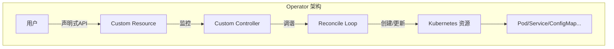
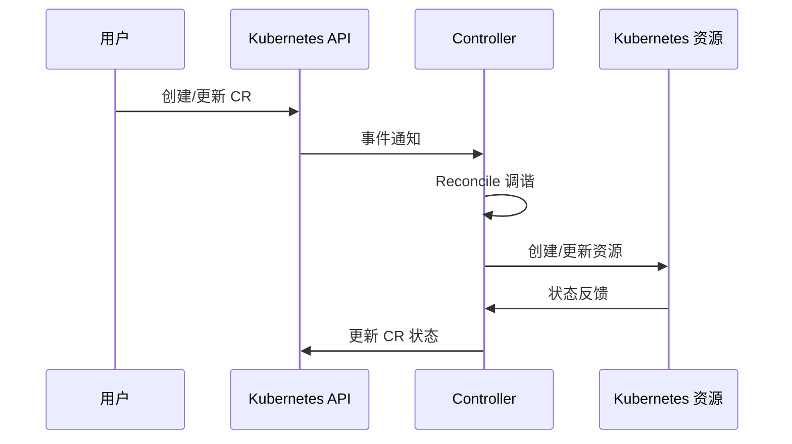
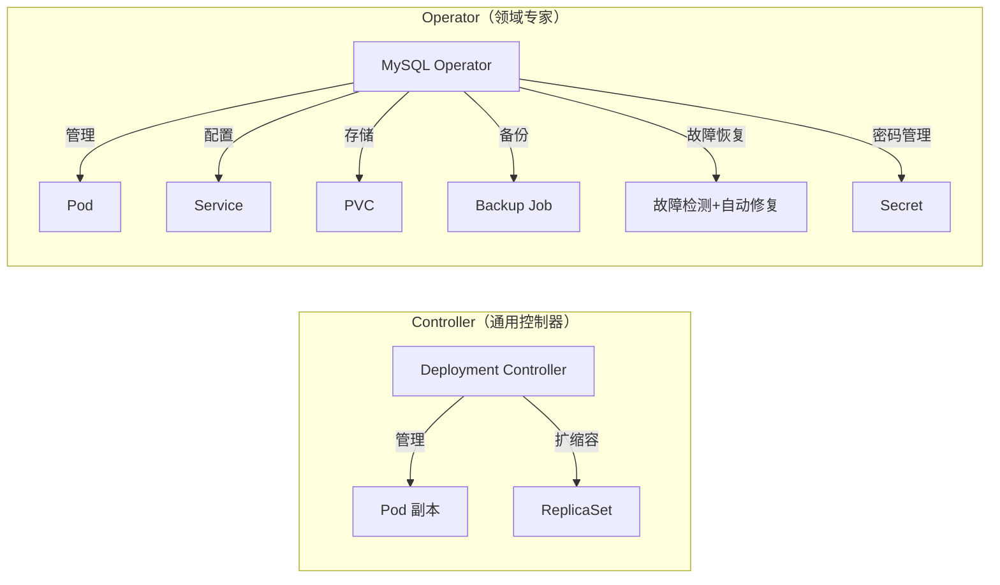
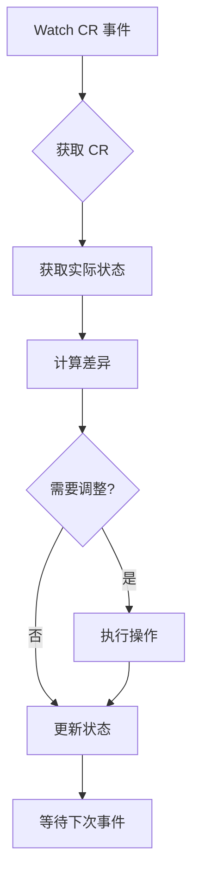
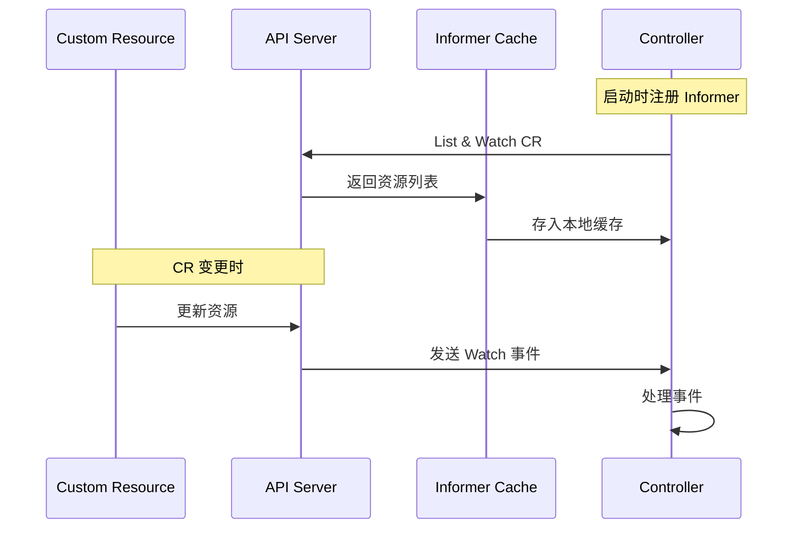

## 目录

1. [为什么需要 Operator](#为什么需要-operator)
2. [Operator 核心概念](#operator-核心概念)
3. [Operator vs Controller：关键区别](#operator-vs-controller关键区别)
4. [Operator 工作原理深度剖析](#operator-工作原理深度剖析)
5. [Operator 开发框架对比](#operator-开发框架对比)
6. [经典 Operator 案例分析](#经典-operator-案例分析)
7. [Operator 最佳实践](#operator-最佳实践)
8. [总结与展望](#总结与展望)

---

## 为什么需要 Operator

在 Kubernetes 已经成为容器编排标准答案的今天，我们已经掌握了 Deployment、StatefulSet、Service 等内置资源来管理无状态和有状态应用。然而，当面对**复杂的、有状态的、需要领域知识的应用**时，这些通用控制器往往力不从心。

### 传统方式的困境

考虑一个 MySQL 集群的管理场景：

```yaml
# 使用 StatefulSet 部署 MySQL - 只能做到基础部署
apiVersion: apps/v1
kind: StatefulSet
metadata:
  name: mysql
spec:
  serviceName: mysql
  replicas: 3
  selector:
    matchLabels:
      app: mysql
  template:
    spec:
      containers:
      - name: mysql
        image: mysql:8.0
```

 StatefulSet 能帮我们：
- 保证 Pod 稳定的网络标识
- 保证有序的部署和扩缩容
- 绑定持久存储

但它**无法处理**：
- 主从复制配置
- 自动故障检测与恢复
- 备份与恢复
- 集群升级和数据迁移
- 运维人员需要手动执行大量脚本

这正是 Operator 要解决的问题。

---

## Operator 核心概念

Operator 是由 CoreOS（现已被 Red Hat 收购）于 2016 年提出的概念，它是一种**封装、部署和管理复杂有状态应用的高级方法**。

### Operator 的定义

```
Operator = 自定义资源（CRD）+ 自定义控制器（Custom Controller）
```



### 自定义资源（CRD）

CRD（Custom Resource Definition）是 Kubernetes API 的扩展机制，允许用户定义新的资源类型：

```yaml
apiVersion: mysql.example.com/v1
kind: MySQLCluster
metadata:
  name: my-mysql
spec:
  replicas: 3
  storageSize: 100Gi
  version: 8.0
  backup:
    schedule: "0 2 * * *"
    retention: 7
```

用户只需声明期望状态，Operator 会自动完成剩余工作。

### 自定义控制器

控制器持续监控 CR 的实际状态，并驱动系统向期望状态调整：



---

## Operator vs Controller：关键区别

这是本文的核心内容。很多初学者会混淆 Operator 和 Controller，让我们详细对比：

### 本质区别

| 特性 | Controller | Operator |
|------|-----------|----------|
| **定位** | Kubernetes 内置控制器 | 用户自定义扩展 |
| **开发主体** | Kubernetes 官方 | 社区/厂商/用户 |
| **管理资源** | Pod/Deployment/Service 等内置资源 | 自定义资源（CR） |
| **领域知识** | 通用逻辑 | 应用特定领域知识 |
| **复杂性** | 相对简单 | 处理复杂有状态应用 |

### 功能范围对比



### 架构对比

**内置 Controller（如 Deployment Controller）**：
- 监听内置资源（Deployment）
- 实现通用的副本管理逻辑
- 逻辑固定，难以扩展
- 由 kube-controller-manager 统一管理

**Operator**：
- 监听自定义资源（CR）
- 实现特定应用的运维逻辑
- 可包含复杂的业务领域知识
- 独立部署运行

### 代码层面的区别

**Controller 示例结构**（简化）：

```go
// Kubernetes 内置 Controller 的典型模式
type Controller struct {
    client     clientset.Interface
    informer   cache.SharedIndexInformer
    reconciler ReconcileFunc
}

func (c *Controller) Reconcile(req reconcile.Request) (reconcile.Result, error) {
    // 1. 获取资源
    // 2. 比较期望状态与实际状态
    // 3. 执行调整
    // 4. 更新状态
}
```

**Operator 示例结构**：

```go
// MySQL Operator 的典型模式
type MySQLClusterReconciler struct {
    client.Client
    Scheme *runtime.Scheme
}

func (r *MySQLClusterReconciler) Reconcile(ctx context.Context, req ctrl.Request) (ctrl.Result, error) {
    // 1. 获取 MySQLCluster CR
    // 2. 创建 Headless Service
    // 3. 创建 StatefulSet
    // 4. 配置主从复制
    // 5. 设置备份任务
    // 6. 处理故障恢复
    // 7. 更新 CR 状态（就绪数、版本等）
}
```

### 关键区别总结

| 维度 | Controller | Operator |
|------|-----------|----------|
| **关注点** | 资源生命周期 | 应用完整生命周期 |
| **知识封装** | 无 | 领域专业知识 |
| **状态管理** | 基础资源状态 | 应用特定状态 |
| **运维能力** | 无 | 备份、恢复、升级 |
| **扩展性** | 通过 Webhook | 通过 CRD |

---

## Operator 工作原理深度剖析

### 控制循环（Control Loop）

Operator 的核心是 **Reconcile（调谐）循环**：



### 事件驱动机制



### Reconcile 逻辑详解

```go
func (r *MySQLClusterReconciler) Reconcile(ctx context.Context, req ctrl.Request) (ctrl.Result, error) {
    // 1. 获取 CR 实例
    mysqlCluster := &mysqlv1alpha1.MySQLCluster{}
    err := r.Get(ctx, req.NamespacedName, mysqlCluster)
    if err != nil {
        return ctrl.Result{}, client.IgnoreNotFound(err)
    }

    // 2. 创建/更新 Headless Service
    svc := r.newServiceForCluster(mysqlCluster)
    if err := r.createOrUpdate(ctx, svc); err != nil {
        return ctrl.Result{}, err
    }

    // 3. 创建 StatefulSet
    sts := r.newStatefulSetForCluster(mysqlCluster)
    if err := r.createOrUpdate(ctx, sts); err != nil {
        return ctrl.Result{}, err
    }

    // 4. 配置主从复制（如果是集群）
    if mysqlCluster.Spec.Replicas > 1 {
        if err := r.ensureReplication(ctx, mysqlCluster); err != nil {
            return ctrl.Result{}, err
        }
    }

    // 5. 设置定时备份
    if mysqlCluster.Spec.Backup.Enabled {
        if err := r.ensureBackup(ctx, mysqlCluster); err != nil {
            return ctrl.Result{}, err
        }
    }

    // 6. 更新 CR 状态
    mysqlCluster.Status.ReadyReplicas = // 计算就绪副本数
    mysqlCluster.Status.CurrentVersion = mysqlCluster.Spec.Version
    if err := r.Status().Update(ctx, mysqlCluster); err != nil {
        return ctrl.Result{}, err
    }

    return ctrl.Result{}, nil
}
```

### 状态管理

Operator 需要维护多种状态：

```yaml
apiVersion: mysql.example.com/v1
kind: MySQLCluster
metadata:
  name: my-mysql
spec:
  replicas: 3
status:
  phase: Running
  readyReplicas: 3
  currentVersion: 8.0.32
  conditions:
  - type: Ready
    status: "True"
    lastTransitionTime: "2024-01-01T00:00:00Z"
  - type: BackupScheduled
    status: "True"
    lastTransitionTime: "2024-01-01T00:00:00Z"
  - type: ReplicationReady
    status: "True"
    lastTransitionTime: "2024-01-01T00:00:00Z"
```

---

## Operator 开发框架对比

### 主流框架概览

| 框架 | 开发主体 | 特点 | 适用场景 |
|------|---------|------|---------|
| **Kubebuilder** | Kubernetes SIG | 官方标准，原生集成 | 新项目首选 |
| **Operator SDK** | CoreOS/Red Hat | 功能丰富，成熟度高 | 复杂 Operator |
| **META-Lego** | 阿里云 | 简化开发，上手快 | 快速原型 |

### Kubebuilder vs Operator SDK

```
┌─────────────────────────────────────────────────────────┐
│                    Controller Runtime                   │
│         (Kubernetes SIG 官方封装的公共库)                 │
└─────────────────────┬───────────────────────────────────┘
                      │
        ┌─────────────┴─────────────┐
        ▼                           ▼
┌───────────────┐           ┌───────────────┐
│   Kubebuilder │           │ Operator SDK  │
│  (亲儿子)     │           │ (后加入)      │
└───────────────┘           └───────────────┘
```

**实际上**：两者底层都依赖 `controller-runtime`，项目结构几乎相同。Operator SDK 在底层调用了 Kubebuilder。

### 开发流程对比

**Kubebuilder 方式**：

```bash
# 1. 安装
brew install kubebuilder

# 2. 创建项目
kubebuilder init --domain example.com --repo github.com/example/mysql-operator

# 3. 创建 API
kubebuilder create api --group mysql --version v1 --kind MySQLCluster

# 4. 生成代码
make generate
make manifests
```

**Operator SDK 方式**：

```bash
# 1. 安装
brew install operator-sdk

# 2. 初始化项目
operator-sdk init --domain example.com --repo github.com/example/mysql-operator

# 3. 创建 API 和 Controller
operator-sdk create api --resource --controller

# 4. 开发和构建
make build
```

---

## 经典 Operator 案例分析

### 1. Prometheus Operator

Prometheus Operator 是最成功的 Operator 之一，它将 Prometheus 的配置抽象为 Kubernetes 资源：

```yaml
# 声明式定义 Prometheus
apiVersion: monitoring.coreos.com/v1
kind: Prometheus
metadata:
  name: prometheus
spec:
  replicas: 2
  serviceAccountName: prometheus
  serviceMonitorSelector:
    matchLabels:
      team: frontend
  ruleSelector:
    matchLabels:
      role: alert-rules
```

**核心 CRD**：
- `Prometheus`：Prometheus 实例
- `ServiceMonitor`：服务发现配置
- `PrometheusRule`：告警规则
- `Alertmanager`：Alertmanager 配置

### 2. etcd Operator

etcd Operator 是最早的开源 Operator 之一，实现了：
- 自动化集群部署
- 故障自动恢复
- 备份与恢复
- 滚动升级

```yaml
apiVersion: etcd.database.coreos.com/v1beta2
kind: EtcdCluster
metadata:
  name: etcd-cluster
spec:
  size: 3
  version: 3.4.0
  pod:
    etcd:
      resource: "2Gi"
  etcdctl:
    resource: "100Mi"
```

### 3. Vault Operator

HashiCorp Vault Operator 管理 Vault 的生命周期：
- 自动初始化和解封
- 密钥轮换
- 高可用配置

---

## Operator 最佳实践

### 1. 资源设计原则

```yaml
# ✅ 推荐：清晰的状态字段
status:
  phase: Running          # 当前状态
  readyReplicas: 3/3      # 就绪情况
  conditions:             # 详细条件
  - type: Ready
    status: "True"
  - type: Degraded
    status: "False"

# ❌ 避免：状态与规格混淆
spec:
  status: "running"      # 不应在 spec 中放状态
```

### 2. Reconcile 幂等性

```go
func (r *MySQLClusterReconciler) Reconcile(...) error {
    // 必须支持多次执行而不产生副作用
    // 使用 createOrUpdate 或 ownerReference
    existing := &corev1.Service{}
    err := r.Get(ctx, svcKey, existing)
    if err != nil && !apierrors.IsNotFound(err) {
        return err
    }

    if apierrors.IsNotFound(err) {
        // 创建
        return r.Create(ctx, expected)
    }

    // 更新 - 只更新必要的字段
    existing.Spec.Ports = expected.Spec.Ports
    return r.Update(ctx, existing)
}
```

### 3. 错误处理策略

```go
func (r *MySQLClusterReconciler) Reconcile(...) (ctrl.Result, error) {
    cluster := &mysqlv1alpha1.MySQLCluster{}
    if err := r.Get(ctx, req.NamespacedName, cluster); err != nil {
        return ctrl.Result{}, client.IgnoreNotFound(err)
    }

    // 区分可重试和不可重试错误
    if err := r.ensureBackup(ctx, cluster); err != nil {
        // 可重试：网络超时、资源不足
        if isTransientError(err) {
            return ctrl.Result{RequeueAfter: 30 * time.Second}, err
        }
        // 不可重试：配置错误，更新 CR 状态
        cluster.Status.Conditions = append(cluster.Status.Conditions,
            metav1.Condition{
                Type:    "BackupFailed",
                Status:  metav1.ConditionTrue,
                Reason:  err.Error(),
            })
        return ctrl.Result{}, r.Status().Update(ctx, cluster)
    }

    return ctrl.Result{}, nil
}
```

### 4. Leader 选举

对于多副本 Operator，需要实现 Leader 选举：

```go
func main() {
    ctx := ctrl.SetupSignalHandler()

    mgr, err := ctrl.NewManager(ctrl.GetConfigOrDie(), ctrl.Options{
        Scheme: scheme,
        LeaderElection: true,
        LeaderElectionID: "mysql-operator-lock",
    })
    // ...
}
```

### 5. Finalizer 管理

```go
func (r *MySQLClusterReconciler) SetupWithManager(mgr *ctrl.Manager) error {
    return ctrl.NewControllerManagedBy(mgr).
        For(&mysqlv1alpha1.MySQLCluster{}, builder.WithPredicates(predicate.Finals{})).
        Owns(&appsv1.StatefulSet{}).
        Owns(&corev1.Service{}).
        Complete(r)
}

// Reconcile 中处理删除
func (r *MySQLClusterReconciler) Reconcile(ctx context.Context, req ctrl.Request) error {
    cluster := &mysqlv1alpha1.MySQLCluster{}
    if err := r.Get(ctx, req.NamespacedName, cluster); err != nil {
        return client.IgnoreNotFound(err)
    }

    if cluster.DeletionTimestamp != nil {
        // 执行清理工作
        if err := r.cleanupResources(ctx, cluster); err != nil {
            return err
        }
        // 移除 finalizer
        controllerutil.RemoveFinalizer(cluster, "mysql.example.com/finalizer")
        return r.Update(ctx, cluster)
    }

    // 添加 finalizer
    if !controllerutil.ContainsFinalizer(cluster, "mysql.example.com/finalizer") {
        controllerutil.AddFinalizer(cluster, "mysql.example.com/finalizer")
        return r.Update(ctx, cluster)
    }

    // 正常 Reconcile 逻辑
    // ...
}
```

### 6. 监控与可观测性

```go
import "sigs.k8s.io/controller-runtime/pkg/metrics"

var (
    reconcileTotal = prometheus.NewCounterVec(
        prometheus.CounterOpts{
            Name: "mysql_operator_reconcile_total",
            Help: "Total number of reconcile attempts",
        },
        []string{"result"},
    )
    reconcileDuration = prometheus.NewHistogramVec(
        prometheus.HistogramOpts{
            Name:    "mysql_operator_reconcile_duration_seconds",
            Help:    "Duration of reconcile in seconds",
        },
        []string{"result"},
    )
)

func init() {
    metrics.Registry.MustRegister(reconcileTotal, reconcileDuration)
}
```

---

## 总结与展望

### 核心要点回顾

| 概念 | 说明 |
|------|------|
| **Operator** | 封装运维知识的自定义控制器 |
| **CRD** | 扩展 Kubernetes API 的机制 |
| **Reconcile** | 持续调谐期望状态与实际状态 |
| **最佳实践** | 幂等性、错误处理、Finalizer |

### Operator vs Controller 小结

```
Controller → 通用 → 内置资源 → 基础功能
Operator   → 专用 → 自定义资源 → 领域知识
```

### 未来趋势

1. **Operator Hub**：标准化 Operator 分发
2. **OAM（开放应用模型）**：应用抽象层
3. **多集群 Operator**：跨集群管理
4. **GitOps 集成**：声明式 Operator 管理

Operator 将 Kubernetes 从"容器编排引擎"提升为"自动化运维平台"，让每个复杂应用都能获得"专属运维专家"的能力。
